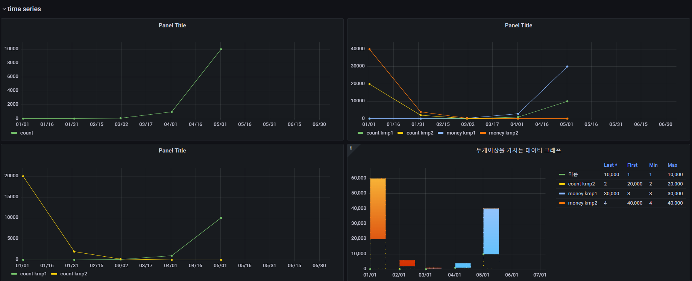
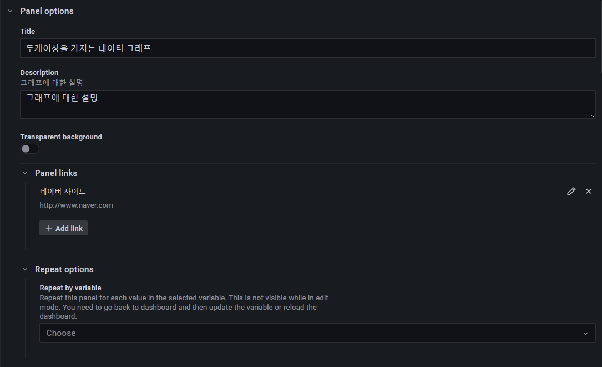
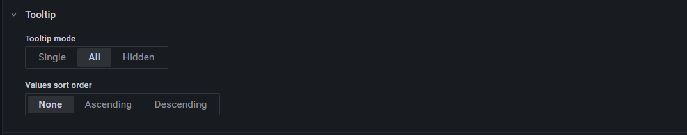
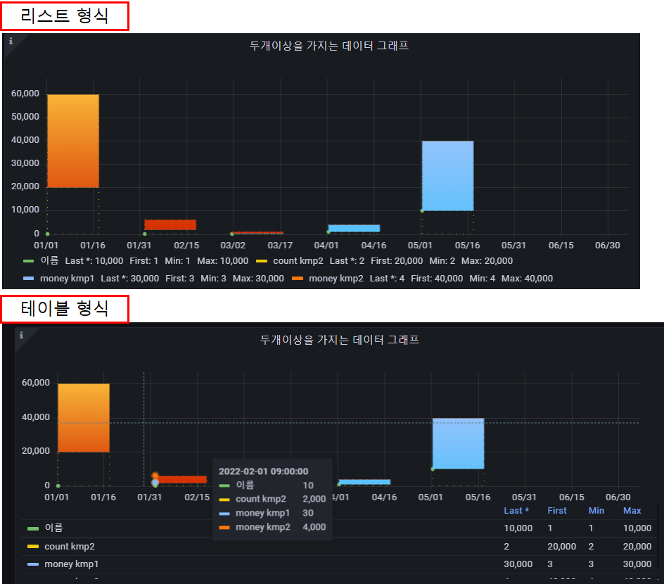
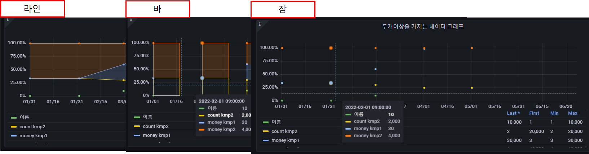
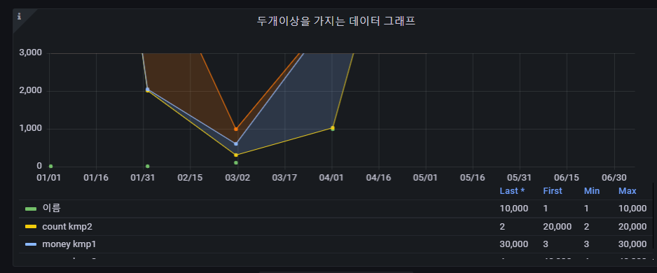
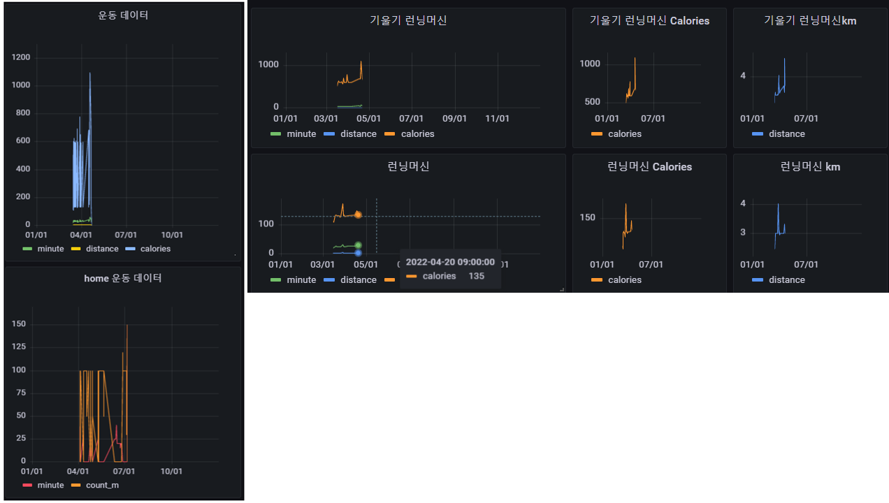

## 2022-07-05-grafana-postgreSQL교육-Timeseries

## 목차

>01.timeseries 기본 교육
>
>>01.1 테이블 설계
>>
>>01.2 데이터  추가
>>
>>01.3 그라파나에 데이터 추가하여 상태 확인
>>
>>01.4 timeseries  option 적용과 이해
>
>02.timeseries 적용 예시를 통한 이해
>
>03.개인대시보드 timeseries 적용하기

## 01.timeseries 기본 교육

### 01.1 테이블 설계

```sql
drop table kmp;
create table kmp
(
 study_time timestamp,
 count int
);

drop table kmp1;
create table kmp1
(
 study_time timestamp,
 name text,
 count int
);

drop table kmp2;
create table kmp2
(
 study_time timestamp,
 name text,
 count int,
 money int
);
```

### 01.2 데이터  추가

```sql
insert into kmp (study_time, count) values
('2022-01-01',1)
,('2022-02-01',10)
,('2022-03-01',100)
,('2022-04-01',1000)
,('2022-05-01',10000);


select * from kmp;

insert into kmp1 (study_time,name, count) values
('2022-01-01','kmp1',1)
,('2022-02-01','kmp1',10)
,('2022-03-01','kmp1',100)
,('2022-04-01','kmp1',1000)
,('2022-05-01','kmp1',10000),
('2022-01-01','kmp2',20000)
,('2022-02-01','kmp2',2000)
,('2022-03-01','kmp2',200)
,('2022-04-01','kmp2',20)
,('2022-05-01','kmp2',2);

select * from kmp1;

insert into kmp2 (study_time,name, count, money) values
('2022-01-01','kmp1',1,3)
,('2022-02-01','kmp1',10,30)
,('2022-03-01','kmp1',100,300)
,('2022-04-01','kmp1',1000,3000)
,('2022-05-01','kmp1',10000,30000)
,('2022-01-01','kmp2',20000,40000)
,('2022-02-01','kmp2',2000,4000)
,('2022-03-01','kmp2',200,400)
,('2022-04-01','kmp2',20,40)
,('2022-05-01','kmp2',2,4);

select * from kmp2;
```

### 01.3 그라파나에 데이터 추가하여 상태 확인



### 01.4 timeseries  option 적용과 이해

- Panel options

  

  - title 설정 desctiption설정
    - panel links에 링크연결 진행

- Tooltip

  - Tooltop mode

    - single과 all, hidden의 차이 이해
      - single의 경우 마우스 포인터가 위치하는 곳의 Tooltip만 표시
      - All의 경우 전체 데이터의 Tooltip 표시
      - Hidden의 경우 숨김

  - values sort order

    - none, ascending, descending

      - Tooltip의 순서 결정 , 오름차순 기준,내림차순기준, 기본 

        

- Legend

  - Legend mode 

    - list모양으로 볼것인지, table모양으로 볼 것인지, 숨길것인지 표시

    

  - Legend placement

    - Legend의 위치 설정  아래로 할 것인지, 오른쪽에 위치할 것인지 지정

  - Legend values

    - legend에 표시할것 지정하는 부분

- Graph styles

  - Style
    - 선으로 볼것인지, 바로 볼것인지 점으로 볼것인지 선택

  - Line width

    - 라인 두께 설정

  - Fill opacity

    - 색상의 채움 정도 설정

  - Gradient mode

    - None, Opacity, Hue, Scheme로 설정 가능

  - Show points

    - 점을 표시할것인지에 대한 여부

      

  - Stack series

    - Off
      - 누적을 하지 않겠음
    - Normal
      - 같은 날짜에 대한 누적 그래프 
    - 100%
      - 같은 날짜에 대해서 100퍼센트 비율 표시

- Standard options

  - Unit
    - 데이터 표시 형식 지정

  - Min
    - Leave empty to calculate based on all values
    - 그래프의 보여지는 최소 지정

  - Max

    - Leave empty to calculate based on all values

    - 그래프의 보여지는 최대 지정

      

      - min : 0 , max : 3000 을 지정한 경우

  - Decimals
    - 소수점 자리 지정

  - Display name
    - Change the field or series name
    - 필드의 이름을 변경 함

  - No Value
    - What to show when there is no value
    - 값이 없는 경우 표시할것  지정

## 02.timeseries 적용 예시를 통한 이해

- 실제적용된 사례

  - 마일스톤 진척률

  - 월별증감률 | 마일스톤 진척률

  - 주별증감률 | 마일스톤 진척률

  - 마일스톤 건수

  - 액션아이템 건수

  - 월별 누계 | 오픈 문서 건수

  - 월별 누계 | 클로즈 문서 건수

  - 주별 누계 | 오픈 문서 건수

  - 주별 누계 | 클로즈 문서 건수


## 03.개인대시보드 timeseries 적용하기

- 개인 주제에 timeseries 적용하기 

  - 테이블 만들고 데이터 넣고 그래프그리기

- 운동 관련 개인 대시보드

  - 테이블 설계 및 데이터 추가

    ```sql
    CREATE TABLE exercise(
      year date,
      name varchar,
      minute numeric,
      distance numeric,
      calories numeric,
      count_m numeric,
      primary key(year,name)
    );
    
    insert into exercise (year, name, minute, distance, calories, count_m)values
          ('2022-03-15','기울기 런닝머신', 30.27, 2.560, 507,0),
          ('2022-03-15','런닝머신',20.11,2.610,111.60,0);
          
    CREATE TABLE home_exercise(
     year date,
     name text,
     minute numeric,
     count_m numeric,
     primary key(year,name)
    );
    
    INSERT INTO home_exercise (year,name,minute,count_m)values
    ('2022-04-03','요가',38.52,0),
    ('2022-04-03','크런치',0,100);
    ```

  - time series 대시보드 작성

    

    

  

  

  

  