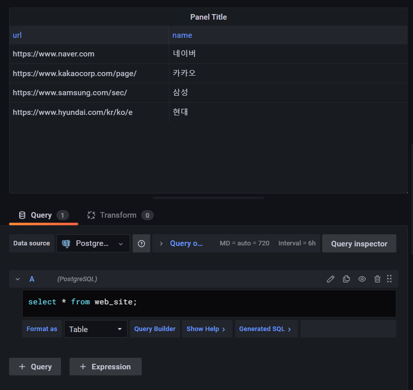
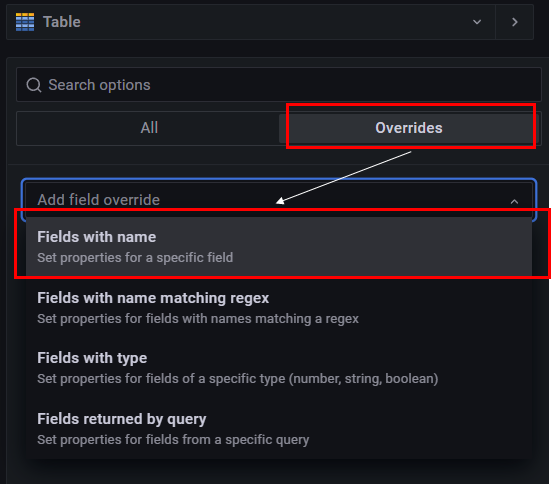
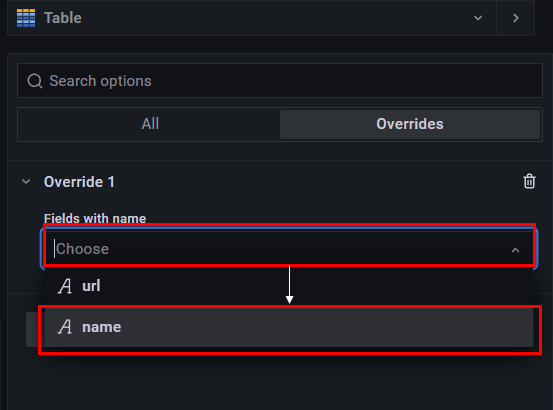
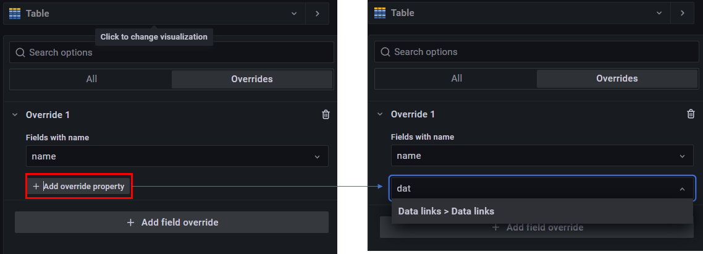
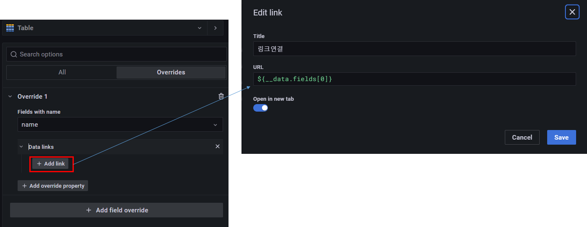
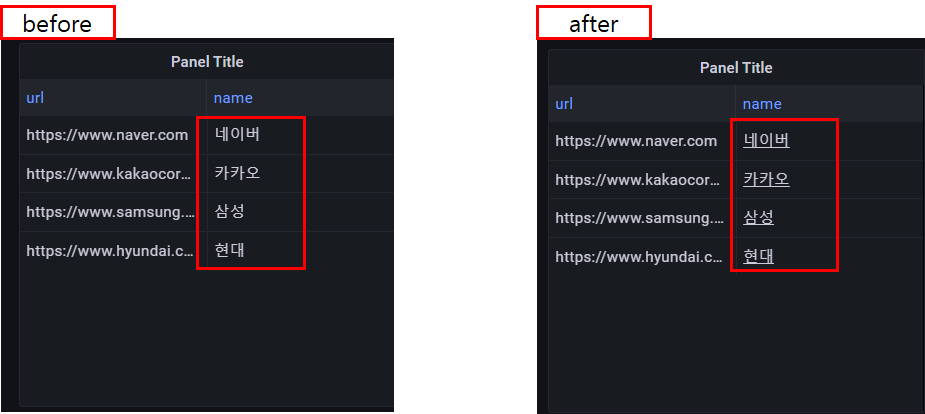

## 2022-07-06-기술-Jinja-링크연결

## 목차

## 01.테이블 구성 및 데이터

```sql
drop table web_site;
create table web_site
(
 url text,
 name text
);

insert into web_site values
('https://www.naver.com','네이버'),
('https://www.kakaocorp.com/page/','카카오'),
('https://www.samsung.com/sec/','삼성'),
('https://www.hyundai.com/kr/ko/e','현대');
```

## 02.그라파나 테이블 확인



- 네이버라는 컬럼의 값을 누르면 링크로 연결되어 들어가게 하는 것

## 03.링크 연결

- **Overrides 클릭**

  - `+ Add field override` 클릭해서 Fields with name 클릭

  

- **Choose 클릭 후  A name 클릭**

  

  

- `+ Add override property` 클릭 후 
  - data links 검색후 클릭



- Add link클릭 후 
  - Title:  링크연결
  - URL:  ${__data.fields[0]}
    - ${__data.fields[0]} 이것에서 [0] 의 경우 컬럼의 위치를 선택할 수 있음 현재 url이라는것이 0번위치에 있어서 0으로 입력이 되는것

### 03.1 링크 연결한 결과



- 이전과 다른 점의 경우 밑줄이 표시가되어 name컬럼의 아래의 값을 클릭시 링크로 연결이됨

## 04.Jinja

- `${__data.fields[0]}` 이런것을 Jinja라고 부른다. 자세한 내용의 경우 아래 링크를 참고
  - [Jinja Documentation 링크](https://jinja.palletsprojects.com/en/3.0.x/)