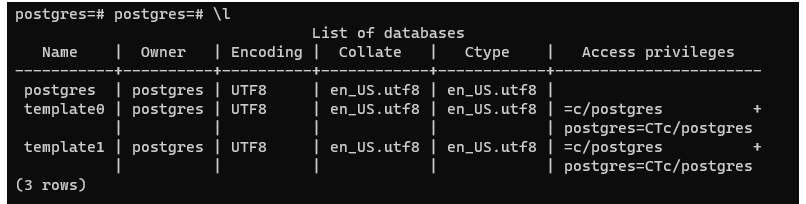
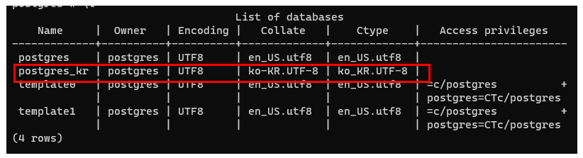
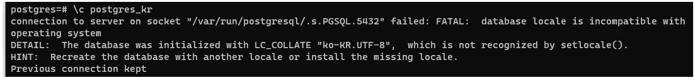
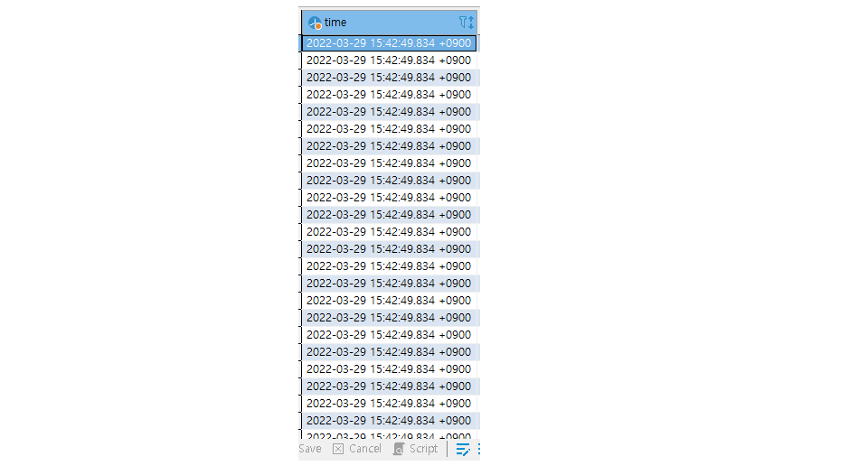
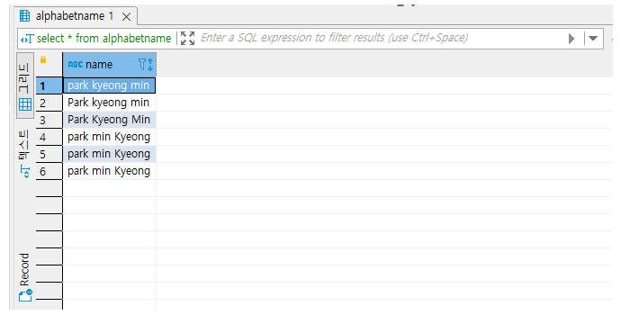
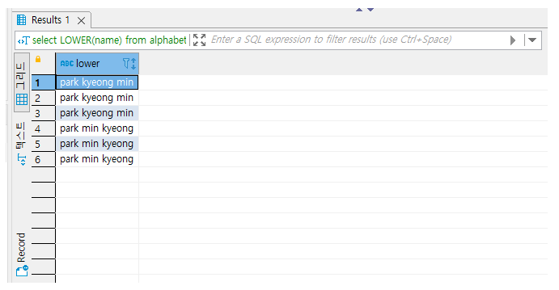
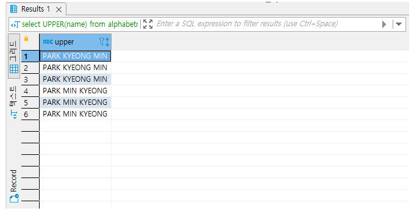
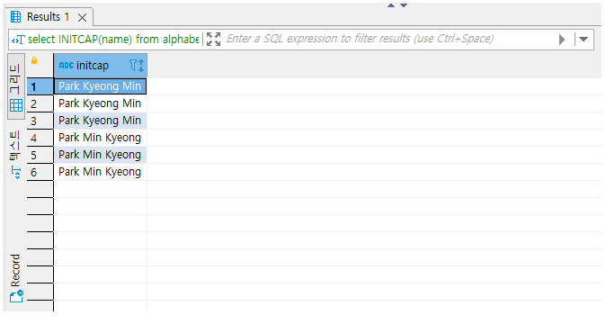

# 프로젝트운영대시보드 | 기술 | 프로젝트 관리 표준화 | Postgres환경설정

## 목차

> 01.korean환경 설정
>
> > 01.1 디비연결후 테이블 생성
>
> 02.한국시간설정
>
> 03.쿼리결과를 소문자나 대문자, 또는 첫문자만대문자로 통일
>
> > 03.1 대소문자 결과 테스트 테이블 쿼리 결과
> >
> > 03.1.1소문자로만 변환 테스트 | 쿼리
> >
> > 03.1.2대문자로만 변환 테스트 | 쿼리
> >
> > 03.1.3첫글자 대문자로만 변환 테스트 | 쿼리
>
> 참고자료

## 01.korean환경 설정



```sql
\l
```

- 위와 같이 나오는데 컬럼별 의미는 아래와 같음
- **COLLATE** : String 정렬 순서
- **CTYPE** : 문자분류 (어떤 글자 인지, 대문자도 동일한지)

```sql
create database test_kr
with
owner=postgres
template=template0
encoding='UTF8'
LC_COLLATE='ko-KR.UTF-8
LC_CTYPE='ko-KR.UTF-8'
tablespace=test_kr
connection limit=999;
```

- 디비 생성시 세팅

```plaintext
update pg_database
set datcollate='ko-KR.UTF-8', datctype='ko_KR.UTF-8'
where datname='postgres_kr';
```

- 세팅 변경

  

  ### 01.1 디비연결후 테이블 생성

```sql
\c 데이터베이스_이름

\c postgres_kr
```



- 현재 ko-KR.UTF-8이 없기 때문에 안되는듯

## 02.한국시간설정

- 시간데이터의 경우 아래와 같이 실시간 데이터로 들어가는것을 봐서 따로 설정할 부분은 없는듯



## 03.쿼리결과를 소문자나 대문자, 또는 첫문자만대문자로 통일

- 소문자로만 변환
  - LOWER(컬럼이름)

- 대문자로만 변환
  - UPPER(컬럼이름)
- 첫 문자만 대문자로 변환
  - INITCAP(컬럼이름)

### 03.1 대소문자 결과 테스트 테이블 쿼리 결과



#### 03.1.1소문자로만 변환 테스트 | 쿼리

```plaintext
SELECT LOWER(name) FROM alphabetname;
```



#### 03.1.2대문자로만 변환 테스트 | 쿼리

```plaintext
SELECT UPPER(name) FROM alphabetname;
```



#### 03.1.3첫글자 대문자로만 변환 테스트 | 쿼리

```plaintext
SELECT INITCAP(name) FROM alphabetname;
```



## 참고자료

[POSTGRESQL 과 문자셋](https://linux.systemv.pe.kr/postgresql-과-문자셋/)

[PostgreSQL Localization](https://rastalion.me/postgresql-localization/)

[[SQL\] 대소문자 조작 함수. LOWER, UPPER, INITCAP.](https://goguri.tistory.com/472)