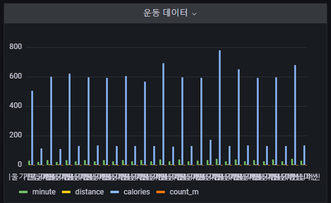
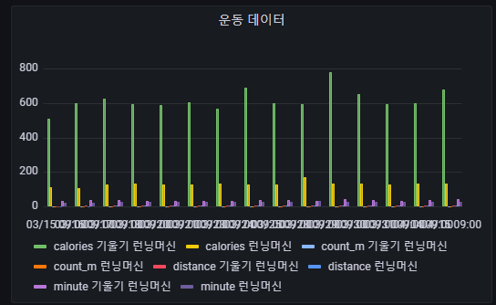
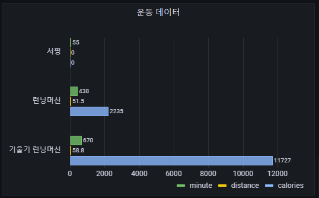
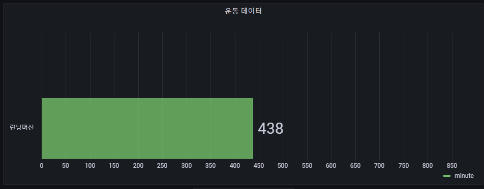
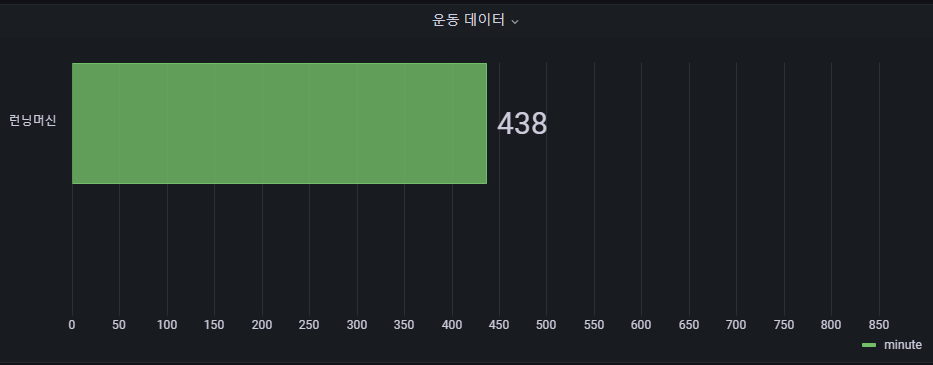
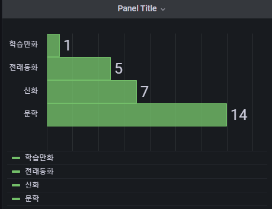
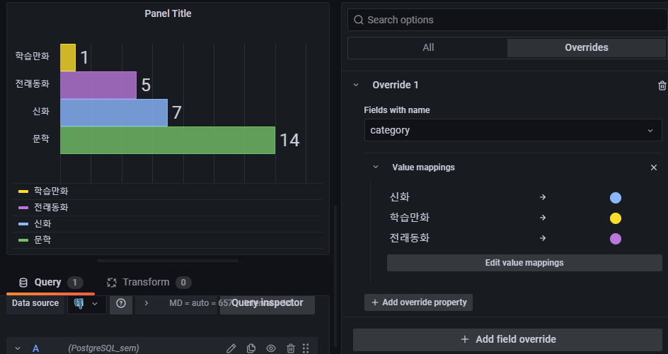
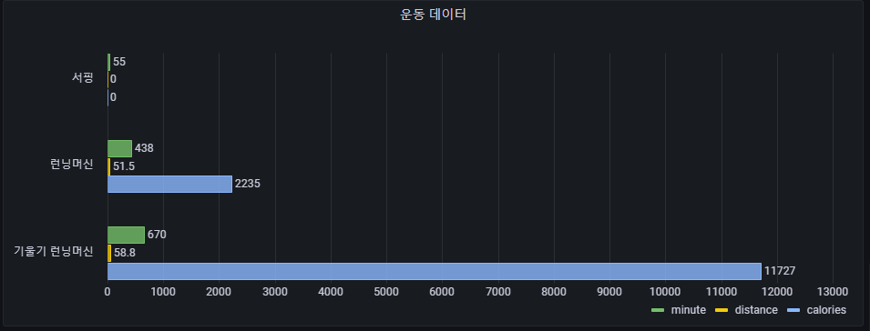
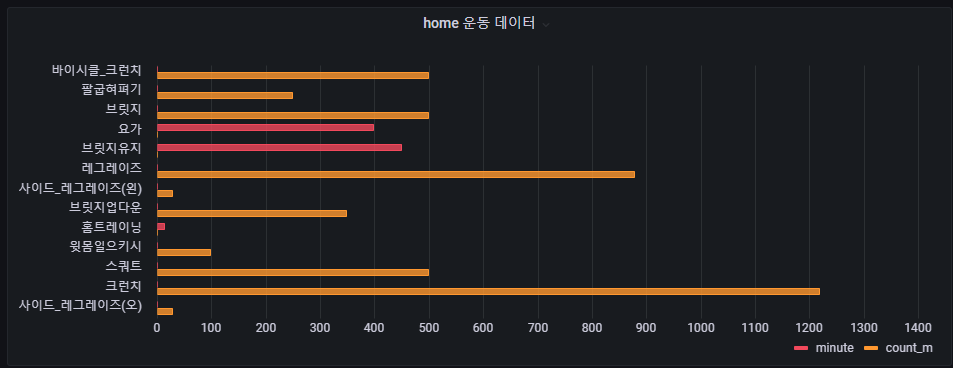

## 2022-07-07-grafana-postgreSQL교육-Barchart

## 목차

> 01.Barchart 기본 교육
>
> >01.1 기본쿼리
> >
> >01.2 sum over를 이용한 데이터 합치는 쿼리
> >
> >01.3 데이터가 한개일때 그래프 표현 안되는 경우
> >
> >01.4 barchart option적용과 이해
>
> 02.barchart 적용 예시를 통한 이해
>
> 03.개인대시보드 barchart 적용하기

## 01.Barchart 기본 교육

### 01.1 기본쿼리

- Format as 

  - **Table 설정시**

  ```sql
  SELECT
  *
  FROM
    exercise
  limit 30
  ;
  ```



- Format as 

  - **Timeseries 설정시**

  ```sql
  SELECT
  year as time
  , name 
  , minute
  , distance
  , calories
  , count_m
  FROM
    exercise
  limit 30
  ;
  ```

  

### 01.2 sum over를 이용한 데이터 합치는 쿼리

```sql
SELECT
  distinct name,
  sum (minute) over(partition by name) as minute,
  sum (distance) over(partition by name) as distance,
  sum (calories) over(partition by name) as calories
FROM
  exercise
;
```



### 01.3 데이터가 한개일때 그래프 표현 안되는 경우

- union 을 이용하여 데이터 한개 생성

  ```sql
  SELECT
    distinct name,
    sum (minute) over(partition by name) as minute
  FROM
    exercise
  where name = '런닝머신'
  union 
  
  select null, null
  ;
  ```

  

  - 위에 공백이 생기게 되어 그래프가 나오게 된다. 
  - 임의적으로 2개 데이터를 만든는 것
    - 위의 경우 위에 공백이 생기는것이 이상할 수 있으니 제일 아래로 보내주면 아래와 같음

- null 값 정렬 아래로 보내기

  ```sql
  SELECT
    distinct name,
    sum (minute) over(partition by name) as minute
  FROM
    exercise
  where name = '런닝머신'
  union 
  
  select null, null
  order by minute nulls last
  ;
  ```

  - `order by minute nulls last`  작성을 해주면 아래와 같은 결과가 나온다.

  

### 01.4 barchart option적용과 이해

- Value mappings

  - before

    

  - after

    

    

    - 위를 이용해서 색상을 달리 지정할 수 있음

## 02.barchart 적용 예시를 통한 이해

- 실제적용된 사례
  - 마일스톤 범주
  - 마일스톤 건수
  - 마일스톤 기간

## 03.개인대시보드 barchart 적용하기



```sql
SELECT
  distinct name,
  sum (minute) over(partition by name) as minute,
  sum (distance) over(partition by name) as distance,
  sum (calories) over(partition by name) as calories
FROM
  exercise;
```



```sql
SELECT
 distinct
  name,
  sum (minute) over(partition by name) as minute,
  sum (count_m) over(partition by name) as count_m
FROM
  home_exercise;
```

