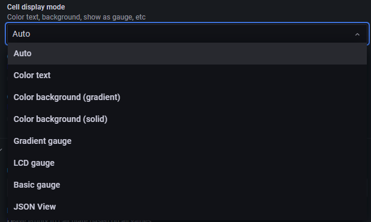

## 2022-07-08-grafana-postgreSQL-교육-Table

## 목차

>01.쿼리를 이용한 Table 생성하기
>
>>01.1 Table 옵션 지정하기
>>
>>01.2 피봇테이블 형식 적용하는법 정리하기
>
>02.실제 구현된 대시보드 확인해보기
>
>03.개인대시보드에 테이블 적용해보기

## 01.쿼리를 이용한 Table 생성하기

### 01.1 Table 옵션 지정하기

- Cell display mode

  

- data links

  - 이부분 하려면 url 담긴 table 생성 필요함
  - ${__data.fields[0]}

- Value mappings
  - 각 원하는 부분에 색지정하거나
- Thresholds이용해서 색지정하는것 까지 해보기

### 01.2 피봇테이블 형식 적용하는법 정리하기

- 피봇테이블 정리부분 따라해보기
- 이때는 좀 쿼리문 위주의 실습으로 진행할것
  - 왜 ? 이렇게 피봇으로 표현하는지 그리고 왜 같은 이름인것을 지우고 하나로 합치는 과정이 필요한지
  - 그리고 어떻게 해야 저렇게 제대로 피봇을 표현할 수 있는지 

- 그리고 피봇방식에서 분류하는 것 cube 이런것에 대해서 설명 후 구현 진행

## 02.실제 구현된 대시보드 확인해보기

- 프로젝트 운영 대시보드
  - 마일스톤 요약
  - 마일스톤 (기간 있는 경우 , 없는 경우)

- 리소스 대시보드
  - Home
  - PM별 리소스
  - 팀별 리소스
  - 프로젝트코드 월별 리소스
  - 프로젝트코드 리소스
  - 영업담당자별 리소스

## 03.개인대시보드에 테이블 적용해보기

- 개인대시보드에 적용할것
  - 운동기록
  - 각 운동별 전체 몇분, 몇 칼로리, 몇번 했는지에 대한 것 유무를 적용할것
  - 그리고 각 크기에 맞게 색깔 지정해보기
- 그리고 뭔가 피봇테이블 적용할 수 있을만한것에 대해서 피봇 적용해보기

