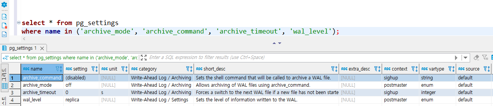
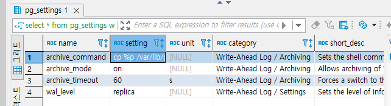
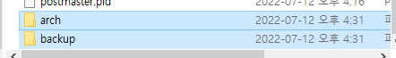
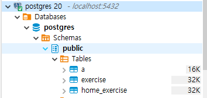
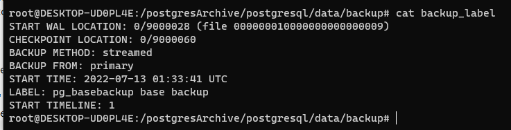
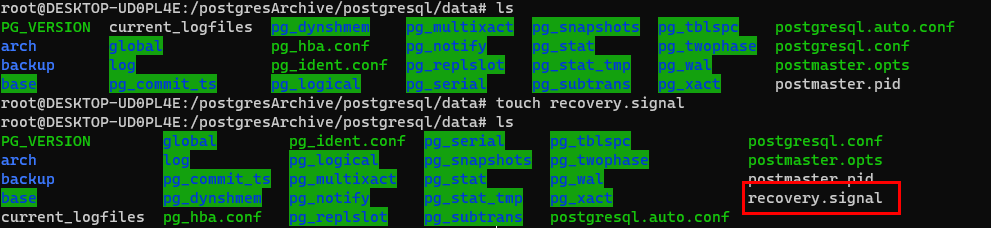
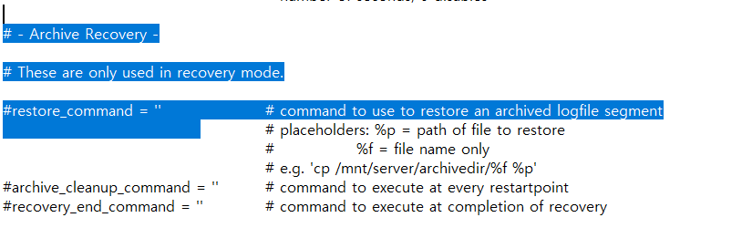

## 2022-07-12-PostgreSQL-백업

## 목차


##  01.PostgreSQL 아카이브 모드란?

- WAL(Write-Ahead Logging)을 이해하고 넘어가야함
  - 데이터 무결성을 보장하는 표준 방법
  - WAL의 중심 개념은 변경 내용을 설명하는 로그 레코드를
    - 영구적 저장소에 먼저 기록할 후에 데이터 파일의 변경 내용을 작성하는 것
- 충돌 발생시 로그를 사용하여 데이터베이스를 복구 할 수 있으므로
  - 트랜잭션 커밋마다 데이터 페이지를 디스크에 쓸 필요가 없음
  - 데이터 페이지에 적용되지 않은 변경 내용은 로그 레코드에서 실행 취소 가능
    - 이를 roll-forward 복구 이며, REDO 라고 함
- 로그 파일은 순차적으로 작성되며, 로그 파일 동기화 비용은 데이터 페이지 쓰기 비용보다 적음
- 서버가 소규모 동시 트랜잭션을 다수 처리하는 경우 
  - 로그 파일의 fsync하나로 여러가지 트랙잭션을 충분히 커밋할 수 있음
  - 온라인 백업 및 PIT(point in time) 복구를 지원 가능하게 함

## 02.PostgreSQL.conf 파라미터에 대해서 알아보기

### 02.1 wal_level (enum)

- wal에 기록되는 정보의 양을 결정
  - 기본값은 충돌 또는 즉시 셧다운으로 부터 복구하기 위해 필요한 정보만 기록하는  minimal임
- **minimal**
  - 기본값
- **archive**
  - WAL 아카이브에 필요한 로깅만 추가
- **hot_standby**
  - 대기 서버에서 읽기 전용 쿼리에 필요한 정보를 추가

### 02.2 archive_mode (boolean)

- 이를 사용하는 것으로 설정 완료시
  - WAL 세그먼트가 archive_command설정에 의해 아카이브 저장소로 전달됨
- archive_mode 및 archive_command는 별개의 변수이므로
  - 아카이밍 모드를 해지하지 않고도 archive_command를 변경할 수 있음
- 매개변수는 서버 시작시 설정
  - wal_level이 minimal로 설정된 경우 archive_mode를 사용 할 수 없음

### 02.3 archive_command (string)

- 완료된 WAL 파일 세그먼트를 아카이브하기 위해 실행하는 로컬 쉘 명령
- string:
  - `%p`: 아카이브할 파일의 경로명으로 대체
  - `%f`: 파일명으로만 대체

### 02.4 archive_timeout (integer)

- archive_command에서 완료된 WAL세그먼트를 호출을 하는데
  - 서버에는 WAL 트래픽이 발생되지 않아서 
    - 트랜잭션이 완료되는 시간과 아카이브 저장소에서 안전하게 기록되는 사이에
      - 긴  지연시간이 발생 할 수 있음
  - 데이터가 아카이브되지 않은 채로 방치되지 않게 하기 위해 서버가 새 WAL 세그먼트 파일로 주기적으로 전환되도록 archive_timeout을 설정할 수 있음
- 매우 짧게 설정하는 것은 좋지 않아서 1~2분정도로 설정하는것이 좋다고함

## 03.실제 아카이브 적용하기



```sql
select * from pg_settings
where name in ('archive_mode', 'archive_command', 'archive_timeout', 'wal_level');
```

- 초기 설정의 경우 
  - archive_command: (disabled)
  - archive_mode: off
  - archive_timeout: 0
  - wal_level: replica

### 03.1 postgresql.conf 설정하기

```sh
wal_level=replica
archive_mode=on
archive_command='cp %p /var/lib/postgresql/data/arch/%f' 
archive_timeout=60
log_destination=stderr
log_directory='pg_log'
logging_collector=on
log_filename='postgresql-%Y-%m-%d_%H%M%S.log'
```



- 아래와 같이 바뀜을 알 수 있음

  ```sql
  select * from pg_settings
  where name in ('archive_mode', 'archive_command', 'archive_timeout', 'wal_level');
  ```

## 04.PostgreSQL 백업



- 두개의 폴더를 `mount-postgres\data` 위치에 만든다.

```sh
docker exec -it postgres_archive bin/bash

pg_basebackup -U postgres -p 5432 -D /var/lib/postgresql/data/backup
```

- 다른 백업 폴더를 생성해서 그곳에 넣어놓기

  - 현재 백업 자체 데이터는 테이블 하나있음

  - 우선 테스트를 위해 테이블 두개 더 생성해놓고 복원해보기

    

- 백업이 제대로 된경우 백업 라벨이 생성됨

  

## 05.PostgreSQL 복원

- 원본 디렉토리에 recovery.signal 파일 생성

  

- before

  

- after

  ```yml
  restore_command = 'cp /var/lib/postgresql/data/arch/%f %p'
  ```

  - 이때 여러가지 방법이 있지만

    - 백업한것을 그대로 원본 쪽에 이동시켜도 가능하다.

    

    

  

  


