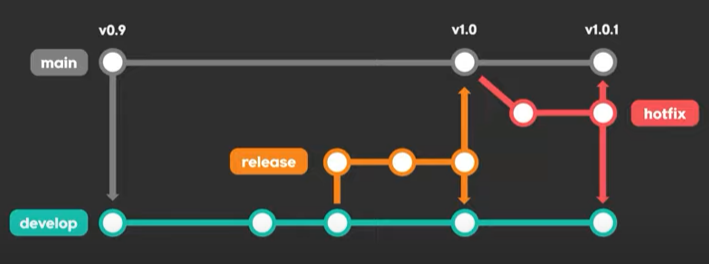
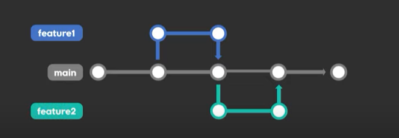

## 2022-07-16-GitFlow-VS-Trunk-based-협업방식

## 목차

>00.프로젝트관리
>
>01.GitFlow
>
>>  01.1 Git Flow란? 
>>
>>  \01.2 장단점
>
>02.Trunk-based
>
>>  02.1 Trunk-based란?
>>
>>  02.2 장단점
>

## 00.프로젝트관리

- 프로젝트가 커져도, 사람 많아도 branch, merge 깔끔하게 하고 싶은 경우
  - Git FLow
  - Github Flow
  - Trunk-based
  - Gitlab Flow

## 01.GitFlow

### 01.1 Git Flow란? 

- GitFlow에서 사용하는 브랜치

  - main
  - develop
  - feature
  - release
  - hotfix

- 1.0버전에서 신기능이 들어갈때

  - 현재 까지 만든것 main 이고 v0.9라고 할때
    - 여기에 신기능의 코드짜서 Push 하면 안된다.

  - 기본코드를 develop라는 것의 브랜치를 딴다.

    - 여기에 개발을 하는데 여기에 신기능 추가
    - 그렇게 되면 원본코드를 건들지 않기때문에 main은 안전함

    - 그렇다고 develop브랜치에 바로 다이렉트로 푸시하지 않음

  - feture라는 브랜치를 딴다. 거기에 신기능 같은 것을 개발을 하고 잘된다고 생각들면 devlop에 merger를 한다.
    - 이름의 형식은 길드를 추가하는 경우라면
      - feature/guild 라고 명명한다.

  - develop자체가 만족스러워서 1.0으로 출시한다면

    - 이때 상남자라면 메인에 다이렉트로 Push해도됨

    - 하지만 불안하기 때문에 release브랜치를 만듦

  - release브랜치에서는 테스트, QA를 진행하고 수정할것이 있으면 수정도 하면 된다. 
    - 그리고 만족 스럽다면 이때, main브랜치에 합치면됨
    - 그리고 계속 개발이 되어야하기 때문에 이 release를 develop에 머지해놓는다.

  - 유저가 버그를 발견한 경우
    - 급한경우 hotfix라는 브랜치를 만ㄷ르어서 버그를 수정해서 
      - v1.0.1버전을 main과 develop로 머지한다.

### 01.2 장단점

- 장점: 안정적으로 버전별 배포가능
- 단점: CI/CD 하는곳은 안좋아함
  - 그래서 상황에 맞게 변형해서 쓰면 좋음

## 02.Trunk-based

### 02.1 Trunk-based란?

- 브랜치 하나만 잘 관리하자
  - main하나만 이용하고
  - 기능이 필요하면 feature1, feature2 브랜치 따서 메인에 merge하는식으로 적용하는 것
- GitHub Flow도 이와 유사
- 그냥 master머지하고 테스트후에 바로 마스터를 배포하는것이 아니라 master에서 RC(릴리즈용)브랜치를 따서 그 브랜치를 테스트하고 문제없으면 RC2022.7.16 식으로 배포하는것

### 02.2 장단점

- 장점: 소스코드가 한곳에만 있어서 관리가 편함 복잡하지 않음
  - 테스트나 배포 자동하는 곳에 쓰면 좋은 점이 있음
  - 안정화된 프로젝트들이 잘씀
- 단점: 메인에 있는것 바로 유저한테 배포하기 때문에 더 많고 자주 테스트를 해야함