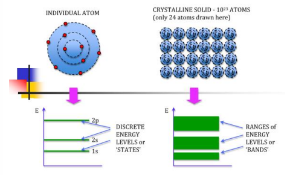

## 2022-07-16-비전공자를-위한-반도체이해

## 목차

## 01.반도체와 반도체 소자

### 01.1 Semiconductor? 반도체?

- 반도체는 전기 전도도를 인위적으로 변화시켜 도체와 부도체로 바꿀수 있는 물질
  - 이것을 이용해서 소자를 만들기 위해 그렇게 원하는 기능을 수행하게 하게함
    - 여기서 전기 전도도는 전압을 주었을 때 전류가 어느정도 흐르는지를 나타내는 것
- 도체: 전기가 흐르는 물질
- 부도체: 전기가 흐르지 않는 물질
  - 이것의 중간 성질을 반도체 라고 한다.

### 01.2 Semiconductor

- 대개 8개의 전자를 가지고 있어야 안정적이다.
  - 그래서 4족원소인 SI, GE를 쓰거나
  - 3족과 5족의 화합물인 GaAs, InP등을 쓴다.

### 01.3 그래핀(Graphene)

- Graphite는 층층이 있는것을 말하고
- Graphene은 Graphite의 층을 떼어놓은것을 말한다.
  - 처음 발견된 것은 테이프로 연필의 흑연부분을 뜯어 빼는 식으로 그래핀을 생성했다고 함 이를 통해 노벨상 수상 받음
- 그래핀은 Si 대비 전하이동도가 1000배이상이다.

### 01.4 반도체, 전기전도도(Conductivity)

- 전하 캐리어 몇개 있는지는 얼마나 빨리 움직일 수 있는지를 나타내는 것이다.

  

  - 전하캐리어의 숫자를 늘렸다 줄였다 하면서 조절을 한다.

### 01.5 전하캐리어(Carrier)

- 모든 전자 != 전하캐리어
- 최외각 전자 != 전하캐리어
  - 모든 전자, 최외각이 전하 캐리어는 아니라는 소리임

### 01.6 에너지 밴드

- 입자, 웨이브 파동 이런것은 특정 에너지에만 존재 할 수 있음
  - 고체여서 유일해야 하는것 (양자역학에서 파울리 베타 원칙이라고 한다.)
  - 즉, 고체로 정제를 하게 되면 같은 파동이 존재한다. 이름 조금씩 벌려 electrons band를 형성한다.

### 01.7 전하캐리어와 에너지 밴드

- electron band (-)
- walence banded (+)차지 hold라고함

- **에너지는** 
  - 열, 빛, 전기, 위치 같은 물리적 에너지 전달 해주면 캐리어를 만들어낸다.
    - 우리가 쓰는 반도체는 이중에서 전기 에너지를 통해 캐리어를 만듦
  - 우리가 덥다고 느끼는 이 열도 에너지라고 함
  - 에너지 밴드 갭을 크게 하면 캐리어 수 적고
  - 에너지 밴드 갭을 작게 하면 캐리어 수는 크다.
- **반도체는 적당한 에너지 밴드 갭을 가지고 있음**
  - 이를, 이용해서 전기를 통하게 하고 안하게 할 수 있는 것
- **절연체에서의** 
  - 전자가 없음의 그림의 경우
    - 움직일수 있는 공간은 있는데 움직일 놈이 없는 것임
  - 전자가 꽉 참의 경우
    - 위의 그림과 같이 전자가 꽉차서 움직일 수가 없는 것
- **에너지를 받았을 때 밴드 구조를 보게 되면**
  - 에너지를 받을 때 Conduction band에 보면 그림처럼 전자캐리어 하나가 튀어 올라가는 것이 생긴다.
  - 그렇게 되면 Valence band에서는 홀이라고 하는것이 생기는데 
    - 그림처럼 한개가 비어서 움직이기 시작한다.
  - 여기서 컨덕션 밴드에 올라간것을 전자를 Valence band의 hole을 말하고 
    - 이것을 (+)차지가 움직인다고함 그것이 -가 움직인다는 표현보다 구분하기 쉬워서 그렇게 말한다고함

### 01.8 반도체가 중요?

- 중요한것은 반도체 소자이다.
- 반도체는 반도체 소자를 만들기 위해 필요한 물직일뿐

### 01.9 Semiconductor device? 반도체 소자?

- 반도체소자: 
  - 외부에서 전기적 신호를 가해 전기신호를 전달하거나 증폭, 정류, 스위칭, 송전, 수전할 수 있도록 하는 기구
  - 전기가 통하는 도체와 통하지 않는 부도체 상태를 갖도록 변화시킬 수 있는 물질을 이용한 소자
- 웨이퍼에 다이라는 곳에 하나로 만들어 공정해서, 집적회로 만듦 -> 이런 칩을 반도체 소자라고 함

## 02.반도체의 역사와 발전/ 컴퓨터와 반도체

### 02.1 Telephone... Semiconductor

- 1876년에 전화라는것이 생겼는데
  - 이때, 이건 정말 사업아이템이다? 돈이 될거라 생각하고
- 1883년 AT & T설립
  - 그리고 1907년 증폭할 수 있는 것이 나오게됨 이는 흡사 진공관 같음
- 그리고 1925 Bell Lab이라고 부르는 Bell Telephone Laboratories설립이됨
  - 이때의 핵심 과제는 이전까지 증폭을 하는 Amplication이 잘깨지는 현상과 전기를 많이 먹는 경우가 있었는데 이를 해결하는 것이였음

### 02.2 진공관 소자

- -V라는 곳의 흐르는 전압양에 따라 흐름이 제어됨
  - `-`가 많으면 적게흐르고
  - `-`가 적으면 많이 흐름
- 반도체가 나오기 전 이것이 모든 일을 했음

- 반도체 고체라서 깨지지 않고 전기를 덜먹음 이를 만든 사람들의 사진
  - 사실 위사진도 왼쪽에 있는 분이 만들고 가운데 있는 사람이 팀장이라고 한다.
  - 이때 팀장이 아무것도 하지는 않았는데 만든사람이 왜 팀장은 개발에 아무런 참여도 하지 않았는데 왜 같이 특허를 내야하나? 했다고 하는데 이때 가운데 있는 팀장이라는 사람은 개발했던것을 카피해서 조금 다르게해서 같은아이디어에 다른 특허를 냈다고 한다. 이때 벨 랩에서는 사회적 으로 회사에서 그런 싸우는 모습이 기업의 이미지상 좋지 않았기에 위에 사진을 찍는다고 했다고함
  - 사진을 찍은 위치는 실제 개발이 진행되었던곳 하지만 가운데 있는 팀장은 처음 앉아봤다고 한다. 그래서 이사진을 찍을때도 불만이 많았다고 한다. 
  - 모르는 누군가가 보면 가운데 사람이 제일 주도적으로 한 사람으로 보여지기때문에 알게 모르게 아래사람의 공로는 가져가려고 한게 아닌가 했다고함
- 그리고 왼쪽에 있는 사람은 존바딘이라는 사람인데 물리 노벨상을 2번 받은 진짜 대단한 사람이다.
- 가운데 있는 사람은 성격이 안좋기로 소문과 정말 많은 직원과 싸웠다고 한다. 하지만 이사람의 업적은 지금 실리콘 벨리라고 부르는 곳에 실리콘이라고 하는 반도체를 처음가져가 사업한 사람이라고 한다. 
  - 윌리엄 쇼클리라는 사람은 자기 회사를 차리기 위해 8명의 뛰어난 인재를 데리고와서 일을 했지만 성격 때문에 연구원 8명이 회사를 그만 두고 다른 회사에 사업부를 만들고 이를 쇼클리는 배신자8인이라고 했다고 한다. 여기서 인텔을 만들 사람이 있다고 한다.

### 02.3 반도체 소자를 이용한 제품들의 출시

- 보청기와 라디오 등이 나오기 시작했다.

### 02.4 전쟁과 반도체

- 세계 2차대전으로 새로운 기술의 발전이 이루어졌음
  -  좋은 품질 반도체 만들수 없었는데, 이유는 반도체 소자로 쓰기 위해서는 완전 순수한 것이어야 했음

- Zone refining을 보면 Metal road 쪽으로 불순물이 이동하여 순수한 것을 만들었다고함
- float zone역시도 순수한 반도체를 만드는 과정임
- Colossus는 암호 해독하는 계산기이다.

- 플래시 메모리
  - 삼성, sk하이닉스. 도시바((현) 키오시아)
- 위의 아키텍쳐는 폰노이만 아키텍처라고함
- CPU
  - Intel, AMD
- DRAM
  - 삼성, sk, 마이크론

### 02.5 Computer

- 1945 최초 컴퓨터 애니악 
  - 이를 켜면 주변 일때가 정전되거나 불이 약했다고 한다.
- A system bug
  - 고장이 났을 때가 있는데 이때 이유를 보니 진짜 벌레가 들어가 고장이 났다고 한다. 이후에 그래서bug라고 쓴다고함
- 수은 지연 메모리
  - 수은이 느려서 그런 느린점을 이용해서 정보를 빼냈다고 한다.
- 자기 코어 메모리 (수은 지연 메모리에서 발전한것)
  - 자기 유도 되어 N,S극 뒤 바뀌면서 빠지게 해서 사용

### 02.6 컴퓨터는 어떻게 작동을 할까?

- 위처럼 어떤 특정 조건일때 불을 켜고 끄고 하는것이 작동원리임을 설정
  - A
    - 해가 안뜬 경우 0
    - 해가 뜬 경우 1
  - B
    - 차가 없는 경우 0
    - 차가 있는 경우 1
  - C
    - 비가 안오는 경우 0
    - 비가 오는 경우 1
- 여기서 비가 오면 무조건 가로등이 켜지는 것이고
- 해가 뜬 경우라면 비올때가 아니라면 차가 지나가도 불이 켜지지 않음
- 해가 안뜬 경우라면 차가 지나가면 무조건 불이켜져야함

### 02.7 Claude Elwood Shannon

- 21세 나이로 디지털 회로 설계를 만듦
- 스위치로 Boolean 대수 를 풀 수 있음을 보임
  - 즉, 스위치만 있으면 모든 계산을 할 수 있다라고 함

### 02.8 Transistors

- 위의 스위치만 많이 넣어서 쓰면됨
  - 계산이 많아 질수록 써야하는 스위치수가 커짐
    - 이러면 납땝의 개수도 늘어났었음
- 요즘은 MOSFET이락 하는것을씀

## 03.집적회로(IC)의 탄생과 스케일링 (무어의 법칙)

### 03.1 To Texas and to California

- 최초의 Si 트랜지스터
  - 실리콘 시대를 열었음
  - 텍사스 인스트로먼트 Ti 회사
- 1956년 9명을 스카웃하고 그중 8명이 나와서 1957년 다른 회사 만듦 이회사가 인텔

### 03.2 Integrated circuits

- 직접 소자 
  - 신호 들어오고 나가는 것 한판으로 만든것
    - 이를 평면으로 만들어 부도체, 도체 깎아서 만듦

- 직접회로라고도 하는 것으로 선이 많은 경우 걸리적 거리기 때문에 한층 올리고 올리고 한것의 모습임

### 03.3 직접회로의 탄생 -> 소자미세화의 시대

- 왜? 대단하나?
  - 웨이퍼에 똑같은 숫자 한개씩 만듦
  - 작을수록 많은 칩을 만들 수 있음
  - 벌어오는 돈이 다름 , 칩하나의 가격이 같을 때 
    - 20 * 1 , 20 * 4 의 차이로 더 많이 벌기 때문
  - 즉, 점점 작게 만들면됨
- 다시 쌓는것을 Pack, Package이다.
- 위의 가장 조밀한 다이를 보면 1cm 에 대략 `500억개 정도가 들어 있음`
  - 작게 만들면 좋은 점은 직접도 올라가고 작게 만들면 스위치 성능이 좋아진다.

### 03.4 Wafer Size Scale-up

- 웨이퍼의 크기를 늘리면됨
- 10년에 한번 크기 키웠고 현재 300mm가 최종임
- 그럼 이런 반문을 할 수있다 더 크게 만들면 이득아닌가? 왜 300 mm인가?
  - 한회사만 독점으로 그럴 수 없음 장비를 표준화하기 위해서 수직적이라고함
    - 그렇지만 수평적 협업을 한다고 함
- ITRS라는 로드맵을 만들었음

### 03.5 반도체 수율

- 다이중에 살아있는 것의 비율
- 작게 만들고 웨이퍼 크기 크게 수율 높게 만들기

### 03.6 Scaling down

- Gate에 전기 주느냐 아니냐에 따라 다른다.
- 작게 만드는 이유
  - 많이 집어넣을 수 있음
  - 빠르다 위의 그래프와 그림을 보면 점점 줄어든다.
    - 빠르다라고 할 수 있는것은 크기가 크면 그만큼 저항이 발생한다. 이것이 짧으면 짧을 수록 저항이 적어서 빠르다고 보면된다.

## 04.반도체 소자의 종류와 반도체 산업구조

### 04.1 IC Changes everthing

- 애니악보다 intel 4004가 17배 성능이 좋음

### 04.2 Dawon Kahng(강대원 박사)

- MOSFET 
  - MOS트랜지스터 만듦
  - BJT는 작게 만들기 쉽지 않음 하지만 MOSFET의 경우 작게 만들 수 있음
- 이를 메모리로 사용 -> 낸드 플래시 메모리로 사용했었음

###  04.3 MOSFET(Metal-Oxide-Semiconductor Field Effect Transistor)

- nMOSFET의 경우
  - 전기가 흐르면 켜진다.
  - 전기가 흐르지 않으면 꺼진다.
    - electronic 왔다갔다 하는 것
- pMOSGET의 경우
  - 전기가 흐르면 꺼진다.
  - 전기가 흐르지 않으면 켜진다.
    - (+)가 왔다갔다 하는 것
- 두 가지 만드는 것 반대로 동작하기 때문에

- 실리콘에 다른 것 집어 넣음
  - 5가를 넣어줌, 하나 남은게 컨덕션 밴드로 올라감
  - 전기 안통함
- 3가 넣음 그렇게  eletron을 받아서 홀을 만듦
- 즉, 바이어스하면 P가 N으로 바뀜 그래서 NNN 전기 통함

### 04.4 CMOS란 무엇인가?

- Complementary metal-oxide-semiconductor
  - Complementary: 상호보완, 보충(두가지를 같이써서) N, P같이 쓰는 것 CMOS

- nMOSFET과 pMOSFET의 각 Gate에 넣고
  - nMOSFET의 Drain, pMOSFET의 Source에서Output이 나옴
- AND, OR, NOT 할때 같 이 써서 만듦
  - 즉, 로직 회로 만드는 기술 1대1로 같은 숫자를 씀

### 04.5 좋은 스위치가 필요

- 켜졌을 때 확실히 흘러야해 꺼졌을 때 안 흘러야함
- 신속정확함
- 작은 전압으로 가능

### 04.6 why scaling is necessary? (Inverter Switching)

- 물을 많이 흐르는 하는법
  - 길이를 줄여주는것
  - 스피드 빨라지는 이유

### 04.7 Demmard's law

- 속도 빠르고 전기 많이 안먹는 법칙

### 04.8 Transistor scaling

- 문제가 생김 
  - 2년마다 줄임 0.7만큼
  -  근데 왜 0.7만큼 줄이는 이유는 0.7줄이면 면적이 0.49가 줄게 되는데 이게 면적이 절반이 줄게 되어서 0.7만큼 줄이는것

### 04.9 Uni-axial Strain Silicon Transistors (Non classical scaling)

- NMOS를 당겼더니 더 빨라짐
  - 이게 중요한것이 사이즈를 줄인것이 아닌데 속도가 빠라진것이 포인트
    - 옥사이드가 전기 막아줘야하는데 이를 High-K라고함
      - 이를 더큰것을 사용함 대략 45nm node정도

### 04.10 VTFET(Vertical-Transport Nanosheet Field Effect Transistor)

- 오른쪽에 잇는것 같이 세우게 되면 더 직접할 수 있음

### 04.11 Device size scaling -> Circuit-level scaling

- EUV는 Contact올리기 위해서 사용도함

- 사이즈 작게 하는것 한계가 있음
  - 이것을 분자 크기 이하로 갈수가 없기 때문에도 문제이고
  - 점점 분자크기로 다가가는데 어려움을 겪고 있음 그렇기 때문에 EUV장비가 비싼것

### 04.12 Memory 소자

- SRAM
  - 이것 빠르다 CPU만들때 같이 만듦
  - 안정적이라고 하는것이 1일때 0이되고 0일때 1이되는게 
    - 서로 호환되어 안정적이라고함
- DRAM
  -  1이라고 적혀있는 부분이 커패시터인데
    - 이를 작세 만들면 안된다. 이것때문에 커짐
    - 즉, 저장 용도로 사용함
- NAND flash memory
  - FG라는 곳에서 전하를 잡고 안잡고의 차이로 0 또는 1이됨
  - 비휘발성 메모리, 데이터 저장 용도로 사용

### 04.13 DRAM

- 이렇게 작지만 작지 않게 만드는것
  - 위에처럼 양을 높이는 식으로 함

### 04.14 NAND Flash memory 발전방향

- 위에처럼 누워 있던것을 세우기 시작함
- 미세화가 어려워지고 EUV 써야해서 비싸지게됨
  - EUV장비는 대략 2000억 정도함

### 

- 하나하나가 트랜지스터임
  - 높이고 구멍을 뚫는것이 어려움
    - 오른쪽 끝에 있는 사진의 모습을 보면 일자로 뚫려야 이상적이지만 아래로 갈수록 뾰족해지는게 문제임

### 04.15 반도체의 종류

- DRAM
  - KMC, 삼성UMC,SMRC(중국)
- CPU
  - 회사가 다 다름
  - 설계와 만드는 회사다르다.

### 04.16 반도체 산업의 전후방 구조

- 항상 차량 반도체가 부족하다고 하는데 이유는
  - 싼 반도체가 문제임
  - 케파가 부족해서 돈이 안되는것을 줄여서 부족현상이 발생

### 04.17 팹리스와 파운드리

- 팹리스
  - 애플, 엔비디아
  - 도시를 계획하는 곳과 비슷, 팹리스의 할일
- 파운드리
  - 만드는 방법을 아는곳 파운드리

## 05.반도체소자의 미래 발전 방향

### 05.1 반도체

- 1초 1000번씩 속도가 증가 목표 점점 증가
  - 로드맵 만족시킬수 있던 이유는 Scailing으로 만족됨

### 05.2 End of Moore's Law Will Lead to New Architectures

- 반도체는 무엇하는지
  - 직접공정이 많은 일함
  - 많은 숫자 동시에 만드는것이 어려움
  - 이를 반도체 공정으로 할것이다.
- 3 QUANTUM COMPUTING
  - 양자시뮬 보안에서는 빠름
- 속도빠르게 해주는 것은 아니다.
  - 다른 소자를 만들어서 가는 방법으로 가지만
  - 또다른, 방법으로는 다른 트랜지스터 방식으로 가는법
  - 다른 컴퓨팅 -> NEURO MOPHIC

### 04.15 Beyond CMOS

- CBRAM을 보면 다른 모습같이라는것이 인간 신경망 같이 하는것 	
  - 이를 뉴럴모픽이라고함

 ## 06.반도체 집적소자 제조 공정

### 06.1 반도체 집적소자

- FEOL
  - Front End Of Line 중요 소자 만드는 공정
- BEOL
  - 배선 만드는 라인

### 06.2  반도체소자를 만드는 것은 도시를 만드는 것과 유사

- 층별로 한번에 지어서 올라간다.
  - 좀 3D프린터 같은 느낌을 받음

### 06.3 High performance device development

- 소자에서만 할 수 없음
  - 장비와 소자에서 같이 해야함

## 07.반도체 8대 공정 Quick Review

### 07.1 반도체 8대공정

### 07.2 Making Semiconductor Structures

- 제일 끝의 오른쪽 원통을 잘라서 웨이퍼 만듦
- (001) Flat이라는게 있는데 이는
  - 방향을 알기위해서 방향 만드는것

### 07.3 산화공정

- Interlayer dielectric
  - 층간 전기 안통하게 하는 것
- Diffusion mask
  - 도핑할 때 사용, 옥사이신 두껍게 안들어감
- C-V measurement
  - 증착해서 산화막 생성
  - 색을 봐서 두께측정

### 07.4 What is Lithography?

- 툴이 비싸고 작은것 그릴수 있는것이 빛의 파장을 모아는것이 비쌈
- 소자 제작 공정중 60프로를 차지하는데 시간을 많이씀

### 07.5 Single Slit/ Circular Aperture Diffraction Pattern

- 꺽기는 정도
  - 파장이 짧으면 작게 꺾기고
  - 파장이 길면 꺾임
- 오른쪽 끝에 빨간선 그래프를 보면
  - 작게 그리기 힘든것 이 빨간선 그래프3개를 보면 알 수 있음
  - 가까우면 점점 합쳐져버린다 그래서 파장 짧은것을 이용해야함

### 07.6 Resolution and DOF

- 파장이 점점 작아짐, 파장은 에너지인데
  - 지구상에 존재하지 않는 것을 만들기 때문에 돈이 많이 듦
- 그래서 좀더 덜 휘게 하기 위해서 물에 넣고도 함

- EUV는 작은 빛을 모아서 모은것이다. 그래서 비싸다.

### 07.7 Requirements for Desirable Deposition 

- 위의 조건을 잘 만족해야 좋음
  - 오염물 적어야하고 Step coverage도 균일해야함
  - 위는 잘 덮은 경우 잘 못 덮은 경우임
- 두께 동일, 조성 동일, 등이 지켜져야함, 300mm에 균일하게 되어야 증착 잘된것

- 저게 제대로 안쌓이게 되면 위쪽에  불룩 튀어 나온것 때문에 점자 막히게됨 빈공간을 잘채우는것도 잘 고려해야함
- 잘못하면 아래와 같은 그림같이 보이드가 생김

	- 이런 보이드가 생긴것은 바라는 증착이 안된것

### 07.8 Deposited thin films

- PVD
  - 오염될 가능성 적음
  - 장점: 왠만한 물질 다됨
  - 단점: 한장씩해야함
    - 피지컬하게 뜯어서 떨어져서 붙는 것
- CVD
  - 화학 물질이 있어야하 가능
  - 장점: 한번에 여러개 할 수 있음
    - 배치 프로세스 가능, 생산량 throuput이 좋음
  - 열에 의한 스트레스 적어야함
  - 반응이 일어나면 안됨
  - 실리콘 옥사이드로 가스를 흘려서 화학 반응 일어나서 덮어지는 것

### 07.9 식각 Etch

- 원하는 부분 깎아내는 것
- 버티는것은 높은것 유지하려고
  - Hard, 마스크 이용해서 더 잘깎으려고함

### 07.10 Etch basic

- Etch에 쓰이는 것
- 원하는 부위만 긁어내는것

- 회색 영역을 뚫고 들어오면 안됨
  - 화학적은 화학결합 이용해 녹여내는것
  - 물리적은 두들겨 패서 만드는 것
- Selectivity
  - 내가 etch하고 싶은것 etching 하는지 
    - 에칭 필요 없으면 레이던시가 느렸으면 좋겠다는 것
    - 선택적으로 녹이는것이고 클수록 좋음

## 08.전체 반도체 IC 제작 공정

