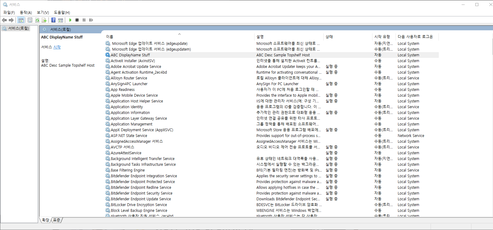

## 2022-07-18-Topshelf에대한-기능조사와-간단한-서비스생성

## 목차 

>01.Topshelf를 사용하는 이유
>
>02.Topshelf 구성 확인하기
>
>>02.1 서비스이름
>>
>>02.2 서비스 설명
>>
>>02.3 이름 표시하기
>>
>>02.4 인스턴스 이름
>>
>>02.5 간단한 서비스
>
>03.Topshelf 사용해보기
>
>>03.1 프로젝트 생성후 Topshelf패키지 설치
>>
>>03.2 서비스 테스트를 위한 소스 구현
>>
>>03.3 서비스 설치
>

## 01.Topshelf를 사용하는 이유

- 윈도우 서비스는 디버깅이 힘듦

- 디버깅을 하려고 하면 항상 경고창이 나타나서 꼼수를 이용하여 디버깅을 함

  ```csharp
  static class Program
  {
      static void Main()
      {
  #if DEBUG
          var service = new SampleService();
          service.Start();
  #else
          ServiceBase\[\] ServicesToRun;
          ServicesToRun = new ServiceBase\[\] 
          { 
              new SampleService() 
          };
          ServiceBase.Run(ServicesToRun);
  #endif
      }
  }
  ```

  - 위의 방식 자체가 틀린건 아니지만 최선은 아님

  - Topshelf 자체가 훨씬 더 편리하게 타이머 적용할 수 있어서 윈도우 서비스를 특정 시간대에만 작동할 수도 있다는 장점있음

## 02.Topshelf 구성 확인하기

### 02.1 서비스이름

- 위의 설정은 선택사항

  - 기본적으로는 Program.cs파일의 네임스페이스를 사용함

    ```csharp
    x.SetServiceName("MyService");
    ```

### 02.2 서비스 설명

- 서비스 제어 관리자에서 서비스에 대한 설명 지정

  - 선택사항이고 , 기본적으로 서비스 이름임

    ```csharp
    x.SetDescription("My First Topshelf Service");
    ```

### 02.3 이름 표시하기

- 서비스 제어 관리자에서 서비스의 표시 이름을 지정

  - 선택사항이고, 기본적으로 서비스 이름임

    ```csharp
    x.SetDisplayName("MyService");
    ```

### 02.4 인스턴스 이름

- 기본 서비스 이름과 결합됨 $로 구분되는 서비스의 인스턴스 이름을 지정

  - 이것은 선택사항이고 지정된 경우에만 추가

    ```csharp
    x.SetInstanceName("MyService");
    ```

### 02.5 간단한 서비스

- 기본틀

  ```csharp
  HostFactory.New(x =>
  {
      x.Service<MyService>();
  });
  
  // Service implements the ServiceControl methods directly and has a default constructor
  class MyService : ServiceControl
  {}
  ```

- 실제 사용

  ```csharp
  var rc = HostFactory.Run(x =>                                   //1
                           {
                               x.Service<TownCrier>(s =>                                   //2
                                                    {
                                                        s.ConstructUsing(name => new TownCrier());                //3
                                                        s.WhenStarted(tc => tc.Start());                         //4
                                                        s.WhenStopped(tc => tc.Stop());                          //5
                                                    });
                               x.RunAsLocalSystem();                                       //6
  
                               x.SetDescription("ABC Desc Sample Topshelf Host");                   //7
                               x.SetDisplayName("ABC DisplayName Stuff");                                  //8
                               x.SetServiceName("ABC ServiceName Stuff");                                  //9
                           });  
  
  public class TownCrier
  {
      readonly System.Timers.Timer _timer;
  
      public TownCrier()
      {
          _timer = new System.Timers.Timer();
          _timer.Interval = 1000;
          _timer.Elapsed += (sender, eventArgs) =>
              Console.WriteLine("It is {0} and all is well", DateTime.Now);
      }
  
      public void Start()
      {
          _timer.Start();
      }
  
      public void Stop()
      {
          Thread.Sleep(100000);
          _timer.Stop();
      }
  }
  
  ```

## 03.Topshelf 사용해보기

### 03.1 프로젝트 생성후 Topshelf패키지 설치

- Windows Service로 프로젝트를 생성한다.


- 프로젝트 생성을 하고 프로젝트에서 오른쪽 마우스 버튼 클리

  - Manage NuGet Packages 클릭

    

    

    - topshelf 검색 후 설치

      

      

### 03.2 서비스 테스트를 위한 소스 구현

- 우선 소스 자체를 입력하고 빌드를 해준다.

```csharp
using Topshelf;

public class TownCrier
{
    readonly System.Timers.Timer _timer;

    public TownCrier()
    {
        _timer = new System.Timers.Timer();
        _timer.Interval = 1000;
        _timer.Elapsed += (sender, eventArgs) =>
            Console.WriteLine("It is {0} and all is well", DateTime.Now);
    }

    public void Start()
    {
        _timer.Start();
    }

    public void Stop()
    {
        Thread.Sleep(100000);
        _timer.Stop();
    }
}

public class Program
{
    public static void Main()
    {
        //TownCrier townCrier = new TownCrier();
        //townCrier.Start();

        //Console.ReadLine();
        //townCrier.Stop();

        var rc = HostFactory.Run(x =>                                   //1
        {
            x.Service<TownCrier>(s =>                                   //2
            {
                s.ConstructUsing(name => new TownCrier());                //3
                s.WhenStarted(tc => tc.Start());                         //4
                s.WhenStopped(tc => tc.Stop());                          //5
            });
            x.RunAsLocalSystem();                                       //6

            x.SetDescription("ABC Desc Sample Topshelf Host");                   //7
            x.SetDisplayName("ABC DisplayName Stuff");                                  //8
            x.SetServiceName("ABC ServiceName Stuff");                                  //9
        });                                                             //10

        var exitCode = (int)Convert.ChangeType(rc, rc.GetTypeCode());  //11
        Environment.ExitCode = exitCode;

    }
}
```


- 관리자 권한으로 실행하고 그 해당 프로젝트 부분으로 간다.

- 그리고 해당 명령어를 입력

  ```sh
  .\TopShelfConsole.exe
  ```

  - 동작시키면 아래와 같이 동작


### 03.3 서비스 설치

```sh
.\TopShelfConsole.exe install
```




- 서비스가 생성됨이 확인이됨

```sh
.\TopShelfConsole.exe uninstall
```

- 위를 하면 삭제됨