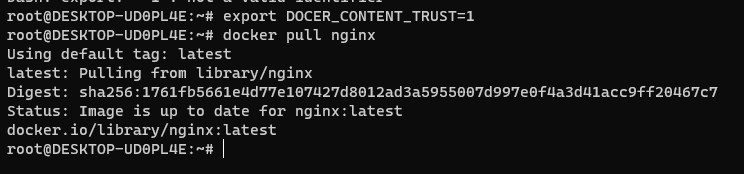
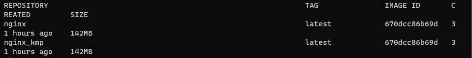
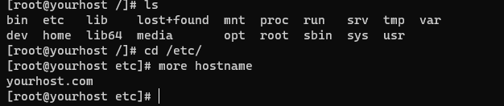
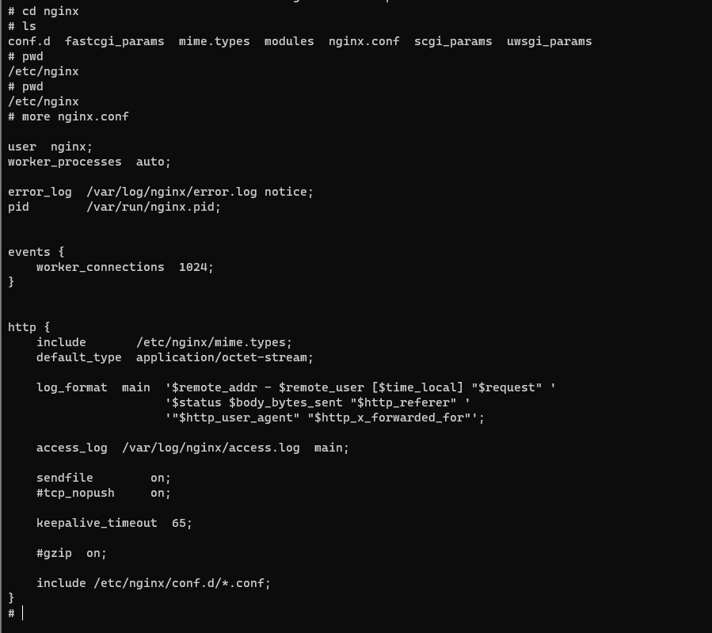
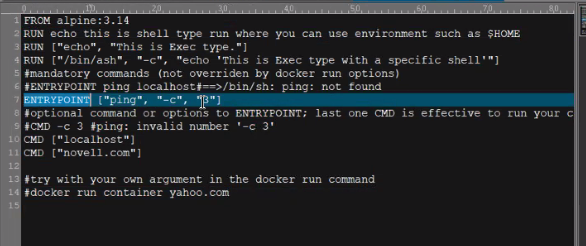
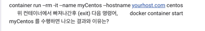

## 2022-07-21-미니프로젝트-IT-BestPractice

- 이미지 pull



- 이미지 삭제 |  강제삭제
  - docker image rm -f nginx

- docker hub 계정있으면 
  - 내 레파지토리로 사용할 수 있음

- 도커 이미지 이름 변경 등등

  - docker image tag nginx nginx_kmp

    

  - 서비스를 하는것은 컨테이너에서 띄우는 것

  - 컨테이너 사용중이라면 강제로 하니 조심해야함

- docker create --name justBron -it alpine /bin/sh

- 도커 띄우기
  - docker container start 
  - 도커 run
    - docker run --name justBorn -d -it alpine /bin/sh
    - 

- nginx 설치
  - docker run --name ngnix-test -d -p 80:80 ngnix

- Centos

  - docker container run --rm -it --hostname yourhost.com centos
  - 
    - 컨테이너 자체를 hostname 하고 싶은 경우 
  - --rm 쓰면 종료가 되면 죽게 됨 테스트 용도로 사용하면 좋음

- docker exec -it nginx-test /bin/sh

  

  - 기본 설정파일

  ### volume mgmt

  - 자원관리할때 좋음
  - 컨테이너 쓴다는것이 아무말을 안하면 그냥 만들어진곳에 그냥 관리해주는 걸 쓰고 사라지면 다 지워버린다.
  - 위험하기 때문에 파티션이 날아가는것을 방지하기 위함
  - docker run --name myNginx -v $Home:/user/share/nginx/html:ro -d -p 82:80 nginx
    - 볼륨 매핑

  ## network mgnt

  - 대개 그냥  bridge를 사용하게됨
    - 직관적인 이름을 주고 사용하면됨
    - --link를 이용해서 서로 같은 네트워크를 사용

## 백업 & 복원 

- 백업 , 복원 해보기

## docker file and docker compose 



```y
FROM alpine:3.14
RUN ["echo"]
ENTRYPOINT ["ping", "-c", "3"]
CMD ["yahoo.com"]
```

```
root@DESKTOP-UD0PL4E:/home/mini# docker run image:test
PING yahoo.com (74.6.143.26): 56 data bytes
64 bytes from 74.6.143.26: seq=0 ttl=37 time=180.985 ms
64 bytes from 74.6.143.26: seq=1 ttl=37 time=182.733 ms
64 bytes from 74.6.143.26: seq=2 ttl=37 time=181.374 ms

--- yahoo.com ping statistics ---
3 packets transmitted, 3 packets received, 0% packet loss
round-trip min/avg/max = 180.985/181.697/182.733 ms
root@DESKTOP-UD0PL4E:/home/mini# docker run image:test www.naver.com
PING www.naver.com (223.130.200.107): 56 data bytes
```

- 사이트를 지정해서도 가능함
  - 원하는 이미지 만들면 쉽게 사용할 수 있음

### docker compose 파일

```yaml
#usage:
#docker-compose up -d (백그라운드로 구동)
#docker-compose down
#-p <project name>
#docker-compose -p drupal up -d
#docker-compose -p drupal down
#docker-compose -p drupal -f ./docker-compose-drupal.yml up -d
#docker-compose -p drupal -f ./docker-compose-drupal.yml down

version: '3.1'
services:
  postgres-db:
    image: postgres:11
    environment:
      - POSTGRES_DB=drupal
      - POSTGRES_USER=user
      - POSTGRES_PASSWORD=pass
    volumes:
      - /postgres_db_for_drupal:/var/lib/postgresql/data
  web:
    depends_on:
      - postgres-db
    links:
      - postgres-db:postgres
    image: drupal
    volumes:
      - drupal-modules:/var/www/html/modules
      - drupal-profiles:/var/www/html/profiles
      - drupal-sites:/var/www/html/sites
      - drupal-themes:/var/www/html/themes
    ports:
      - "81:80"
volumes:
  drupal-modules:
  drupal-profiles:
  drupal-sites:
  drupal-themes:
  
#use postgres-db rather than localhost in advanced configuration of drupal web page
```

- php 솔루션 drupal 파일

- docker-compose -p drupal up -d
  - 도커컴포즈 파일 업로드

## 개인정보 | GDPR

- 우리의 동선이 서버로 들어가면 그게 완전 좋지는 않다고 생각함
- 어디서 빠져나갔다는 정보가 이렇게 노출이되면 문제가 있음
- 데이터를 다룰때 개인정보가 관련있으면 인지해야함

## 스케줄 작업

- 어떻게 하는지?
- cron을 반이상
  - os 자체
- quartz를 3분의 일정도 사용함
  - 자바 실행할때만사용
- 스케줄러는 큰 장애는 없는듯
- 정확히 관리만 되면 상관없다.

- 유지 보수 작업할때는 시간을 잘 설정해야함

## Quartz 실습

- java가 제대로 적용이 안되서 안됨

## 서비스 수준 관리

- SLM
  - 사용자 만족과 서비스 품질을 개선하기 위함

- 추진 조직 구성
  - sla작성나오도 안했는데 불가함

## 추진계획서 작성

- 추진목적
  - 기능추가와 문제가되는 부분에 대해서 투입되는 시간을 줄인다.
- 추진범위
  - 소프트웨어 유지보수
    -  테스트를위한 코드와 유지보수가능한 코드로 대체한다.
- 추진 기간
  - 2022-08-01 ~ 2022-08-31 
- 추진 조직 및 조직 내 역할과 책임
  - 해당 서비스 개발팀 추진
  - 서비스개발팀과 고객의 의견 절충하는 책임 가짐
- 목표수준
- 

## SLA초안작성

- 실현 가능한 목표수준 정의
- 초기 목표를 정한 후 개선 목표 수준을 충분히 높지 않게
- 처음하는거면 초기목표를 낮게 해야함
  - 그 측정치를 근거로 다음 6개월하면서 개선되고 잘되고 있음을 보여주는것이 좋음

## SLA 파이널

- 추진목적
  - 해당 서비스에 기능추가와 문제가되는 오류를 해결하는 부분에 대해서 투입되는 시간을 줄여 서비스를 정상화를 유지한다.
- 추진범위
  - 소프트웨어 유지보수를 위한 테스트 코드와 유지보수가 더 쉬운 코드로 리팩토링을 진행한다.
- 추진 기간
  - 2022-08-01 ~ 2022-08-31 
- 추진 조직 및 조직 내 역할과 책임
  - 해당 서비스 개발팀 추진
  - 팀장 역할: 서비스개발팀과 고객의 의견 절충
- 목표수준
  - 변경이 되는부분에서 오류가 나는 숫자를  50%이상 줄이는 것을 목표로 한다.
    - 10% 줄이는 경우 : 1점
    - 30% 줄이는 경우 : 5점
    - 50% 줄이는 경우 10점

## 애자일

- 칸반차트, 번다운차트
- 번다운차트
  - post-it으로 시간을 빼가는씩이고 마지막 시점일때 0이되어야하고 0이되는 그래프가 되어야함
- 지각인 경우 1달러씩
  - 이런 귀여운 패널티 같은것을 만들어놓으면 동기부여가 됨

## SLA 성과보고를 진행

- 한달에 한번정도 보고를 함
  - 문서를 보지 않을정도로 완벽해짐?

## ITIL4

- 6개 chain activities
  - 한서비스를 위한 개념과 인지로 부터 해당 서비스를 구체화하여 진행

## Guiding principles

- 인간에 포커싱
- 가시성 있어야함
- 전체론적인 즉, 전체를 볼 수 있는 프레임 워크가 완성되어야함
- 최적화와 자동화가 되어야함
  - best라는게 있을 수 있을까 생각해야함
    - 최적점을 찾는것이 회사의 성숙도를 올릴 수 있음
  - 이것이 끝나더라도 외부적 가이드 없어서도 진화테두리 있어서 성공할 수 밖에 없음
- 4개의 측정 모델
  - organ ->실무진과 경영진
  - ... -> 터미널 시스템
  - ... -> 시스템과 절차 , 소비자, 측정해서 볼수 있는 kpi, 감사
  - ... -> 파트너사업, 업체 등

## Cr의 LEAD 타임

- 체계적인 회사는 바로 적용하지 않음
- 언제 적용할지 cdr?Cr시스템에 넣으면
  - DEPOLY 타임을 넣는데 그 것에 대한 근거 누가 ...하는지 SUBMIT해서 이것을 매니저가 승인하는데 걸리는 시간
    - 승인하는 사람이 걸리는 시간까지 확인해서 cr이 적용되기위한 시간을 가늠해서 하는 시간
- CR을 SUBMIT하는 개념
  - 실제 구현하는 시간은 아님
  - 구현은 다한것이고 승인까지 걸리는것
    - 좀더 행정적이고 윗분이 실시간으로 승인안해질 수 있는것까지 포함해서 
  - 휴일이 껴있는 경우에도 4-5 일정도가 리드타임이된다.
- 새벽 1시에 deploy할껀데 금요일에 해달라고 하면 승인 안나면 cr이 안되는것

- LEAD타임 재설명
  - CRM에 change request하려고 할때
    - Target Service: CRM
    - Urgency: Critical
    - Issue Description: 
      - CR근거:...
      - CR검증: 홍길동
      - CR 테스트 해 봤어? 네 when ...
        - beta에서 해봤어? 네
    - deploy 날짜: 2022-07-25 01:00
    - Rollback: .....
      - 이런 것 말하기전에 미리 넣는것 시스템적으로 넣는 폼

- critical한 것이 있으면 이를 보는 조직도 있어야함
  - 중요하다는 것이 개인적인 생각일 수도 있음
  - 충분히 봤을때 괜찮다 했으면 CR요청을 하는 것
- 개발, deploy하는 사람따로 있어야하고 deploy를 검증할 줄 아는 사람도 있어야함

## FREEZE

- 한국어로 무엇이 좋을까?
  - 현행유지, 변동금지, 변동지양
- 약간 금요일저녁에 무슨일 주는것은 매너다?
- 프리즈 기간이 오면 통보를 한다고함
  - 어떤 경우더라도 시스템에 대한 변화를 금지하는 것

## Severity Level

- High impact & low ugency
  - impact 업무로의 영향도
    - 비지니스라고 생각하면됨
    - 망가지면 서비스 종료되고 마비되는 상황
      - 이런것을 피부로 느끼고 severity를 잘 정해야함
  - Urgency 긴급도 , 현상황이 실제 업무 영향이 끼치는

## Breached SLA

- 이슈설명, 영향도, 근본 원인, 원인 유형, 
- 조치, 상태, 담당, 완료일
- 재발방지안, 상태, 담당, 완료일

## Incident/ CR criteria

- 자세하게 들어가야함
- 프로젝트명
- COTS
- 영향도, 긴급도
- Proper title naming convention등등....
  - 대게 Ticket no.로 트래킹이 된다고함
- Subject  Matter Expert pair-review
  - 전문가, cR에 적용시 경고나 조언같은것?

---

- 정말 구현 내용 (매우 상세히)
- 구현근거
- 검증절차(상세히)
- Fallback plan(상세히)
  - 구현과정 반대로 식의 불성실하게 기록 금지
- 테스트 진행 여부
- Risk estimation

## CR Workflow - 실습 | Change Request

- Stakeholder:
- CS team
- 고객
- 팀장
- 개발자
- 팀장윗분
  - 윗분들이 참여하는 Emergency CR을 위한 워크 플로우 

```
고객 -> CS team -> 팀장 <-> 개발자 
고객 <- CS team <-팀장 -> 팀장 윗분 (이것의 경우는 아니라고함)
```

- 변화를 반영하겠다고 에스컬레이션하는 절차

## risk level check point example

- 이왕이면 해본사람이 하는게 좋음

## 의견

- 현재는 팀장님이 부재중이라 중요한 사항에 대해서 바로는 진행은 불가합니다.
- 그렇지만 1시안에는 할수 있는 방안에 대해서 빠르게 말씀드리겠습니다.

## RCA

- 이런것은 길게 쓸 필요가 없음 그럼 핑계같이 보이기 때문에

## 백업 & Recovery

- 시스템을 사용하나? 아니면 인간이하는지

###  Oracle - Logical 실습

- 물리적으로 데이터 저장
- 다시 백업

##  Troubleshooting

- 날씨등 이런것도 영향을끼침

- 여러 상항이 있음

## 가장큰 장애

- 우리 회사의 가장큰 장애가 ? 무엇이 있을까?

## 마지막은 테스트를 진행 예정

### 01.ICMP는 OSI7 layers계층중 어느 layer에 속하고 어느 명령어와 밀접한 관계가 있는지?

```
3계층에 해당한다.
```

```
ping이고 네트워크 레이어 3계층에 해당됨
```

### 02.다음 DB간의 가장 큰 차이를 설명

```
Mysql/redis/ mongo DB

우선 mysql은 rdb이고 redis, mongo DB의 경우 nosql기반이다. 즉, mysql의 경우 테이블 형식 , redis와 mongoDB의 경우 json형식이라는 차이가 있음
```

```
rdbms/ memory-db/ document-oriented
```

### 03.다양한 통신 방식 중 AS2를 사용하는 가장 큰이유는?

```
메시지를 안전하게 전송하기 위함이 큰것 같음 보안쪽으로
```

```
Ack message(MDn) 을 받기 위함
내가 안받았다는것을 속일 수 없음 증빙이 있어서
```

### 04.Impact, Urgency, Severity의 차이를 설명해주세요.

```
impact는 업무로의 영향도와 기준을 설립해야한다고 하셨고, urgency의 경우 현상황이 실제 업무에 끼치는 영향 의 시간, severity는 심각도를 나타낸다. impact는 업무로의 영향도, Urgency는 긴급도, 현상황이 실제업무영향이 끼치는 것
```

```
impact- 한사건의 실제 업무로의 영향도
urgency-긴급도, 현상황이 업무영향을 끼치는
serevi-심각도 상대적인 종합적 인지도 시간
```

### 05.SLA는 한 서비스에 대해 작성되면 특정기간(예 3년)내에 수정하지 않는다.

```
O
```

```
x
```

### 06.INcident와 Problem의 정의를 간단히 작성

```
incident는 설계된 대로 작동되지 않는 예기치 못한 서비스 장애 또는 품질 저하, 
Problem은 하나 이상의 사건에 대한 근본 원인
```

```
icident

problem

문서 내용 비슷
```

### 07.RCA는 반드시 장애가 해결되면 고객에게 제공

```
X
```

```
X
```

### 08.SLA가 왜 필요한지 기술

```
사전적인 답이 있겠지만 우선 고객에게 우리가 어떤식으로 해야하는지 부분을 더 말해주고 서류를 남겨서 어떤식으로 진행을 할지에 대해서 알려주기 위해 필요한것 같다 그리고 평가하는 부분을 통해서 우리가 무엇이 부족한지 더 무엇을 해야하는지 확실히 할수 있는 장점이 있기에 필요하다
```

```
지속적인 만족도를 주기 위함
```

### 09.i18n은 보통 다국어 지원을 위한 설계 및 구현만을 의미한다.

```
X
```

```
X
```

### 10. 



```
컨테이너가 없다고 나올것이다. 이유는 —rm명령어로 실행을 하는것은 단지 테스트하기위해서 사용하기 때문에 컨테이너를 빠져나오면 사라지기 때문이다.
```

```
```

### 11.자유토론 현재 귀사에서 꼭 진행되어야하지만 하기 싫은 작업

```
사실상 쿠버네티스나 오케스트레이션 툴을 이용해서 컨테이너를 관리해야하는데 그런 서버적인 비용문제와 능력부족인면이 있어서 진행을 못하는것 같아서 싫다기 보다는 좀 고민이된다.
```

```
```

### 12.추후 원하시는 과정에 대한 주제에 대해 자유기술

```
쿠버네티스 부분을 전반적으로 사용할수 있는 방법에 대해서 배우고 싶습니다.
```

```
```

## 전기 생산하는 1w 천?

- 회사나 호텔 로비같은 것에 깔면 운동에너지를 전기에너지로 바꾸는 것
- 이런것이 아이디어로 세상을 바꾸는?

## 클라우드

- 취사선택인지 남들하니까 따라간다는것인지 그것은 자기 자신이 선택해야함

## OTT

- 몇백조 단위고 몇천명정도가 참가햇다고함
  - 자체 블로그도 있다고 함
  - 큰시장도 여러사람들이 모여서 만듦
- 여기는 한해에 몇백조 벌어낸것

## IT News

- log4j incident

  - 이런 문제가 있었는데 소스 변경없이 .. 한다면 잘하는것
  - 정말 보안 부분이 중요하다.
  - 믿고 쓴것이지만 이런 리스크가 있다고 발견되니까 패치 적용
  - 어떤 모듈을 쓸때 상용이든 아니든 replace할수 있다는것

- N??

  - NFT 시장에 대한 문제
  - 버추얼한 이미지 해서 파는것 가능하지만
  - 유일한 물건을 nft와 연결하는 움직임
  - 제 3자나 4 5자나 어떻게 인정할 것인지가 문제임

- 회사안에서도 워라벨같이 특정 어떤것을 끝내는것이 칭찬받는 사회

  - 그게 맞나도 문제

  - 어떤 포지션이라도 ai가 대체 될수도

  - 하이레벨에 있는 직업이 더 잘 대체될 수 있음

  - 몸으로하는 일이 더 대체됨

    - 이런 일이 위험하지 않을까함

  - 우리가 하는 일이 대체될수 있는것

    - automation이라는것이 무섭다는것
    - 이런것을 할때 우리가 성취감을 느끼고 하면서 아날로그적인것으로 행복감을 느기는 등
      - 이런것이 맹세라고 생각 안했으면 좋겠다는 것

    - 변동을 불허하는것은 나쁜계획이다라는것도 있는데 무튼 행동으로 옮기지 않으면 안된다.
      - 그냥 느꼈다 끝이 아님 그것을 행동으로 해봐야 좋다고 말함

## epilogue

- 초등학생 학년말 소감

  - 느리게 가지만 반대로 가는게 아닌지?

    
