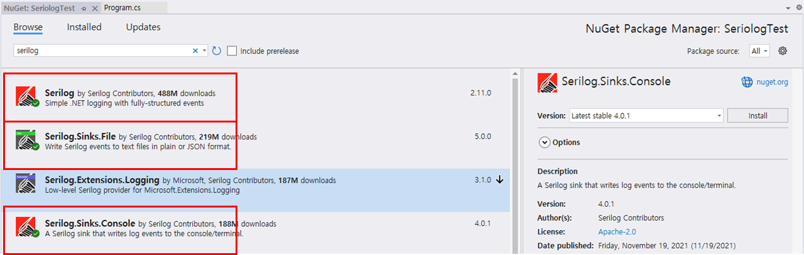
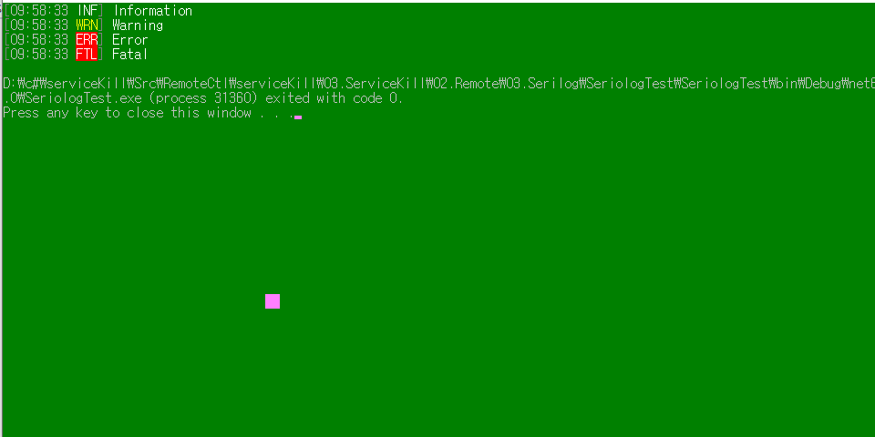
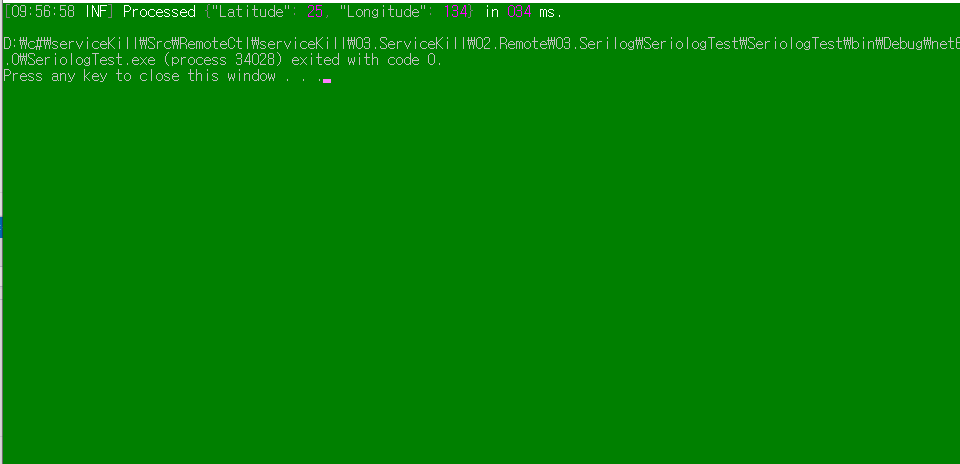
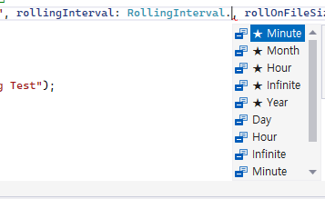
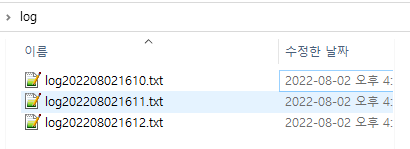

## 2022-07-25-Serilog를-이용한-로그수집

## 목차

>01.Serilog 설치
>
>02.기본 Serilog 수집
>
>03.Serilog json 수집
>
>04.일반적인 형태의 log
>
>> 04.1 serilog설명 LoggerConfiguration()
>
>> > 04.1.1 MinimumLevel.Information()
>> >
>> > 04.1.2 .WriteTo.Console()
>> >
>> > 04.1.3 WriteTo.File()

## 01.Serilog 설치




## 02.기본 Serilog 수집

```csharp
using Serilog;

class SerilogTest
{

    public static void Main(string[] args)
    {
        var log = new LoggerConfiguration()
     .WriteTo.Console()
     .WriteTo.File("log.txt")
     .CreateLogger();
        
        log.Debug("Debug");
        log.Information("Information");
        log.Warning("Warning");
        log.Error("Error");
        log.Fatal("Fatal");
        Log.CloseAndFlush();
    }
}
```




## 03.Serilog json 수집

```csharp
using Serilog;

class SerilogTest
{

    public static void Main(string[] args)
    {
        var log = new LoggerConfiguration()
     .WriteTo.Console()
     .WriteTo.File("log.txt")
     .CreateLogger();

        var position = new { Latitude = 25, Longitude = 134 };
        var elapsedMs = 34;

        log.Information("Processed {@Position} in {Elapsed:000} ms.", position, elapsedMs);
        Log.CloseAndFlush();
    }
}
```



## 04.일반적인 형태의 log

``` sql
        Log.Logger = new LoggerConfiguration()
            .MinimumLevel.Information() //최소 지정 로그 레벨 info 레벨 이상으로 기록함
            .WriteTo.Console() // 콘솔에 찍음
            .WriteTo.File(@"c:\log\log.txt", rollingInterval: RollingInterval.Day, rollOnFileSizeLimit: true) //파일로 기록할 로그 파일명 입력
            .CreateLogger();

        for(int i = 0; i < 10; i++)
        {
            Log.Information($"{i} - Serilog Test");
        }

        Log.CloseAndFlush();
```

### 04.1 serilog설명 LoggerConfiguration()

#### 04.1.1 MinimumLevel.Information()

- 최소 지정 로그 레벨 info 레벨 이상으로 기록함
  -  log.Debug("Debug");
  -  log.Information("Information");
  -  log.Warning("Warning");
  - log.Error("Error");
  - log.Fatal("Fatal");
    - 위와같은 종류를 가지고 있는데 여러개중 하나를 지엉하면 그 이상만 기록이 되어지는 것이다.

#### 04.1.2 .WriteTo.Console()

- 콘솔에 찍는다면 위를 적어주면되고 아니면 쓰지 않으면된다.

#### 04.1.3 WriteTo.File()

- **rollingInterval: RollingInterval.Day**

  -  쓰이는 것이 하루 단위로 적용되는것

    

    - 옵션의 경우 Minute, Month, Hour, Infinite, Year 단위로 선택할 수 있음

- **rollOnFileSizeLimit: true**

  - 로그 파일 최대 사이즈 1GB null 옵션 가능

-  **retainedFileCountLimit: 3**

  - 로그 파일 갯수 기본 3개 null 옵션 가능

    - 갯수의 경우 지정할 수 있음

      

      - 위에처럼 3개의 파일이 유지되는 옵션임

      

## 참조자료

[serilog 간단한 사용법 콘솔](http://wish.mirero.co.kr/mirero/project/infra/miwt-group/miwt/-/issues/24)

[serilog json simple](https://serilog.net/)