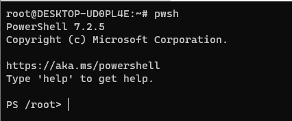
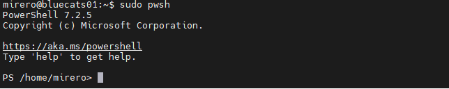
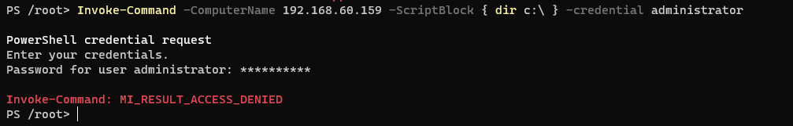

## 2022-07-25-WINRM-Linux를-이용한-접근테스트-[HTTP]

## 목차

## 01.리눅스 파워셀 설치

### 01.1 apt로 설치

- wsl

  ```sh
  apt update
  apt install -y wget apt-transport-https software-properties-common
  wget -q "https://packages.microsoft.com/config/ubuntu/$(lsb_release -rs)/packages-microsoft-prod.deb"
  dpkg -i packages-microsoft-prod.deb
  apt update
  apt install -y powershell
  pwsh
  ```

  

  - 위처럼 나오면 성공

- Linux - server

  ```sh
  sudo apt update
  sudo apt install -y wget apt-transport-https software-properties-common
  sudo wget -q "https://packages.microsoft.com/config/ubuntu/$(lsb_release -rs)/packages-microsoft-prod.deb"
  sudo dpkg -i packages-microsoft-prod.deb
  sudo apt update
  sudo apt install -y powershell
  sudo pwsh
  ```

  


## 02.동작확인해보기

```sh
Invoke-Command -ComputerName 192.168.60.159 -ScriptBlock { dir c:\ } -credential administrator
```



- 사용 형식

  ```sh
  Enter-PSSession -Credential $creds -ConfigurationName microsoft.exchange -ConnectionUri http://x.x.x.x/powershell -Authentication Negotiate -Verbose
  ```


### 참고자료

[Linux에서 Windows 시스템으로 PSSession을 입력/생성할 수 없음](vhttps://github.com/PowerShell/PowerShell/issues/6647)

[PowerShell remoting between Windows and Linux](https://4sysops.com/archives/powershell-remoting-between-windows-and-linux/)

[about_Remote_Troubleshooting](https://docs.microsoft.com/ko-kr/powershell/module/microsoft.powershell.core/about/about_remote_troubleshooting?view=powershell-7.2)