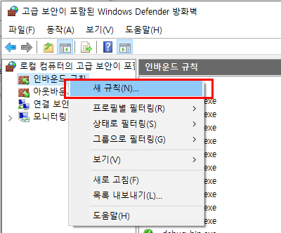

## 2022-07-25-WINRM-Windows를-이용한-접근테스트-[HTTP]

## 목차

>01.WINRM서비스 실행
>
>>01.1 서비스 동작확인
>
>02.윈도우 서비스 실행해보기
>
>>02.1 로컬로 self 테스트
>>
>>02.2 원격지 self 테스트
>>
>>> 02.2.1 원격지에서도 같은 self 테스트 하기
>
>초기 설정 소스
>
>연결 제대로 되게 하는 소스
>
>연결 후 테스트 소스
>
>03.각각 원격지 명령어 테스트
>
>04.참고
>

## 01.WINRM서비스 실행

- 화면자체적으로 실행하는 법


- 윈도우에서 검색 서비스에 들어가서 Windows Remote Management(WS-Management)라는 것이 있음
  - 이것을 실행할 것


- 위처럼 실행 중이라고 나오면 제대로 실행이되고 있는 것임

- 셀로 시작

  ```sh
  Start-Service -Name "WinRM“
  ```

### 01.1 서비스 동작확인


```sh
Get-Service -Name "WinRM"
```

- 시작 타입을 자동으로 하고 싶은 경우

  ```sh
  Get-Service -Name "WinRM" -StartupType Automatic
  ```

  - 위처럼 진행해주면 된다.

##  02.윈도우 서비스 실행해보기

### 02.1 로컬로 self 테스트

- 주의해야하는 것은 서비스관련 한것은 관리자모드로 셀을 실행하자

```sh
winrm e winrm/config/listener
```


- 관리자 모드로 쉘을 시작해서 위의 명령어를 입력하면 위에처럼 나옴


- 위와 같은 에러가 발생하는데 아래의 명령어를 실행하고 다시 진행해보자.

- 직접 대화형으로 들어가는 경우

  ```sh
  Enter-PSSession -ComputerName 192.168.100.116
  ```

- 바로 명령으로 하는 경우

  ```sh
  Invoke-Command -ComputerName 192.168.100.116 -ScriptBlock { dir c:\ }
  ```


- 위와 같은 에러가 발생하는데 아래의 명령어를 실행하고 다시 진행해보자.

  ```sh
  Enable-PSRemoting -SkipNetworkProfileCheck –Force
  Set-Item WSMan:\localhost\Client\TrustedHosts -Force -Value *
  Restart-Service -Force WinRM
  winrm e winrm/config/listener
  ```

  - `Set-Item WSMan:\localhost\Client\TrustedHosts -Force -Value *` 이걸로 하면 왠만해서 실행됨

  - 동작 재 테스트

    ```sh
    Enter-PSSession -ComputerName 192.168.100.116
    ```

    

    - 위에 처럼 들어가지면 성공한것

    ```sh
    Invoke-Command -ComputerName 192.168.100.116 -ScriptBlock { dir c:\ }
    ```

    

### 02.2 원격지 self 테스트

- 로컬에서 원격지 ip로 테스트해보기

  

  - 당연히 서비스가 제대로 동작중이 아니기 때문에 안됨

#### 02.2.1 원격지에서도 같은 self 테스트 하기


- 실행중인것 확인후 위와 환경 확인

  ```sh
  # 초기 설정 소스
  Start-Service -Name "WinRM“
  Get-Service -Name "WinRM"
  Get-Service -Name "WinRM" -StartupType Automatic
  winrm e winrm/config/listener
  
  # 연결 제대로 되게 하는 소스
  Enable-PSRemoting -SkipNetworkProfileCheck -Force
  Set-Item WSMan:\localhost\Client\TrustedHosts -Force -Value *
  Restart-Service -Force WinRM
  winrm e winrm/config/listener
  
  # 연결 후 테스트 소스
  Enter-PSSession -ComputerName 192.168.60.159
  Invoke-Command -ComputerName 192.168.60.159 -ScriptBlock { dir c:\ }
  ```

  

## 03.각각 원격지 명령어 테스트

- remote 윈도우 연결 테스트

  ```sh
  (New-Object System.Net.Sockets.TcpClient).ConnectAsync('192.168.60.159', 5985).Wait(1000)
  ```

  

- 원격 WinRM서비스에 대한 연결 테스트

  ```sh
  Test-WSMan -ComputerName 192.168.60.159
  ```

  

- 원격 명령 실행

  ```sh
  Invoke-Command -ComputerName 192.168.60.159 -ScriptBlock { dir c:\ } -credential administrator
  ```

  

  - 지금은 원격 접속시 비번 입력해줘야함

  - 로컬에서 원격지로 명령어 동작확인

    ```sh
    Invoke-Command -ComputerName 192.168.60.159 -ScriptBlock { dir c:\ } -credential administrator
    ```

    

    

  - 원격지에서 로컬로 명령어 동작확인

    ```sh
    Invoke-Command -ComputerName 192.168.60.159 -ScriptBlock { dir c:\ } -credential administrator
    ```

    

    

    - 현재 위에  대한 에러가 발생

      ```
      [192.168.100.116] 다음 오류 때문에 원격 서버 192.168.100.116에 연결하지 못했습니다. WinRM에서 작업을 완료할 수 없습니다
      .  지정한 컴퓨터 이름이 올바른지, 네트워크를 통해 컴퓨터에 액세스할 수 있는지, WinRM에 방화벽 예외를 사용하도록 설정하
      고 이 컴퓨터의 액세스를 허용하는지 확인하십시오. 기본적으로 공용 프로필에 대한 WinRM 방화벽 예외에서는 동일한 로컬 서브
      넷 내의 원격 컴퓨터로 액세스를 제한합니다. 자세한 내용은 about_Remote_Troubleshooting 도움말 항목을 참조하십시오.
          + CategoryInfo          : OpenError: (192.168.100.116:String) [], PSRemotingTransportException
          + FullyQualifiedErrorId : WinRMOperationTimeout,PSSessionStateBroken
      ```

      

      - 공용으로 되어 있으면 안된다고 한다 저것을 개인으로 변경할 것		

        ****

        - 다시 명령어를 입력하면 제대로 동작함이보임

## 04.참고

- [Powershell – 원격 접속을 위한 Credential 만들기](https://talsu.net/?p=2108)

- [Powershell – Remoting (원격 접속)](https://talsu.net/?p=2074)

- https://adamtheautomator.com/ansible-winrm/

  https://www.youtube.com/watch?v=IdP1TAVOb0E

  https://docs.ansible.com/ansible/latest/user_guide/windows.html


## 추후 https할때 사용


- `wf.msc`

  - 위를 입력하여 실행해준다.

  

  - 위에서 인바운드 규칙 오른쪽 마우스 클릭 후 새규칙 클릭


- 포트 클릭 후 다음 클릭

  

  - 5985를 설정할것

    

  

  - 연결 허용 클릭 다음 클릭

  

- 도메인 클릭 후 다음


```
Set-Service -Name "WinRM" -StartupType Automatic 
Start-Service -Name "WinRM“

Enable-PSRemoting -SkipNetworkProfileCheck –Force
Set-Item WSMan:\localhost\Client\TrustedHosts -Force -Value *
Restart-Service -Force WinRM

winrm e winrm/config/listener

Invoke-Command -ComputerName 192.168.100.28 -ScriptBlock { dir c:\ }
Enter-PSSession -ComputerName 192.168.100.28

```

