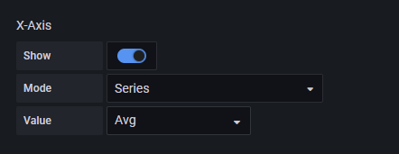
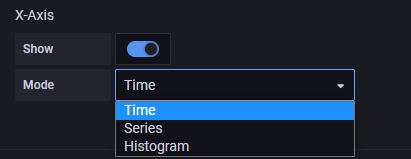
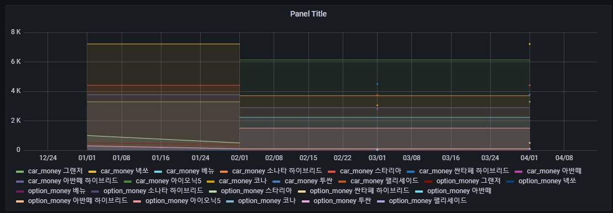
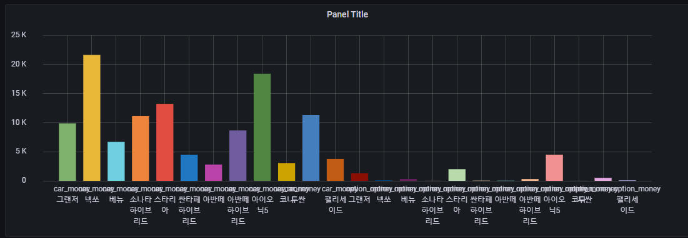
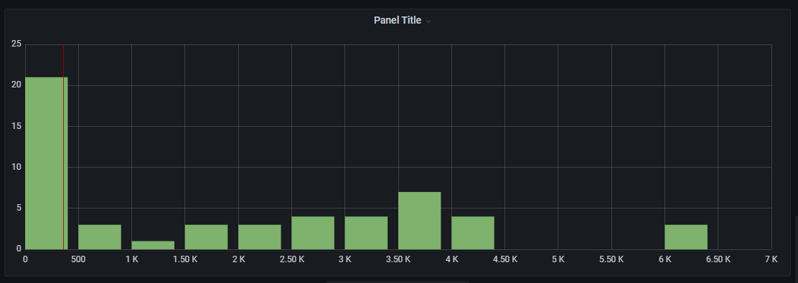
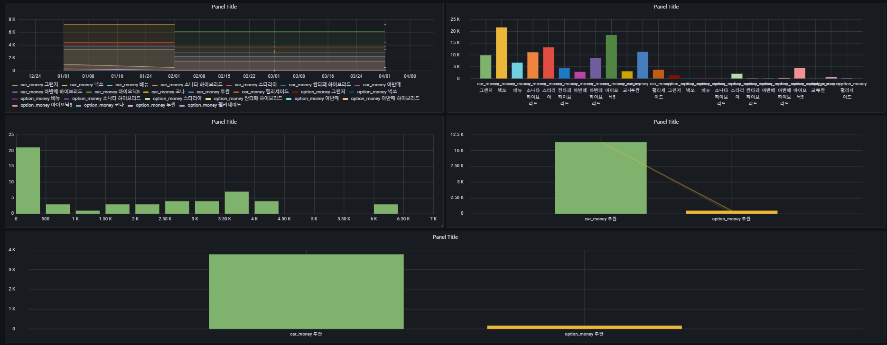
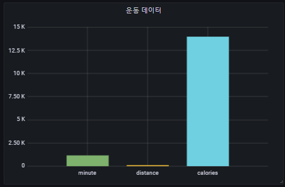
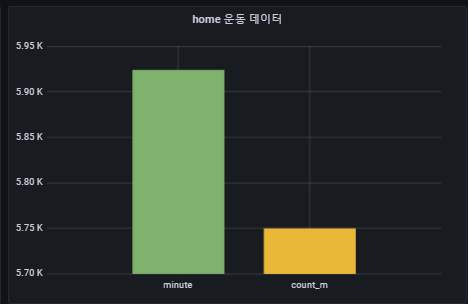

## 2022-07-25-grafana-postgreSQL-교육-Graph

## 목차

 >01.Graph기본
 >
 >> 01.1 Graph 기본과 옵션
 >>
 >> 01.2 time series  graph와 graph의 차이
 >
 >02.Graph예시
 >
 >03.개인 대시보드 작성

##  01.Graph기본

## 01.1 Graph 기본과 옵션

- 1.그래프를 그리기위한 테이블 구성(시간정보들어간 것)

  ```sql
  drop table carShop;
  
  create table carShop (
  	sale_date timestamp,
  	car_name text,
  	car_money numeric,
  	option_money numeric
  );
  
  insert into carShop values
  ('2022-01-01','투싼',3776,300)
  , ('2022-01-01','그랜저',3294,500)
  , ('2022-01-01','스타리아',4412,1000)
  , ('2022-01-01','넥쏘',7219,100)
  , ('2022-02-01','투싼',3776,100)
  , ('2022-02-01','그랜저',3294,400)
  , ('2022-02-01','스타리아',4412,500)
  , ('2022-02-01','넥쏘',7219,0)
  , ('2022-02-01','베뉴',2236,100)
  , ('2022-02-01','아이오닉5',6135,1500)
  , ('2022-02-01','아반떼 하이브리드',2892,100)
  , ('2022-02-01','소나타 하이브리드',3706,10)
  , ('2022-03-01','코나',3058,10)
  , ('2022-03-01','아반떼',2806,40)
  , ('2022-03-01','싼타페 하이브리드',4497,50)
  , ('2022-03-01','팰리세이드',3748,90)
  , ('2022-03-01','베뉴',2236,100)
  , ('2022-03-01','아이오닉5',6135,1500)
  , ('2022-03-01','아반떼 하이브리드',2892,100)
  , ('2022-03-01','소나타 하이브리드',3706,10)
  , ('2022-04-01','투싼',3776,100)
  , ('2022-04-01','그랜저',3294,400)
  , ('2022-04-01','스타리아',4412,500)
  , ('2022-04-01','넥쏘',7219,0)
  , ('2022-04-01','베뉴',2236,100)
  , ('2022-04-01','아이오닉5',6135,1500)
  , ('2022-04-01','아반떼 하이브리드',2892,100)
  , ('2022-04-01','소나타 하이브리드',3706,10);
  ```

## 01.2 time series  graph와 graph의 차이

- time series와 graph부분의 차이나 공통점 알 수 있는 예제 준비

  - 가장 큰 차이는 time seriese의 경우 x축이 무조건 시간만 가능

  - Graph의 경우

    

    - 위의 부분을 Mode를 Seies로 하면 문자로 x축 보이는것 가능




- time 

  

- series

  

- histogram

  

## 02.Graph예시

- 실제적으로 대시보드 그린것은 없음
- 우선 Timeseries와 완전 유사하고 x축에 문자열을 둘것이 아니라면 필요가 없어서 사용을 덜함

## 03.개인 대시보드 작성

- 테스트를 위한 대시보드

  

- 실제 개인 대시보드에 적용한것

  


