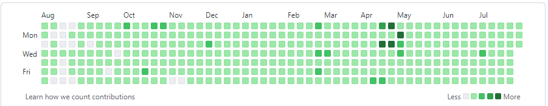
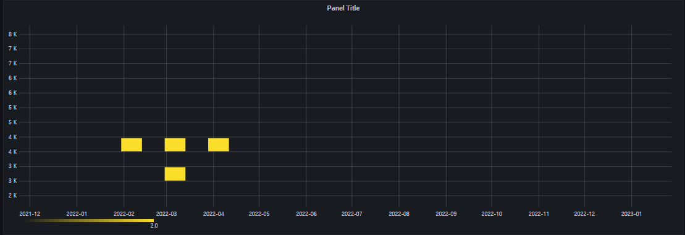
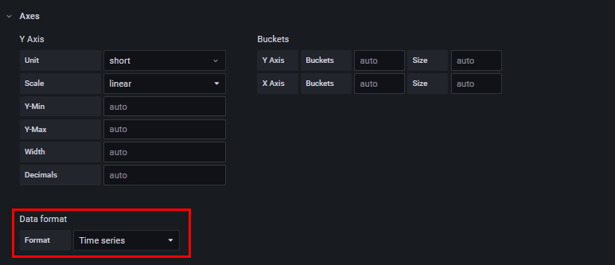
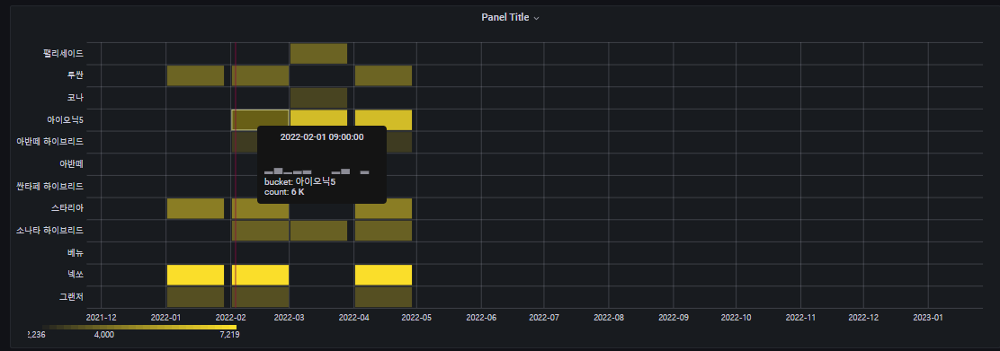
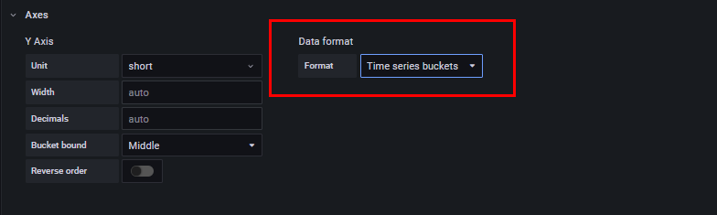
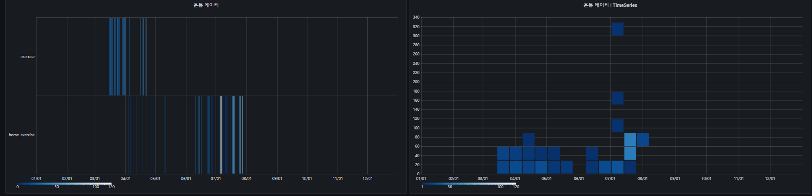

##  2022-07-25-grafana-postgreSQL-교육-HeatMap

## 목차

> 01.HeatMap기본과 옵션
>
> > 01.1 HeatMap 그리기
> >
> > > Time Series 포맷인 경우
> > >
> > > Time series buckets 포맷인 경우
>
> 02.HeatMap예시
>
> 03.개인 대시보드 작성

## 01.HeatMap기본과 옵션

- heatmap을 위한 테이블 구성 

  ```sql
  drop table carShop;
  
  create table carShop (
  	sale_date timestamp,
  	car_name text,
  	car_money numeric,
  	option_money numeric
  );
  
  insert into carShop values
  ('2022-01-01','투싼',3776,300)
  , ('2022-01-01','그랜저',3294,500)
  , ('2022-01-01','스타리아',4412,1000)
  , ('2022-01-01','넥쏘',7219,100)
  , ('2022-02-01','투싼',3776,100)
  , ('2022-02-01','그랜저',3294,400)
  , ('2022-02-01','스타리아',4412,500)
  , ('2022-02-01','넥쏘',7219,0)
  , ('2022-02-01','베뉴',2236,100)
  , ('2022-02-01','아이오닉5',6135,1500)
  , ('2022-02-01','아반떼 하이브리드',2892,100)
  , ('2022-02-01','소나타 하이브리드',3706,10)
  , ('2022-03-01','코나',3058,10)
  , ('2022-03-01','아반떼',2806,40)
  , ('2022-03-01','싼타페 하이브리드',4497,50)
  , ('2022-03-01','팰리세이드',3748,90)
  , ('2022-03-01','베뉴',2236,100)
  , ('2022-03-01','아이오닉5',6135,1500)
  , ('2022-03-01','아반떼 하이브리드',2892,100)
  , ('2022-03-01','소나타 하이브리드',3706,10)
  , ('2022-04-01','투싼',3776,100)
  , ('2022-04-01','그랜저',3294,400)
  , ('2022-04-01','스타리아',4412,500)
  , ('2022-04-01','넥쏘',7219,0)
  , ('2022-04-01','베뉴',2236,100)
  , ('2022-04-01','아이오닉5',6135,1500)
  , ('2022-04-01','아반떼 하이브리드',2892,100)
  , ('2022-04-01','소나타 하이브리드',3706,10);
  ```

- heatMap은 어떻게 표현하는지에 따라 다르지만 대개 githubs나 gitlab에서 예시를 찾아볼 수 있음

  

- 진하기에 따라서 좀더 뭔가를 더 했음을 표시할 수 있는 것으로 사용함

### 01.1 HeatMap 그리기

### Time Series 포맷인 경우



```sql
SELECT
  $__time(sale_date)
  ,car_name
  ,car_money as " "
 -- ,option_money
FROM carShop 
```



- 시간기준으로 표시가 된다.
  - 위의 경우 시간 별 어느정도 분포를 가지고 있는지 확인하기위해서는 좋지만 
    - 어떤 아이템인지 모르기 때문에 아래방법을 통해 좀더 직관적으로 데이터를 보자.

### Time series buckets 포맷인 경우



```sql
SELECT
  $__time(sale_date)
  ,car_name
  ,car_money as " "
 -- ,option_money
FROM carShop 
```



- Data format의 Format이 기본적으로 Time Series로 되어 있음
  - Time series buckets로 변경하면 위와 같이 볼 수 있음

## 02.HeatMap예시

- 마일스톤 일정 대시보드 참고

## 03.개인 대시보드 작성



```sql
-- exercise 쿼리
SELECT
  year as "Time",
  name,
  minute as "exercise"
FROM
  exercise
WHERE year in ($year) AND name in ($exercise_sort)
order by year;

-- home_exercise 쿼리
SELECT
  year as "Time",
  name,
  minute as "home_exercise"
FROM
  home_exercise
WHERE year in ($year) AND name in ($exercise_sort)
order by year;
```

