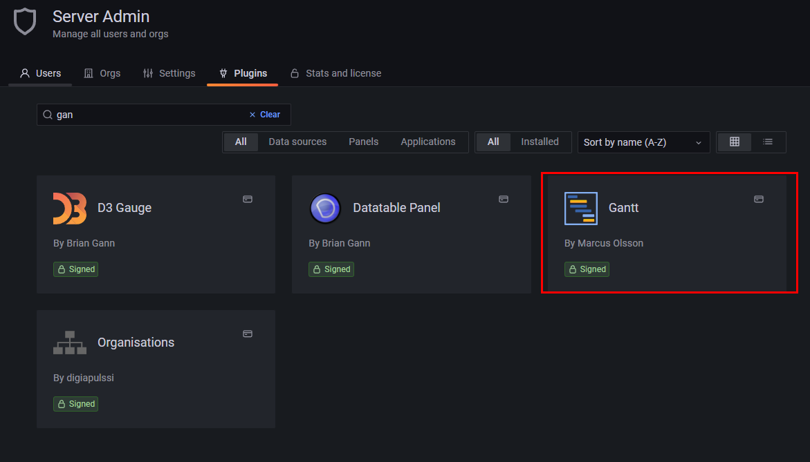
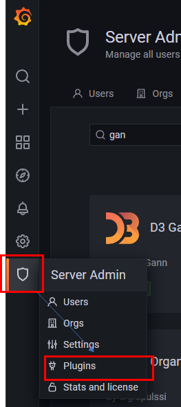
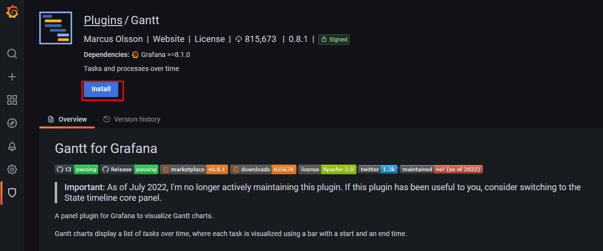
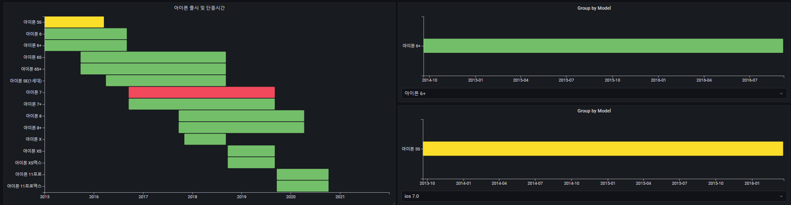
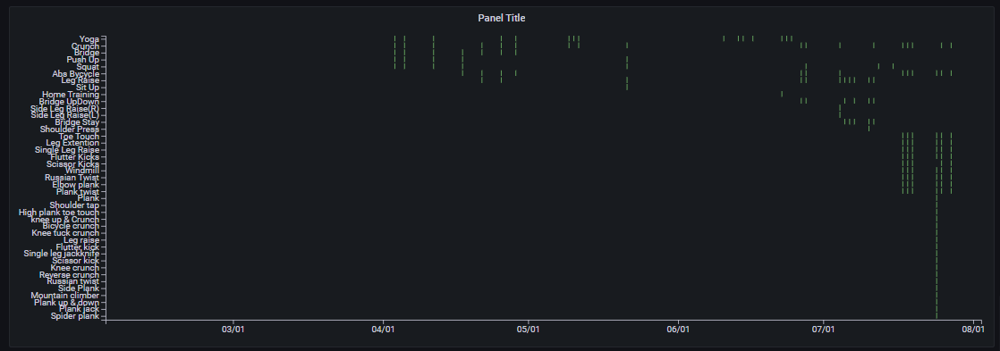
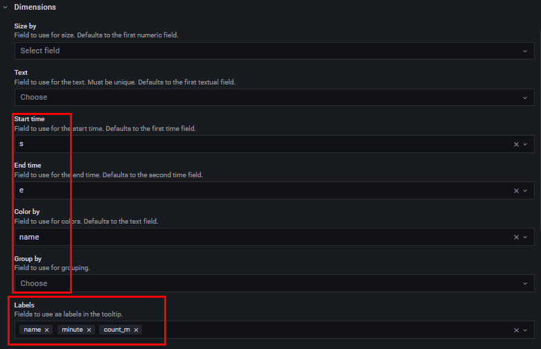

## 2022-08-01-grafana-postgreSQL-교육-Gantt-iframe

## 목차

> 01.Gantt의  이해 및 간단한 실습
>
> > 01.1 테이블 생성 및 데이터 추가
> >
> > 01.2 실습
> >
> > 01.3 iframe 적용하기
>
> 02.Gantt 실제 사용사례
>
> 03.나만의  Gantt와 iframe 차트 만들기
>
> > 03.1 Gantt
> >
> > > 옵션
> >
> > 03.2 iframe

## 01.Gantt의  이해 및 간단한 실습

- 기본적으로 설치되어 있는 것이 아님

  



- 방패 표시를 클릭하고 Plugins 클릭



- install 클릭

### 01.1 테이블 생성 및 데이터 추가

```sql
create table iphone(
	release_date timestamp,
	stop_date timestamp,
	ios_stop_date timestamp,
	model_name text,
	first_ios text,
	last_ios text,
	max_life_year numeric,
	min_life_year numeric,
	first_cost numeric
);

insert into iphone values
('2013-09-20','2016-03-21','2020-07-15','아이폰 5S','ios 7.0','ios 12.4.1',5,3,849),
('2014-09-19','2016-09-07','2020-07-15','아이폰 6','ios 8.0','ios 12.4.1',4,3,849),
('2014-09-19','2016-09-07','2020-07-15','아이폰 6+','ios 8.0','ios 12.4.1',4,3,949),
('2015-09-25','2018-09-12','2022-08-03','아이폰 6S','ios 9.0.1','ios 15.0',6,3,849),
('2015-09-25','2018-09-12','2022-08-03','아이폰 6S+','ios 9.0.1','ios 15.0',6,3,949),
('2016-03-31','2018-09-12','2022-08-03','아이폰 SE(1세대)','ios 9.3','ios 15.0',6,3,499),
('2016-09-16','2019-09-10','2022-08-03','아이폰 7','ios 10.0.1','ios 15.0',5,2,849),
('2016-09-16','2019-09-10','2022-08-03','아이폰 7+','ios 10.0.1','ios 15.0',5,2,969),
('2017-09-22','2020-04-15','2022-08-03','아이폰 8','ios 11.0','ios 15.0',4,2,849),
('2017-09-22','2020-04-15','2022-08-03','아이폰 8+','ios 11.0','ios 15.0',4,2,949),
('2017-11-03','2018-09-12','2022-08-03','아이폰 X','ios 11.0.1','ios 16.0',4,3,1149),
('2018-09-21','2019-09-10','2022-08-03','아이폰 XS','ios 12.0','ios 16.0',3,2,1349),
('2018-09-21','2019-09-10','2022-08-03','아이폰 XS맥스','ios 12.0','ios 16.0',3,2,1449),
('2019-09-20','2020-10-13','2022-08-03','아이폰 11프로','ios 13.0','ios 16.0',2,2,1349),
('2019-09-20','2020-10-13','2022-08-03','아이폰 11프로맥스','ios 13.0','ios 16.0',2,2,1449);
```

### 01.2 실습



```sql
SELECT 
*
FROM iphone
```

- 현재는 전체를 넣었지만 최소 조건의 경우 시간데이터 2개, 문자열 데이터 1개를 가지고 있어야 Gantt차트를 그릴 수 있음

### 01.3 iframe 적용하기


```html
<iframe id="Example2"
    title="iframe Example 2"
    width="400" height="300"
    style="border:none"
    src="https://maps.google.com/maps?f=q&source=s_q&q=buenos+aires&sll=37.0625,-95.677068&sspn=37.27489,127.08056&t=h&hnear=Buenos+Aires,+Argentina&z=11&ll=-34.603723,-58.381593&output=embed">
</iframe>
```


```html
<iframe width="1000" height="300" src="https://tech.kakao.com/blog/" name="test" id="test" frameborder="1" scrolling="yes" align="left">이 브라우저는 iframe을 지원하지 않습니다</iframe>
```


```html
<iframe width="300" height="300"  src="https://www.youtube.com/embed/jaxUumCpt_E"
sandbox="allow-forms allow-scripts allow-same-origin"></iframe>
```

- iframe의 경우 사실상 사이트 마다 되는것이 있고 안되는 것이 있음 이점은 주의해서 쓰면되고 위에처럼 그냥 인터넷 창을 보여주는 것도 쓸수 있지만
  - html이기때문에 html이랑 css를 이용해서 어느정도 다양하게 꾸며서 사용할 수 있음 

## 02.Gantt 실제 사용사례

- 마일스톤 일정

  - 단점 데이터가  많은 경우 아래와 같이 나오니 갯수를 조절해서 쓰자

    

## 03.나만의  Gantt와 iframe 차트 만들기

### 03.1 Gantt



#### 옵션



### 03.2 iframe


