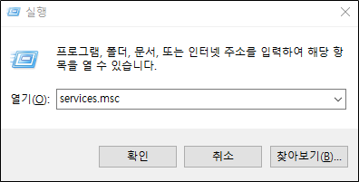
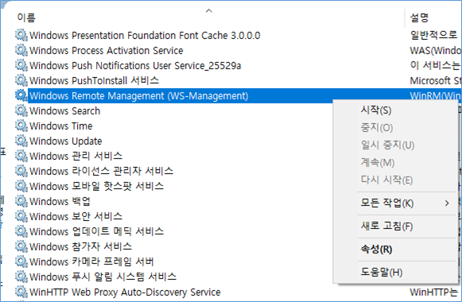

## 2022-08-03-[HTTP]-WINRM-제어

> Summary
>
> ```markdown
> # Windows
> # 간단한 명령_self
> ## 직접 대화형으로 들어가는 경우
> Enter-PSSession -ComputerName "Computer IP"
> 
> ## 바로 명령으로 동작시키는 경우
> Invoke-Command -ComputerName "Computer IP" -ScriptBlock { dir 'C:\' }
> 
> # 간단한 명령_remote
> ## 직접 대화형으로 들어가는 경우
> Enter-PSSession -Computername "Computer IP" -Authentication Negotiate -Credential "Username"
> 
> ## 바로 명령으로 동작시키는 경우
> Invoke-Command -ComputerName "Computer IP" -ScriptBlock { dir 'C:\' } -Authentication Negotiate -Credential $cred
> 
> # 인증까지 하는 명령
> $sessionoptions = (New-PSSessionOption -SkipCACheck -SkipCNCheck)
> $securePassword = ConvertTo-SecureString -AsPlainText -Force "Password"
> $cred = New-Object System.Management.Automation.PSCredential "Username", $securePassword
> Invoke-Command -ComputerName "Computer IP" -ScriptBlock { cmd.exe /c dir } -Authentication Negotiate -Credential $cred -SessionOption $sessionoptions
> 
> # Linux
> # 간단한 명령_self
> ## 직접 대화형으로 들어가는 경우
> Enter-PSSession -ComputerName 127.0.0.1
> 
> ## 바로 명령으로 동작시키는 경우
> Invoke-Command -ComputerName 127.0.0.1 -ScriptBlock { dir 'C:\' }
> 
> # 간단한 명령_remote
> ## 직접 대화형으로 들어가는 경우
> Enter-PSSession -ComputerName 127.0.0.1 -Authentication Negotiate -Credential $cred
> 
> ## 바로 명령으로 동작시키는 경우
> Invoke-Command -ComputerName 127.0.0.1 -ScriptBlock { dir 'C:\' } -Authentication Negotiate -Credential $cred
> 
> # 인증까지 하는 명령
> $sessionoptions = (New-PSSessionOption -SkipCACheck -SkipCNCheck) 
> $securePassword = ConvertTo-SecureString -AsPlainText -Force password
> $cred = New-Object System.Management.Automation.PSCredential administrator, $securePassword 
> Invoke-Command -ComputerName 127.0.0.1 -ScriptBlock { cmd.exe /c dir } -Authentication Negotiate -Credential $cred -SessionOption $sessionoptions
> 
> # pwsh 입력 별개
> pwsh
> $sessionoptions = (New-PSSessionOption -SkipCACheck -SkipCNCheck) '
> $securePassword = ConvertTo-SecureString -AsPlainText -Force password
> $cred = (New-Object System.Management.Automation.PSCredential km.park,  ConvertTo-SecureString -AsPlainText -Force mirero)
> Invoke-Command -ComputerName 127.0.0.1 -ScriptBlock { cmd.exe /c dir } -Authentication Negotiate -Credential (New-Object System.Management.Automation.PSCredential km.park, (ConvertTo-SecureString -AsPlainText -Force mirero)) -SessionOption (New-PSSessionOption -SkipCACheck -SkipCNCheck)
> # pwsh 입력 한번에
> pwsh -Command "& {Invoke-Command -ComputerName 127.0.0.1 -ScriptBlock { cmd.exe /c dir } -Authentication Negotiate -Credential (New-Object System.Management.Automation.PSCredential km.park, (ConvertTo-SecureString -AsPlainText -Force mirero)) -SessionOption (New-PSSessionOption -SkipCACheck -SkipCNCheck)}"
> ```
>
>  

## 목차

>**Windows**
>
>01.WINRM 서비스 실행 | 사전 준비
>
>>01.1 마우스를 이용한 실행
>>
>>01.2 커멘드창을 이용한 실행
>
>02.WINRM 사용하기
>
>>02.1 WINRM 사용하기전 설정 명령어
>>
>>02.2 실제로 원격 제어해보기
>>
>>> 윈도우로컬 -> 윈도우(로컬/ 원격)
>
>**Linux**
>
>01.Linux 사전 준비를 위한 패키지 설치
>
>02.WinRM 사용하기
>
>>리눅스 -> 윈도우(로컬/ 원격)
>
>03.pwsh입력까지 한번에 동작

# Windows

## 01.WINRM 서비스 실행 | 사전 준비

### 01.1 마우스를 이용한 실행

- 직접 마우스로 실행하는 법

  

  - `윈도우키 + R ` 을 키보드에 입력하여 실행창을 켠다.
    - `services.msc`를 입력하고 엔터를 누른다.

  

  - 위와 같은 창이 나오게 되면 `Windows Remote Management (WS-Management)`를 찾아서 시작하면됨

### 01.2 커멘드창을 이용한 실행

- 파워셀을 관리자 모드로 실행해준다.

  ```sh
  # 시작 유형을 설정해주는 부분
  Get-Service -Name "WinRM" -StartupType Automatic
  
  # WinRM을 실행하는 부분
  Start-Service -Name "WinRM“
  
  # WinRM의 현재 상태를 보는 부분
  Get-Service -Name "WinRM"
  ```

## 02.WINRM 사용하기

### 02.1 WINRM 사용하기전 설정 명령어

```sh
# 매개변수를 사용하여 동일한 로컬 서브넷의 공용 네트워크에서 원격 액세스를 허용
Enable-PSRemoting -SkipNetworkProfileCheck –Force
# 호스트 허용하는부분 현재는 전체 허용
Set-Item WSMan:\localhost\Client\TrustedHosts -Force -Value *
# WinRM 재시작
Restart-Service -Force WinRM
# listener 확인
winrm e winrm/config/listener
```

## 02.2 실제로 원격 제어해보기

#### 윈도우로컬 -> 윈도우(로컬/ 원격)

- 형식

  ```sh
  # 간단한 명령_self
  ## 직접 대화형으로 들어가는 경우
  Enter-PSSession -ComputerName "Computer IP"
  
  ## 바로 명령으로 동작시키는 경우
  Invoke-Command -ComputerName "Computer IP" -ScriptBlock { dir 'C:\' }
  
  # 간단한 명령_remote
  ## 직접 대화형으로 들어가는 경우
  Enter-PSSession -Computername "Computer IP" -Authentication Negotiate -Credential "Username"
  
  ## 바로 명령으로 동작시키는 경우
  Invoke-Command -ComputerName "Computer IP" -ScriptBlock { dir 'C:\' } -Authentication Negotiate -Credential $cred
  
  # 인증까지 하는 명령
  $sessionoptions = (New-PSSessionOption -SkipCACheck -SkipCNCheck)
  $securePassword = ConvertTo-SecureString -AsPlainText -Force "Password"
  $cred = New-Object System.Management.Automation.PSCredential "Username", $securePassword
  Invoke-Command -ComputerName "Computer IP" -ScriptBlock { cmd.exe /c dir } -Authentication Negotiate -Credential $cred -SessionOption $sessionoptions
  ```

- 실제 사용 예시

  ```sh
  # 간단한 명령_self
  ## 직접 대화형으로 들어가는 경우
  Enter-PSSession -ComputerName 127.0.0.1
  
  ## 바로 명령으로 동작시키는 경우
  Invoke-Command -ComputerName 127.0.0.1 -ScriptBlock { dir 'C:\' }
  
  # 간단한 명령_remote
  ## 직접 대화형으로 들어가는 경우
  Enter-PSSession -ComputerName 127.0.0.1 -Authentication Negotiate -Credential $cred
  
  ## 바로 명령으로 동작시키는 경우
  Invoke-Command -ComputerName 127.0.0.1 -ScriptBlock { dir 'C:\' } -Authentication Negotiate -Credential $cred
  
  # 인증까지 하는 명령
  $sessionoptions = (New-PSSessionOption -SkipCACheck -SkipCNCheck) 
  $securePassword = ConvertTo-SecureString -AsPlainText -Force password
  $cred = New-Object System.Management.Automation.PSCredential administrator, $securePassword 
  Invoke-Command -ComputerName 127.0.0.1 -ScriptBlock { cmd.exe /c dir } -Authentication Negotiate -Credential $cred -SessionOption $sessionoptions
  ```

  - "Computer IP": 127.0.0.1
  - "Password": password
  - "Username": administrator

# Linux

## 01.Linux 사전 준비를 위한 패키지 설치

- online | 인터넷이 있는 곳 

  - powershell 설치

    ```sh
    sudo apt update
    sudo apt install -y wget apt-transport-https software-properties-common
    sudo wget -q "https://packages.microsoft.com/config/ubuntu/$(lsb_release -rs)/packages-microsoft-prod.deb"
    sudo dpkg -i packages-microsoft-prod.deb
    sudo apt update
    sudo apt install -y powershell
    sudo pwsh
    ```

  - ntml 설치

    ```sh
    sudo apt-get update -y
    sudo apt-get install -y gss-ntlmssp
    ```

- offlilne | 인터넷이 없는 곳

  - 패키지를 미리 다운 받아 놓은 것을 올린다.

  ```sh
  dpkg -i *.deb
  ```

## 02.WinRM 사용하기

#### 리눅스 -> 윈도우(로컬/ 원격)

- 형식

  ```sh
  # 간단한 명령
  ## 직접 대화형으로 들어가는 경우
  pwsh
  Enter-PSSession -Computername "Computer IP" -Authentication Negotiate -Credential "Username"
  
  ## 바로 명령으로 동작시키는 경우
  pwsh
  Invoke-Command -ComputerName "Computer IP" -ScriptBlock { dir 'C:\' }
  
  # 인증까지 하는 명령
  pwsh
  $sessionoptions = (New-PSSessionOption -SkipCACheck -SkipCNCheck)
  $securePassword = ConvertTo-SecureString -AsPlainText -Force "Password"
  $cred = New-Object System.Management.Automation.PSCredential "Username", $securePassword
  Invoke-Command -ComputerName "Computer IP" -ScriptBlock { cmd.exe /c dir } -Authentication Negotiate -Credential $cred -SessionOption $sessionoptions
  ```

- 실제 사용 예시

  ```sh
  # 간단한 명령
  ## 직접 대화형으로 들어가는 경우
  pwsh
  Enter-PSSession -ComputerName 127.0.0.1 -Authentication Negotiate -Credential administrator
  
  ## 바로 명령으로 동작시키는 경우
  pwsh
  Invoke-Command -ComputerName 127.0.0.1 -ScriptBlock { dir 'C:\' }
  
  # 인증까지 하는 명령
  pwsh
  $sessionoptions = (New-PSSessionOption -SkipCACheck -SkipCNCheck)
  $securePassword = ConvertTo-SecureString -AsPlainText -Force password
  $cred = New-Object System.Management.Automation.PSCredential administrator, $securePassword
  Invoke-Command -ComputerName 127.0.0.1 -ScriptBlock { cmd.exe /c dir } -Authentication Negotiate -Credential $cred -SessionOption $sessionoptions
  ```

  - "Computer IP": 127.0.0.1
  - "Password": password
  - "Username": administrator

## 03.pwsh입력까지 한번에 동작

- before

  ```sh
  pwsh
  $sessionoptions = (New-PSSessionOption -SkipCACheck -SkipCNCheck) '
  $securePassword = ConvertTo-SecureString -AsPlainText -Force password
  $cred = (New-Object System.Management.Automation.PSCredential km.park,  ConvertTo-SecureString -AsPlainText -Force mirero)
  Invoke-Command -ComputerName 127.0.0.1 -ScriptBlock { cmd.exe /c dir } -Authentication Negotiate -Credential (New-Object System.Management.Automation.PSCredential km.park, (ConvertTo-SecureString -AsPlainText -Force mirero)) -SessionOption (New-PSSessionOption -SkipCACheck -SkipCNCheck)
  ```

- after

  ```sh
  pwsh -Command "& {Invoke-Command -ComputerName 127.0.0.1 -ScriptBlock { cmd.exe /c dir } -Authentication Negotiate -Credential (New-Object System.Management.Automation.PSCredential km.park, (ConvertTo-SecureString -AsPlainText -Force mirero)) -SessionOption (New-PSSessionOption -SkipCACheck -SkipCNCheck)}"
  ```

  - [명령링크 참고](https://docs.microsoft.com/ko-kr/powershell/module/microsoft.powershell.core/about/about_pwsh?view=powershell-7.2)