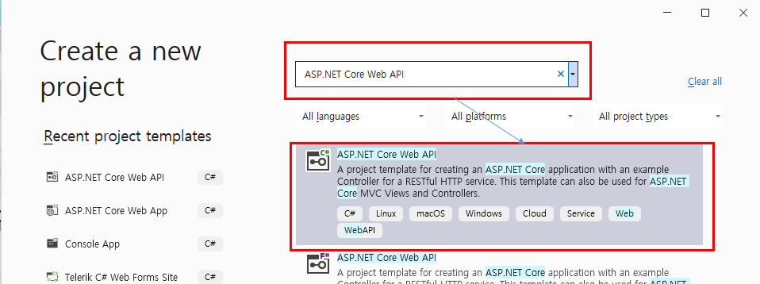

## 완료조건(주요결과)

- [ ] AKka.NET의 코드 이해와 이전의 RESTFUL API를 연동하여 도커화 진행하기


## 목차

## 00.프로젝트 생성



- ASP.NET Core Web API 검색


- 옵션 선택 Enable Docker,  Docker OS `Linux`선택

## 01.CliWrap 사용해보기


- NuGet Package에서 CliWrap검색해서 설치진행

```csharp
using CliWrap;
using System.Text;

var stdOutBuffer = new StringBuilder();
var stdErrBuffer = new StringBuilder();

var exeCommand = "PowerShell.exe";  // 실행 지정                

string computerIp = "192.168.100.116";
string pid = "60144";
string scriptBlock = $"cmd.exe /c taskkill /f /pid "+ pid;
string userName = "km.park";
string passWord = "mirero";
string script = $"-Command \" & {{Invoke-Command -ComputerName {computerIp} -ScriptBlock {{ {scriptBlock} }} -Authentication Negotiate -Credential (New-Object System.Management.Automation.PSCredential {userName}, (ConvertTo-SecureString -AsPlainText -Force {passWord}))  -SessionOption (New-PSSessionOption -SkipCACheck -SkipCNCheck) }}\"";

Console.WriteLine($"\nscript: {script}\n");

var result = await Cli.Wrap(exeCommand)
    .WithArguments(script)
    .WithStandardOutputPipe(PipeTarget.ToStringBuilder(stdOutBuffer))
    .WithStandardErrorPipe(PipeTarget.ToStringBuilder(stdErrBuffer))  
    .ExecuteAsync();

var stdOut = stdOutBuffer.ToString();
var stdErr = stdErrBuffer.ToString();

Console.WriteLine("Info:" + stdOut);
Console.WriteLine("Error:" + stdErr);
```

- 우선위와 같이 입력을 하고 진행을 하게되면 서비스를 죽일 수 있게됨

```csharp
using CliWrap;
using System.Text;

var stdOutBuffer = new StringBuilder();
var stdErrBuffer = new StringBuilder();

var exeCommand = "PowerShell.exe";  // 실행 지정                

string computerIp = "192.168.100.116";
string pid=null;
string scriptBlock;
string userName = "km.park";
string passWord = "mirero";
string serviceName = "ServiceNormal_60s Service Name";
string script = $"-Command \" & {{ cmd.exe /c sc queryex '"+ serviceName + "'}\"";

Console.WriteLine($"\nscript: {script}\n");

var result = await Cli.Wrap(exeCommand)
    .WithArguments(script)
    .WithStandardOutputPipe(PipeTarget.ToStringBuilder(stdOutBuffer))
    .WithStandardErrorPipe(PipeTarget.ToStringBuilder(stdErrBuffer))  
    .ExecuteAsync();
var stdOut = stdOutBuffer.ToString();
var stdErr = stdErrBuffer.ToString();

Console.WriteLine("Info:" + stdOut);
Console.WriteLine("Error:" + stdErr);

var index = stdOut.IndexOf("PID");
for (int i = index + 21; !stdOut[i].Equals('\n'); i++)
{
    pid += stdOut[i];
}

scriptBlock = $"cmd.exe /c taskkill /f /pid " + pid;

script = $"-Command \" & {{Invoke-Command -ComputerName {computerIp} -ScriptBlock {{ {scriptBlock} }} -Authentication Negotiate -Credential (New-Object System.Management.Automation.PSCredential {userName}, (ConvertTo-SecureString -AsPlainText -Force {passWord}))  -SessionOption (New-PSSessionOption -SkipCACheck -SkipCNCheck) }}\"";

result = await Cli.Wrap(exeCommand)
    .WithArguments(script)
    .WithStandardOutputPipe(PipeTarget.ToStringBuilder(stdOutBuffer))
    .WithStandardErrorPipe(PipeTarget.ToStringBuilder(stdErrBuffer))
    .ExecuteAsync();
stdOut = stdOutBuffer.ToString();
stdErr = stdErrBuffer.ToString();

Console.WriteLine("Info:" + stdOut);
Console.WriteLine("Error:" + stdErr);
```

- 이름으로 ip 찾아서 죽이는 것

## 02.API에 기능 추가해보기

- 서비스 죽이는 것

```csharp
app.MapPost("/programKillOrder", async (SendMessage info) =>
{
    Console.WriteLine("");
    Console.WriteLine(info);

    var stdOutBuffer = new StringBuilder();
    var stdErrBuffer = new StringBuilder();

    var exeCommand = "Powershell.exe";  // 실행 지정                

    string computerIp = info.Ip;
    string pid = null;
    string scriptBlock;
    string userName = info.Username;
    string passWord = info.Password;
    string serviceName = info.ServiceName;
    string script = $"-Command \" & {{ cmd.exe /c sc queryex '" + serviceName + "'}\"";

    Console.WriteLine($"\nscript: {script}\n");

    var result = await Cli.Wrap(exeCommand)
        .WithArguments(script)
        .WithStandardOutputPipe(PipeTarget.ToStringBuilder(stdOutBuffer))
        .WithStandardErrorPipe(PipeTarget.ToStringBuilder(stdErrBuffer))
        .ExecuteAsync();
    var stdOut = stdOutBuffer.ToString();
    var stdErr = stdErrBuffer.ToString();

    Console.WriteLine("Info:" + stdOut);
    Console.WriteLine("Error:" + stdErr);

    var index = stdOut.IndexOf("PID");
    for (int i = index + 21; !stdOut[i].Equals('\n'); i++) pid += stdOut[i];

    scriptBlock = $"cmd.exe /c taskkill /f /pid " + pid;

    script = $"-Command \" & {{Invoke-Command -ComputerName {computerIp} -ScriptBlock {{ {scriptBlock} }} -Authentication Negotiate -Credential (New-Object System.Management.Automation.PSCredential {userName}, (ConvertTo-SecureString -AsPlainText -Force {passWord}))  -SessionOption (New-PSSessionOption -SkipCACheck -SkipCNCheck) }}\"";

    result = await Cli.Wrap(exeCommand)
        .WithArguments(script)
        .WithStandardOutputPipe(PipeTarget.ToStringBuilder(stdOutBuffer))
        .WithStandardErrorPipe(PipeTarget.ToStringBuilder(stdErrBuffer))
        .ExecuteAsync();
    stdOut = stdOutBuffer.ToString();
    stdErr = stdErrBuffer.ToString();

    Console.WriteLine("Info:" + stdOut);
    Console.WriteLine("Error:" + stdErr);

    return info;

})
.WithName("programKillOrder");
```

- json 보내는 형식

```json
{
  "ip": "192.168.100.116",
  "password": "mirero",
  "username": "km.park",
  "serviceName": "ServiceNormal_60s Service Name"
}
```


- 일단 문제는 docker에서 실행하면 안됨 이유는 powershell이 설치 안되어있기때문에 이를 하기 위해 powershell이랑 원격제어를 위한 ntlm..을 설치해야함

## 03.Powershell, gss-ntlmssp 추가 하기

```dockerfile
#See https://aka.ms/containerfastmode to understand how Visual Studio uses this Dockerfile to build your images for faster debugging.

FROM ubuntu 
ENV builddir=build
RUN mkdir \${builddir}
RUN apt-get update
RUN apt-get install -y wget apt-transport-https software-properties-common
RUN wget -q "https://packages.microsoft.com/config/ubuntu/$(lsb_release -rs)/packages-microsoft-prod.deb"
RUN dpkg -i packages-microsoft-prod.deb
RUN apt-get update
RUN add-apt-repository universe
RUN apt-get install -y powershell
RUN apt-get install -y gss-ntlmssp

FROM mcr.microsoft.com/powershell:lts-7.2-nanoserver-1809

FROM mcr.microsoft.com/dotnet/sdk:6.0 AS build
WORKDIR /src
COPY ["RemoteProcessKill/RemoteProcessKill.csproj", "RemoteProcessKill/"]
RUN dotnet restore "RemoteProcessKill/RemoteProcessKill.csproj"
COPY . .
WORKDIR "/src/RemoteProcessKill"
RUN dotnet build "RemoteProcessKill.csproj" -c Release -o /app/build

FROM build AS publish
RUN dotnet publish "RemoteProcessKill.csproj" -c Release -o /app/publish

FROM base AS final
WORKDIR /app
COPY --from=publish /app/publish .
ENTRYPOINT ["dotnet", "RemoteProcessKill.dll"]
```

- 위는 전체 소스 이고 아래 소스를 추가하여 테스트 진행중

```dockerfile
FROM ubuntu 
ENV builddir=build
RUN mkdir \${builddir}
RUN apt-get update
RUN apt-get install -y wget apt-transport-https software-properties-common
RUN wget -q "https://packages.microsoft.com/config/ubuntu/$(lsb_release -rs)/packages-microsoft-prod.deb"
RUN dpkg -i packages-microsoft-prod.deb
RUN apt-get update
RUN add-apt-repository universe
RUN apt-get install -y powershell
RUN apt-get install -y gss-ntlmssp
```

