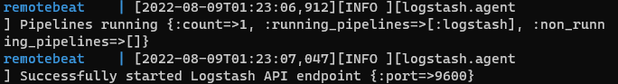
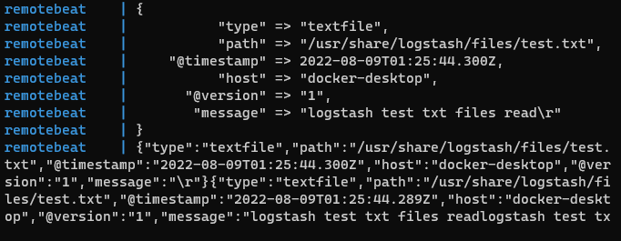
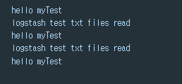

## 2022-08-09-로그스태시-도커-환경-구성과-동작-테스트

>Summary
>
>```yml
># docker-compose.yml 파일
>version: '2'
>
>services:
>  remotebeat:
>    restart: always
>    container_name: remotebeat
>    image: docker.elastic.co/logstash/logstash-oss:7.10.2
>    env_file: 
>    - .env
>    environment:
>    - bootstrap.memory_lock=true 
>    - "LS_JAVA_OPTS=-Xms2g -Xmx2g" 
>    volumes:
>    - ./config/remotebeat/logstash.yml:/usr/share/logstash/config/logstash.yml
>    - ./config/remotebeat/pipelines.yml:/usr/share/logstash/config/pipelines.yml
>    - ./config/remotebeat/pipeline/:/usr/share/logstash/pipeline/    
>    - ./config/remotebeat/remotebeat-data:/usr/share/logstash/data/
>    - ./config/remotebeat/files/:/usr/share/logstash/files/
>    network_mode: host
>    user: 0:0
>    command: --config.reload.automatic
>
># .env
>REMOTE_SITE=CHANGE_ME
>REMOTE_KAFKA_HOST=127.0.0.1:7710
>COMPOSE_PROJECT_NAME=REMOTEBEAT
>
># config/remotebeat/logstash.yml
>http.host: 0.0.0.0
>pipeline.workers: 1
>
># config/remotebeat/pipelines.yml
>- pipeline.id: logstash
>  pipeline.workers: 2
>  path.config: "/usr/share/logstash/pipeline/logstash.conf"
>  
># config/remotebeat/pipeline/logstash.conf
>input {  
>  file {
>    path => "/usr/share/logstash/files/test.txt"
>    start_position => "beginning"
>	stat_interval => 1
>    type => textfile
>	}
>}
>
>output {  
>  stdout { codec => rubydebug }
>  stdout { codec => json }
> http {
>	url => "http://127.0.0.1:49154/v2/log"
>	http_method => "post"
>            format => "json"
>	mapping => [ "message", "%{message}"]
>  }
>}
>
># config/remotebeat/files/test.txt
>logstash test txt files read
>
># docker-compose.yml 위치에서 명령어 입력
>docker-compose up
>```
>
>


## 목차

>01.로그 스태시 docker-compose.yml 파일
>
>02.볼륨 준비
>
>02.0 .env
>
>>02.1 config/remotebeat/`logstash.yml`
>>
>>02.2 config/remotebeat/`pipelines.yml`
>>
>>02.3 config/remotebeat/pipeline/`logstash.conf`
>>
>>02.4 config/remotebeat/files/`test.txt`
>
>03.remotebeat 실행하기
>
>> remotebeat에서 찍히는 것
>>
>> API 콘솔에서 찍히는것
>

## 01.로그 스태시 docker-compose.yml 파일

```yml
version: '2'

services:
  remotebeat:
    restart: always
    container_name: remotebeat
    image: docker.elastic.co/logstash/logstash-oss:7.10.2
    env_file: 
    - .env
    environment:
    - bootstrap.memory_lock=true 
    - "LS_JAVA_OPTS=-Xms2g -Xmx2g" 
    volumes:
    - ./config/remotebeat/logstash.yml:/usr/share/logstash/config/logstash.yml
    - ./config/remotebeat/pipelines.yml:/usr/share/logstash/config/pipelines.yml
    - ./config/remotebeat/pipeline/:/usr/share/logstash/pipeline/    
    - ./config/remotebeat/remotebeat-data:/usr/share/logstash/data/
    - ./config/remotebeat/files/:/usr/share/logstash/files/
    network_mode: host
    user: 0:0
    command: --config.reload.automatic
```

## 02.볼륨 준비

- .env

- config | 폴더
  - remotebeat |폴더
    - logstash.yml
    - pipelines.yml
    - pipeline | 폴더
      - logstash.conf
    - files | 폴더
      - test.txt
    - remotebeat-data |폴더

## 02.0 .env

```yml
REMOTE_SITE=CHANGE_ME
REMOTE_KAFKA_HOST=127.0.0.1:7710
COMPOSE_PROJECT_NAME=REMOTEBEAT
```

- 사실상 REMOTE_SITE=CHANGE_ME, REMOTE_KAFKA_HOST=127.0.0.1:7710
  - 여기 단계에서는 사실상 필요는 없음

### 02.1 config/remotebeat/`logstash.yml`

```yml
http.host: 0.0.0.0
pipeline.workers: 1
#log.level: debug
```

### 02.2 config/remotebeat/`pipelines.yml`

```yml
- pipeline.id: logstash
  pipeline.workers: 2
  path.config: "/usr/share/logstash/pipeline/logstash.conf"
```

### 02.3 config/remotebeat/pipeline/`logstash.conf`

```yml
input {  
  file {
    path => "/usr/share/logstash/files/test.txt"
    start_position => "beginning"
	stat_interval => 1
    type => textfile
	}
}

output {  
  stdout { codec => rubydebug }
  stdout { codec => json }
 http {
	url => "http://127.0.0.1:49154/v2/log"
	http_method => "post"
            format => "json"
	mapping => [ "message", "%{message}"]
  }
}
```

### 02.4 config/remotebeat/files/`test.txt`

```sh
logstash test txt files read
```

## 03.remotebeat 실행하기

- docker-compose.yml  파일 있는 위치로 이동

  ```sh
  docker-compose up
  ```



- 위와 같이 나온경우 제대로 동작한 것

###  remotebeat에서 찍히는 것



### API 콘솔에서 찍히는것



- 혹시나 위에처럼 api에서 못받아온다면 test.txt 파일 자체를 변경해주자
  - 원래 변화를 감지하여 로그를 찍어주는 것이기 때문에 문서의 내용을 변경하고 확인하면 제대로 읽어오는것을 알 수 있음