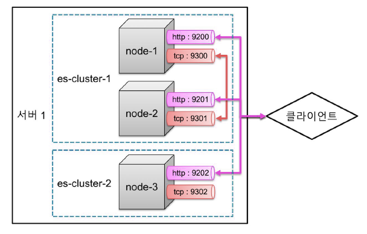

# ElasticSearch 세미나1

## 목차

>01.History
>
>02.Elasticsearch Deep Dive
>
>>02.1 elasticsearch
>
>03.Elasticsearch 시스템 구조
>
>>03.1 Elasticsearch 클러스터링 과정
>>
>>> 과정
>>>
>>> 용어 정리
>>
>>03.2 클러스터 구성
>>
>>> 실행 과정
>
>04.Elasticsearch 데이터 구조
>
>>04.1 RDBMS와의 차이
>
>05.텍스트 분석 과정
>
>> _analyze API
>>
>> 05.1 검색 과정
>
>06.한글 검색
>
>> 06.1 한글 형태소 분석기
>>
>> 06.2 루신인 지라에서 프로젝트 관리함
>>
>> 기타

## 01.History

- 데이터 넣을때 elk 쓸때 로그스태시 사용
- Kibana, elastic, logstash
  - 위의 세개를 elk용어로 쓰임
- 2011년에 회사 창업....
- 아파치 라이센스로 제공을 하다가
  - 오픈소스가 비지니스를 해서 성공하는 경우가 많지 않음
  - 처음 대형회사에서 개발하다가 오픈소스로 공개해서 하는 경우 
    - 대기업이 시작을 해서 망하는 경우 없었음
  - 오픈소스가 인기가 많아져서 성공하는 경우는 적음
- 배포하다가, 유료로 제공 진행
- 그 후에 클라우드 서비스를 많이함
- 상용을 위한 보안, 알림, 스택자체를 모니터링하는 기능 상용으로 만드러서 유저들에게 제공함
  - 보안(로그인, 통신 암호화)- 실드
  - 알람 (워쳐)
  - 모니터링 (마블)
- 이전에는 각각 개발을 하다보니 버전이 들쑥날쑥함

- elk는 5버전 이후에 얼라이닝시작
- xpack, watcher이런거 기존에 api가 남아있는데
  - 이름이 이렇게 됬는데 디지니가 이름 쓰지말라고해서 못쓰고 재미 없는 이름 쓰는중
- 5.0 ~ 6.3 버전으로 가면서 라이브러리를 바꾸게됨
- 베이직 기능이 있었지만 잘 사용하지 않았음
  - 그래서상용 베이직 같이 내려받게 해놓음
- 라이센스의 경우 
  - 별도 설치없이 라이센스적용시 enable할 수 있게 해줌
- 7.x 이후 버전이후에는 기능이 많아져서 하나로 묶어짐

## 02.Elasticsearch Deep Dive

### 02.1 elasticsearch

- 분산 시스템이다.

  - 클러스터로 동작

  - 쉽게 스케일 아웃이 가능
    - 처음 만들어졌을때 부터 염두 되어서 만들어짐


  - 아파치루신을 사용함 (1999년 더그커팅에 의해 개발)
    - 이를 통해 검색 엔진을 만듦
    - elasticsearch
      - 상용으로 더 많이 씀
    - Solr
      - 이 경우 지원하는 회사 적음


- 더그 커팅
  - 하둡이랑 등등 루신등을 만든 사람
  - 루씬 만들때 왜 자바로 만들었나?
    - 편의성, 이런 쉬워서?
    - 자바를 공부하려고 만든것이 루씬이라고함
  - Elastic에서 루씬을 고쳐서도 많이씀
    - 소스 레벨을 건들어야하는 경우
    - 제품에 내재화 할때, 그때 마다 반영힘들고 어려울 수 있음
    - elastic의 경우 루씬 커미터 20여명정도 있었음
      - 루씬의 60프로 이상을 컨트리뷰션하고 있음

## 03.Elasticsearch 시스템 구조

### 03.1 Elasticsearch 클러스터링 과정


- 대용량 검색을 위해서는 클러스터링이 필요

  - 샤드 단위

  - 실행단위 노드라고함


- 데이터 한건 한건 도큐먼트 그것의 합쳐진것 인덱스
- 인덱스 설정에 따라서 샤드사용 유무 바뀜
  - 예전에는 5개 였지만 1개만 일단 사용
- 저장소가 꽉차는 경우 노드 실행해주고 네트워크랑 이런것 설정 같이 해놓는 경우 같은 클러스터로 됨
  - 그렇게 해서 용량 나누어 가짐
- 프라이머리 샤드와 리프리카샤드로 나뉘어짐
  - primary는 처음 생성된 샤드
  - 노드가 하나인 경우 리프리카가 생성되지 않음
  - 이때 노드를 따로 만들어놓음
- 노드가 죽으면 살때까지 있다가 안된다 싶으면 다른 노드에 리프리카 데이터 이동해서 무결성 유지함

#### 과정

- 노드를 여러개 실행 시키면 같은 클러스터로 묶임


- 샤드들은 각각의 노드들에 분배되어 저장

  

- 무결성과 가용성을 위해 샤드의 복제본을 만들고

  - 같은 내용의 복제본과 샤드는 서로 다른 노드에 저장

    

- 시스템 다운이나 네트워크 단절 등으로 유실된 노드가 생긴 경우

  

  - 복제본이 없는 샤드들을 다른 살아있는 노드로 복제를 시작함

    

- 노드의 수가 줄어들어도 샤드의 수는 변함 없이 무결성을  유지함

  

#### 용어 정리

- 클러스터

  - elasticsearch 시스템의 가장 큰 단위
  - 하나의 클러스터는 다수의 노드로 구성
  - 하나의 클러스터를 다수의 서버로 바인딩 해서 운영
    - 또는, 역으로 하나의 서버에서 다수의 클러스터의 운영이 가능함

  ```markdown
  ## 클러스터 다르면 데이터 간섭이 일어나지 않음
  - config/elasticsearch.yml
    - 이곳에 클러스터 이름 지정됨
    - 여기서 이름 적용하면 같은 것으로 묶임
    
  ## 적용 하는 법
  - config/elasticsearch.yml
    cluster.name: elasticsearch
  
  bin/elasticsearch -E cluster.name = elasticsearch
  ```

- 노드

  - elasticsearch를 구성하는 하나의 단위 프로세스
  - 다수의 샤드로 구성
  - 같은 클러스터명을 가진 노드들은 자동으로 바인딩됨

  ```markdown
  ## 적용 하는 법
  - config/elasticsearch.yml 에서 수정
    node.name: "Node1"
  
  bin/elasticsearch -E node.name = Node1
  ```

### 03.2 클러스터 구성

- 하나의 물리 장비에서 하나 이상 노드 실행 가능

- 디폴트로 2개의 포트를 통해 클라이언트(http:9200), 노드간(tcp:9300)통신

  

- 하나의 물리 장비에서 다수의 클러스터도 실행 가능

- Discovery: 같은 클러스터의 다른 노드를 찾아 바인딩 하는 과정

  

####  실행 과정


- 9300번은 다른 노드들끼리 통신하는 것
- 한 서버에 노드 두개면 알아서 1씩 증가시켜서 포트 선언해서 사용
- 새 노드 실행시 노드 찾아서 시작할지 합류할지 선언

## 04.Elasticsearch 데이터 구조

- REST API를 지원하면 RESTFul한 속성을 가지고 있음

  

  - 메서드를 통해 put,get, delete 사용 가능함

- json 도큐먼트를 기반으로 동작

  - 구조가 어렵지는 않음

- 쿼리와 관리 명령들도 json 형식

- 풀텍스트(Full Text)검색이 가능

  - 위키피디아도 위와 같은 full text로 되어 있음

### 04.1 RDBMS와의 차이

|                           | RDBMS                                                        | Elasticsearch                                                |
| ------------------------- | ------------------------------------------------------------ | ------------------------------------------------------------ |
|                           | 특정열 기준으로 만듦                                         | 텍스트를 다 뜯어서 검색어 사전을 만듦(Term 이라고 함)        |
|                           | 내용 검색시 인덱스를 Like 검색으로 한행씩 찾아야함           | 책의 맨 뒤에 있는 페이지를 가리키는 키워드 같음              |
|                           | 테이블 내용이 늘어날수록 검색에 걸리는 시간 또한 늘어남      | 텍스트를 저장할 때 몇가지 처리 과정을 거치는데 <br />이를 텍스트 분석(Text Analysis)라고함 |
|                           |  |  |
|                           |                                                              | 실제저장<br /> |
|                           |                                                              | Term들이 늘어날 수 있지만 찾아가는 시간이 많이 늘어나지 않음<br />그것의 id역시 포인터만 늘어날 뿐 RDBMS보다는 확실히 속도가 빠름 |
|                           | **RDBMS**                                                    | **검색엔진**                                                 |
| 데이터 저장방식           | 정규화                                                       | 역정규화                                                     |
| 전문(Full Text) 검색 속도 | 느림                                                         | 빠름                                                         |
| 의미검색                  | 불가능                                                       | 가능                                                         |
| Join                      | 가능                                                         | 불가능                                                       |
| 수정/ 삭제                | 빠름                                                         | 느림<br />                                                   |

```markdown
- 조인은 가능하지만 스크립트 필드로 하지만 트릭임
- elk같은 nosql은 내가 보고 싶은 결과를 자체를 넣어놓고 빨리 찾을 수 있는게 넣어 놓은것
  - 그래서 그것을 설계를 맞춰서 사용해야함
- rdb의 조인한 결과를 넣어서 써야함 이것을 불편하다고 생각하면 안됨
- 수정 삭제가 비쌈
  - 책을 비유하면 rdb는 목차떼어내서 제목 만든것
  - elk 는 찾아보기 같은것
    - 5챕터 필요없어서 다 지워야하는경우 rdb의 경우 챕터만 지우면 되지만 
    - elk는 하나한 찾아서 지워야해서 비쌈
```

## 05 텍스트 분석 과정

- 텍스트 분석은 Analyer라고 하는 도구가 수행

  - 캐릭터 필터링 -> 토크나이징 -> 토큰 필터링의 과정을 거침

    

- 문장을 분리하는 과정 Tokenizing

  - 보통은 whitespace Tokenizer가 사용됨

    

- Tokenized된 Term들을 가공

  - 이 과정은 Token Filtering이라고함

  - 먼저 Lowercase Token Filter로 대소문자를 변환

    

- 대소문자가 변환되어 같아진 텀들을 합쳐줌

  

- 불용어(StopWords, 검색어로서의 가치가 없는 단어)들은 제거

  - the, a, an, are, at, be, but, by, do ,for, i, no, to... 그런것을 필요없는 부분을 다 제외함

  - Stop Token Filer가 사용됨

    

    - ​	불용어 the 제거한 결과	

- 형태소 분석 과정

  - 보통 ~s, ~ing를 제거하는 과정

  - 보통 Snowball Token Filter를 사용

  - 한글의 경우 의미 분석을 해야해서 좀 더 복잡

    

    -  jumps나 jumping 을 jump으로 검색할 수 있게 만들어줌

- 동의어 처리를 함

  - Synonym Token Filter를 이용해 동의어 사전을 정의할 수 있음

    

    - quick 을 검색해도 fast동의어도 찾아줌

### _analyze API

- 분석된 텍스트를 미리 볼 수 있음

- analyzer는 1개의 tokenizer와 n개의 token filter로 구성됨

  | POST /_analyze?pretty<br/>{<br/>"tokenizer": "whitespace",<br/>"filter": ["lowercase", "stop", "snowball"],<br/>"text": [<br/>"The quick brown fox jumps over the lazy dog"<br/>]<br/>} | {<br/>"tokens" : [<br/>{<br/>"token" : "quick",<br/>"start_offset" : 4,<br/>"end_offset" : 9,<br/>"type" : "word",<br/>"position" : 1<br/>},<br/>{<br/>"token" : "brown",<br/>"start_offset" : 10,<br/>"end_offset" : 15,<br/>"type" : "word",<br/>"position" : 2<br/>},<br/>... |
  | ------------------------------------------------------------ | ------------------------------------------------------------ |

## 05.1 검색 과정

- 검색어도 똑같이 분석 처리를 함

  - The lazy dogs라고 검색시

    

## **06.한글 검색**

- 한글은 복합어로 이루어진 언어
  - 단순한 whiteapce 기반이 아닌 단어 사전 기반으로 분석이 필요

- 화이트 스페이스 나누면 안됨
  
  ```markdown
  - 동해물과 백두산이
    – 동해 + 물 / 백두 + 산
    – 동 + 해물 / 백 + 두산
    
  - 대학생선교회
    – 대학생 + 선교 + 회
    – 대학 + 생선 + 교회
  ```
  
- 동시흥분기점
  - 이거 형태분석하면 음란마귀가 나옴 그래서 두글자 두글자로 나눔
  
    
  
- 커스텀으로 만들어야하는 경우 많음

### 06.1 한글 형태소 분석기

- 커스텀 받아서 써야했는데
- 지금은 버전에 맞춰서 제공하고 있음
  - Nori출시 , 프랑스 사람이 만들었다고 함
  - 한국어 검색이 만들기 힘들때, 창시자에게 한글 검색기 안 만들어주면 안된다 고 했는데 지미라는 애가 만듦
    - 일본형태소의 경우도 만듦
- 은전한닢
  - 메카브 일본어 사전파일 한국어 사전파일로 바꾼것
  - 자기가 참여해서 만들었다고 함
  - 은전한닢 참고하는 레파지토리 있는데 거기에 csv파일로 81만개에 대한 사전에 들어간 내용이 있음
    - 대학, 대학 + 교수... 이라는 것 이라는것이 들어 있음
      - btree형식으로 변경해서 각 점수를 네자리 숫자를 정수형을 short로해서 200mb 14mb로 2주만에 만듦
        - 이를 루신에 반영해서 만듦 

### 06.2 루신인 지라에서 프로젝트 관리함

- 한국어 검색기 - 고도리
  - 고도리라고 이름 되어 있는데
  - 한국어 단어 몇개 해서 편한것 선택한것중 노리가 선택됨
- 노리 : 일본어 김, 행운이라고 하는 뜻임

### 기타

- elastic 설정 cloud에대해서 설정
  - 최근 일주일 hot
  - 최근 6개월 warm
  - 최근 5년 frozone에 넣음
- 클라우드는 존 이나, 스토리지 설정을 함
  - 스토리지 넒게하면 마스터 설정 별개로 할 수 있게하는것 활성화됨
  - 노드가 많아지면 마스터 노드 만드는것이 좋음
- integrations server
  - 예전에 비트를 이용해서 했는데 이제 atm 서비스, 플릿서버, 메트릭비드 파일 비트
    - 그것을 관리하믄 중간 미들웨어 필요 이것이 integrations임
      - 플릿이 있어야 다른 원격으로 관리 용이함
- enterprise Search
