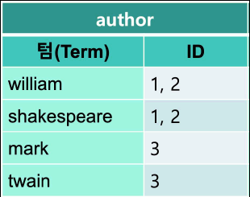

# ElasticSearch 세미나2

## 목차

>01.매핑 및 필드
>
>>01.1 매핑
>>
>>01.2 match 검색
>>
>>01.3 Keyword
>>
>>> 키워드 저장이유
>
>02.Elasticsearch 집계 Aggregations
>
>> bucket, metric, pipeline
>>
>> Aggregation 종류
>>
>> 02.1 Bucket Aggregation
>>
>> 02.2 Metric Aggregation
>>
>> 02.3 Agg. Combination
>>
>> 02.4 Agg. Combination in Kibana
>
>03.도큐먼트 색인 과정
>
>04.Elasticsearch 랭킹알고리듬
>
>>04.1 TF/ IDF
>>
>>04.2 검색 랭킹 중요이유
>
>05.루씬 세그먼트
>
>> 05.1 문서 변경/ 삭제 과정

## 01.매핑 및 필드

### 01.1 매핑

- 스키마를 매핑이라고함
- 인덱스 만들때 설정해야하는데 도큐먼트만해도 자동으로 생성됨
- 각 필드별로 데이터를 저장하는 스키마 명세이며 인덱스/타입 별로 구분됨
- 매핑이 없는 경우 데이터를 처음 입력하면 매핑이 자동 생성
  - 자동 생성된 매핑의 텍스트 필드는 기본적으로 standard analyzer가 적용되고,
    - keyword 타입으로 멀티 필드가 생김

- 각 타입의 경우 거의 자동으로 해서 알아서 넣어줌
  - 텍스트 경우
    - 처음 키워드 바꿔도됨
    - 타입의 경우 키워드 타입으로 해야함


### 01.2 match 검색

- 검색어도 analyze과정을 거침

- 검색시 _search?
  - match 쿼리 사용해서 검색 
- 키워드는 제대로 다 입력해야지 검색이 됨

```json
curl -XGET "http://localhost:9200/books/_search?pretty=true" -d'
{
"query": {
	"match": {
	"author": "william"
		}
	}
}' -H 'Content-Type: application/json'
```



### 01.3 Keyword

- Keyword 필드 검색시 대소문자까지 정확히 일치해야함

  ```json
  curl -XGET "http://localhost:9200/books/_search?pretty=true" -d'
  {
  "query": {
  "match": {
  "author.keyword": "William Shakespeare"
  }
  }
  }' -H 'Content-Type: application/json'
  ```

  

#### 키워드 저장이유

- Key

- 집계때문에 
  - 집계를 그냥했을때, 통으로 집계되는게 아니라 잘려서 집계가 되었음
  - 아이들 검색시
    - 서태지 아이들, 아이들,.. 검색 되었음
- 각 필드가 어떻게 사용될지 고민하고 사용하면 좋음
- 집계를 할때 쓰이는 경우가 많은 경우
  - category
    - 그럴때 키워드 타입으로 저장하고 검색시 ui 레벨에서 드롭 리스트를 이용해서 컨트롤 하게해서
      - 사용자들이 오타낼 일 없이 사용할 수 있게 할 수 있음
- 한국어, 일본어, 중국어 이렇게 있을때, 각각의 언어에 맞게 검색을 하기 위해서 사용

## 02.Elasticsearch 집계 Aggregations


- search 와 같이 쓸 수 있음

  - authors임의 지정

  - 필드구분까지 
    - 결과는 제일 처음 나오고
    - 이를 bucket으로 해서 몇건이 나타나는지 나오게됨
    
  - _search API에서 query와 함께 사용이 가능함

    

### bucket, metric, pipeline

- bucket

  - 도큐먼트 집단 단위인 버킷을 생성
  - 또 다른 bucket또는 metric의 sub-aggregation을 포함

- metric

  - 도큐먼트 집단에 대한 하나 또는 그 이상의 계산된 수치를 포함

  - 사칙, 최대, 최소

- pipeline

  - agg결과에 대한 새로운 계산을 실행

  - 변위 미분값 등등

### Aggregation 종류

• percentile
• percentile_ranks
• cardinality
• significant_terms
• top hits
• scripted_metric
• filters
• range
• geohash
• terms
• histogram
• date_histogram
• stats
• extended stats
• min / max
• sum
• pipeline aggregations

### 02.1 Bucket Aggregation


### 02.2 Metric Aggregation


### 02.3 Agg. Combination


- 숫자는 range agg 사용가능
- 날짜는 게이트레인지?
  - 이것도 bucket으로 할 수 있고, 이거으로 레인지 잡지만 이를 히스토그램이라고 하고 
  - 인터벌을 해서 10으로 설정시 10기준으로 버킷을 생성해줌
- metric agg
  - 평균, 합계등등 계산
  - 쿼리 하나에 agg 여러개 할 수 도 있음

### 02.4 Agg. Combination in Kibana

- 키바나에서도 agg해서 결과를 만들어냄

  

## 03.도큐먼트 색인 과정

- 도큐먼트 색인 과정

  ```json
  Put my_index/_doc/100
  # 안쓰면 자동으로 들어감
  ```

  - 도큐먼트 아이디를 통해 샤드에 넣고 라운드로빈을 이용해서 넣음

  

- 도큐먼트 불러오기

  - 도큐먼트 ID를 입력하여 검색과정 없이 바로 도큐먼트를 불러올 수 있음
  - 검색 과정이 다르기 때문에 inverted index를 사용하지 않고 실행됨

  ```json
  GET my_index/_doc/101
  ```

  

- 검색과정

  ```json
  GET my_index/_search{size: 10}
  # 기본이 10, 
  #이를 샤드에 10개씩 가져오게 되어 있고 이를 코디네이터로 전달함
  #루신이 자체로 선언한 도큐먼트 아이디와 내부 점수 리턴함
  #샤드 가 코디네이터까지 오면 코디네이트라고함
  #10개를 가지고 와서 40개 버리고 10개 도큐먼트에게 요청해서 그 과정에서 해당 도큐먼트 내용 샤드들이 코디네이터 가 클라이언트에게 전달 Fetch phase
  ```

  - 1.Query Phase

    - 처음 쿼리 수행 명령을 받은 노드는 모든 샤드에게 쿼리를 전달
      - 이 명령을 전달하는 노드를 코디네이트 노드라고함
      - 1차적으로 모든 샤드(또는 복제본에서) 검색을 실행

    

    - 각 샤드들은 요청된 크기만큼의 

      - 검색 결과 큐를 코디네이트 코드로 리턴함

    - 리턴된 결과는 루씬 doc id와 랭킹 점수만 가지고 있음

      

  - ​	2.Fetch Phase

    - 노드는 리턴된 결과들의 랭킹 점수를 기반으로 정렬한 뒤
      - 유효한 샤드들에게 최종 결과들을 다시 요청

    

    - 전체 문서 내용(_source)등의 정보가 리턴되어 클라이언트로 전달

      

      

## 04.Elasticsearch 랭킹알고리듬

- 대부분의 검색엔진은 사용자가 원하는 검색 결과를 위해 랭킹 점수를 적용

- 보통 TF/IDF를 사용을 많이 하고 elastic에서도 처음에 씀 

  

- Elasticsearch 5.0부터는 지금은 BM25라는 알고리듬 사용

  

### 04.1 TF/ IDF

- TF (Term Frequency)

  - 찾는 검색어가 문서에 많을수록 해당 문서의 정확도가 높음

    

- IDF (Inverse Document Frequency)

  - 만들수록 점수 낮음

  - 많이 출현한 단어 많을 수록 점수 낮음

    - 즉, 전체 문서에서 많이 출현한(흔한) 단어일 수록 점수가 낮음

      

- 스파이더맨 검색시, 
  - 도큐먼트에 1개, 도큐먼트 10, 도큐먼트 100 일때 
    - 100이 사용자가 더 선호 하는 것 이때 TM

- spiderman 할때 spider + man 분리 해서 무튼 많을 수록 점수 낮은것 IDF


### 04.2 검색 랭킹 중요이유

- 사람들 처음 나온값만 봄
  - 1만개이상은 안됨
  - 사용시 from을 쓸수 있는데
  - 그 위치부터 몇개를 가져올 수 있을지 설정
    - 이렇게 하면 페이지 처리를 할 수 있음
    - 페이지 넘어갈 수록 느려진다고 하는데 
    - 999, 10 이면 페이지 99개 가져오고
      - 페이지 해야하는 경우 다른것 피드백줘서 하는게 좋음 비용이 너무 비싸서

- 구글 URL보면 start=10 이런게 있는데 이를 설정하면 60이면 6페이지, 200이면 20페이지 이렇게 되는것
  - 900하면 검색이 안되는데 990억개라는것 거짓말임
  - 검색엔진은 대략위와 같이 동작함
  - 필요없는것 까지 굳이 만드는것 아님
  
- 결과 값이 큰 내용을 fetch하는 것은 상당히 부하가 큼

- 1~100을 fetch하는 것이나 990~1000을 fetch하는 것이나 쿼리 작업 규모가 비슷

  

## 05.루씬 세그먼트

- Inverted index, Doc Value, 원본 문서 등등을 저장하고 있는 단위 파일
  - 루씬은 inverted index를 여러개의 작은 세그먼트로 저장
  - 입력 버퍼가 가득 차거나, 디폴트 1초마다 하나씩 생성
    - 그래서 파일 갯수가 많음
    - 책을 넘기면 1초동안 내용가지고 인벌트인덱스만들어서 저장함
  - 한번 생성된 세그먼트는 변경되지 않음(immutable)


### 05.1 문서 변경/ 삭제 과정

- **한번 생성된 세그먼트는 변하지 않음**
  - update 없음, 모두 delete & insert
  - 문서 삭제시 삭제되었다는 상태만 표시하고 검색에서 제외
  - 나중에 세그먼트 병합 과정에서 삭제된 문서를 빼고 
    - 나머지 문서들을 모아서 새로운 세그먼트를 만듦

- **이때 도큐먼트 삭제되면**

  - 그 도큐먼트는 새로 들어오는 세그먼트에 저장소에 기록..?

  - 그래서 삭제되는거 빼고 검색하는데

  - 많아지면 한번 세그먼트 머지하는데 삭제된것 빼고, 나머지만 병합을 해서 저장
    - 그래서 문서를 삭제하더라도 세그먼트 병합을 하기 전까지 스토리지 용량은 줄어들지 않음

- **세그먼트 병합할때**

  - 디스크 I/O 라서 느려질 수 있음

  - 시스템이 느려짐

  - 가능하면 사용자들이 적은 시간에 하는 것이 좋음

  - force merge하면 임의적으로 할 수 있음

    

  - 오래된것 커지고, 새로 생긴것 상대적으로 작음
  - 오래된 문서를 삭제하는 것은 더욱 비용이 큼
  - 날짜별로 저장 영역(인덱스)를 구분하는 것이 바람직
    - Elasticsearch에서는 여러 인덱스를 묶어서 검색할 수 있는 멀티테넌시를 지원

- **lucene segment..**
  - changing bits라는것 보면 영상으로 확인 할 수 있음 [영상링크](https://youtu.be/YW0bOvLp72E)
- **사용하면서 하면안되는것**
  - 2년전 100만개 데이터라고 하면 거기서 한번도 쿼리 추가 안했다고 했을때
  - 잘못들어간것때문에 지웠다면 elk는 그 작업을 다시해야함
    - 그래서 로그데이터 쌓기에는 좋음, 바꿀 이유는 없기때문에
  - 삭제시 인덱스 단위로 삭제하는 것이 좋음
- **날짜단위로 하는것이 좋다고 말했지만**
  - 안좋은것은 인덱스 개수많아지고 샤드 많아져서 느려지는 현상이 있었음
  - 그래서 5개에서 1개로 샤드 바꿨는데
  - 데이터 프레임 구조를 만들었는데 이 데이터 프레임이 인덱스 관리해줌
    - 날짜 단위가 아니고 20기가마다 새로 만들어주는것 즉, 원하는 사이즈가되면 새로운것 만들고 검색시 같이 검색하는식으로 되게 해주는
    - 데이터 프레임사용하려면 아직은 설정을 따로해야함
      - apm,등등은 데이터 프레임을 사용함
- **처음하는 사람들이 쉽게 하게**
  - sample data라는것이 있음
    - other sample data라는 것에 샘플데이터 있는데 이를 이용해서 사용할 수 있게함
