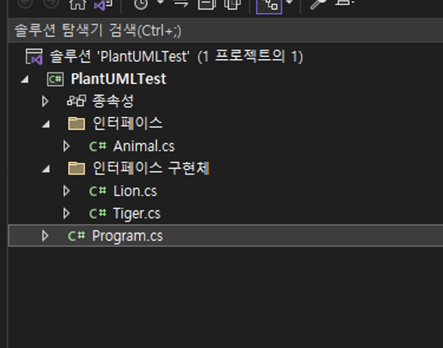
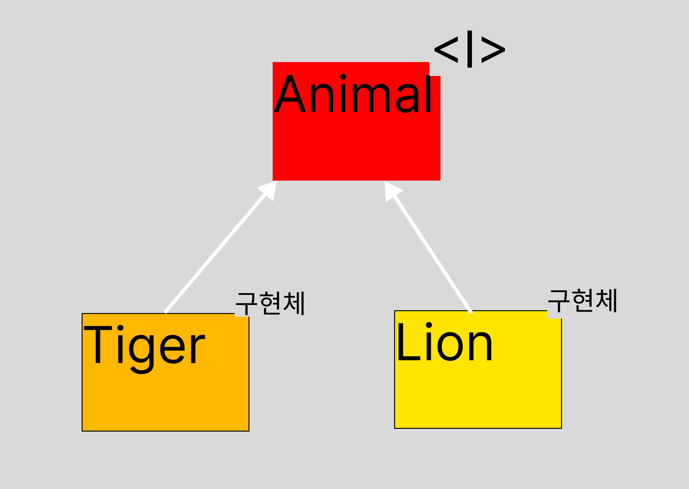
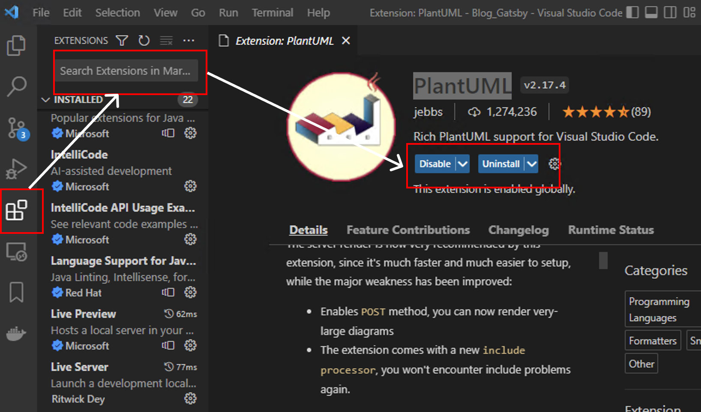
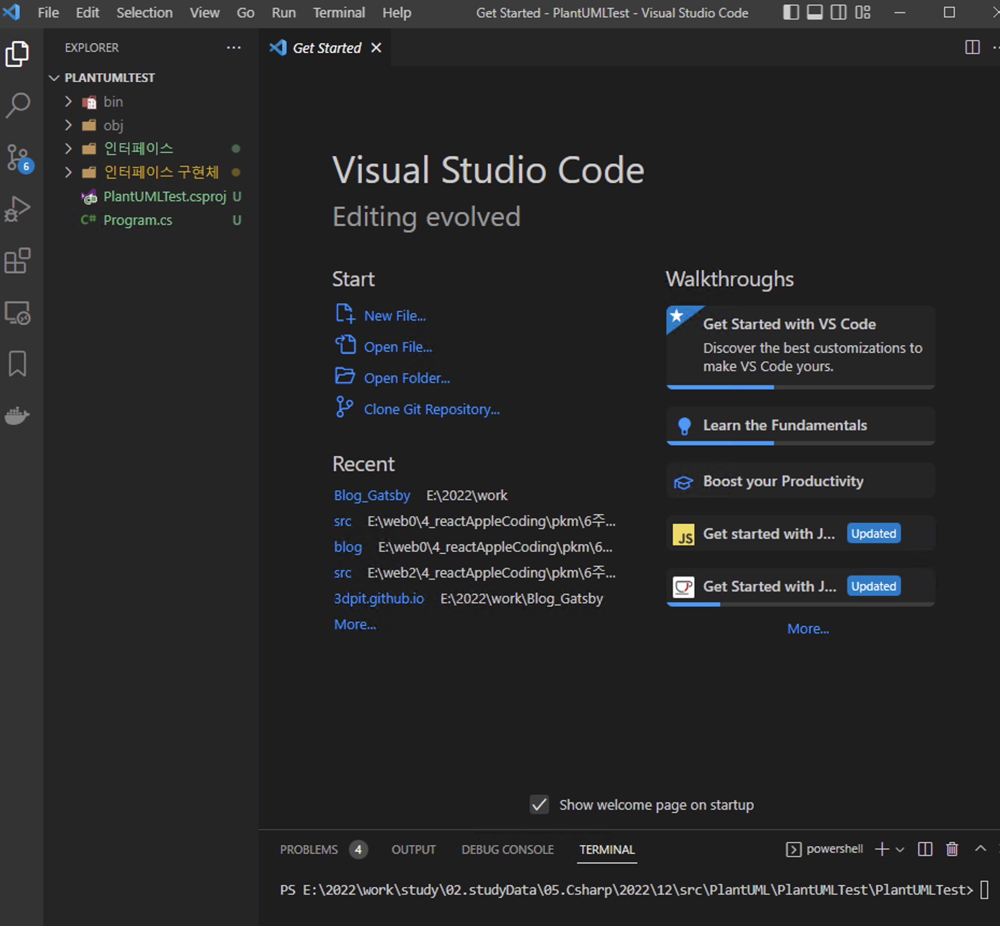
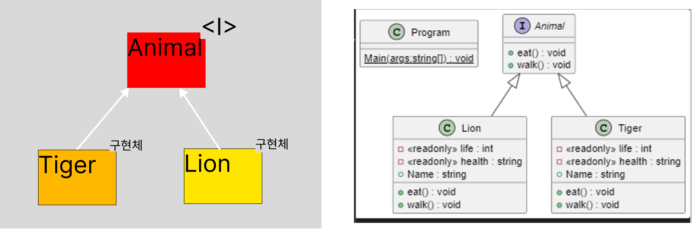

## 2022-12-09-Puml를-이용하여-UML-그리기

## 목차

> 01.프로젝트 구성해보기
>
> 02.PlantUML로 UML 그려보기
>
> 03.결과
>
> 참고자료  

## 01.프로젝트 구성해보기

- 우선 프로젝트가 아무것도 없다면 먼저 만든다.



- 인터페이스 | 동물

  ```cs
  using System;
  using System.Collections.Generic;
  using System.Linq;
  using System.Text;
  using System.Threading.Tasks;
  
  namespace PlantUMLTest.인터페이스
  {
      public interface Animal
      {
          public void eat();
          public void walk();
      }
  }
  ```

- 구현체 | 사자, 호랑이

  ```cs
  // Lion
  using System;
  using System.Collections.Generic;
  using System.Linq;
  using System.Text;
  using System.Threading.Tasks;
  using PlantUMLTest.인터페이스;
  
  namespace PlantUMLTest
  {
      public class Lion :Animal
      {
          private readonly int life;
          private readonly string health;
          public string Name;
          public void eat()
          {
              Console.WriteLine("사자ㅣ 답게 냠냠");
          }
  
          public void walk()
          {
              Console.WriteLine("사자 답게 당당하게 걷기");
          }
      }
  }
  
  
  // Tiger
  using System;
  using System.Collections.Generic;
  using System.Linq;
  using System.Text;
  using System.Threading.Tasks;
  using PlantUMLTest.인터페이스;
  
  namespace PlantUMLTest
  {
      public class Tiger : Animal
      {
          private readonly int life;
          private readonly string health;
          public string Name;
          public void eat()
          {
              Console.WriteLine("호랑이 답게 냠냠");
          }
  
          public void walk()
          {
              Console.WriteLine("호랑이 답게 당당하게 걷기");
          }
      }
  }
  ```

  - 현재는 간단한 uml이다 여기서 우리가 원하는 uml이 뭔가

    

    - 이렇게 상속 관계를 표현할것이다. 
      - 위와 같이 간단한 경우 내가 직접할 수 있지만? 
      - 너무 많다면? 직접 그리기 힘들긴 할것이다. 그 구현체에 세부적인 변수도
        - 다 적는다면 더 걸릴것인데 더 간단히 할 수 있는 방법을 소개한다.

## 02.PlantUML로 UML 그려보기

- 초기 셋업
  - vscode가 있어야함
  - vscode에서 PlantUml확장 설치를 한다.

- 적용해보기

  - 위의 c#관련 소스를 vs코드로 실행한다.

  - plantUML 설치

    

  - 확장에서 PlantUML 검색 후 설치를 한다.

- 해당 소스가 있는 위치로 이동한다.

  

  - 터미널 창을 켠다. 

    - 단축키 

      - 윈도우: 컨트롤 + ~
      - 맥: 커맨트 + ~

    - 명령어 입력해보기

      ```sh
      puml-gen . ./out -dir -allInOne
      ```

      - out이라는 폴더가 생긴다
      - out 폴더에 들어가서 include.puml 이있는데 그 파일을 열고
        - 윈도우 : alt + d를 해주면 아래와 같은 결과를 얻는다.

## 03.결과



- 이전 예상한 결과와 같은 결과를 얻는것을 알 수 있을 것이다.
- 잘쓰면 편하게 uml를 사용할 수있다. 하지만 만능은 아닐 수 있으니 간단히 써보는것을 추천한다.

## 참고자료

[plantUML](https://github.com/pierre3/PlantUmlClassDiagramGenerator)