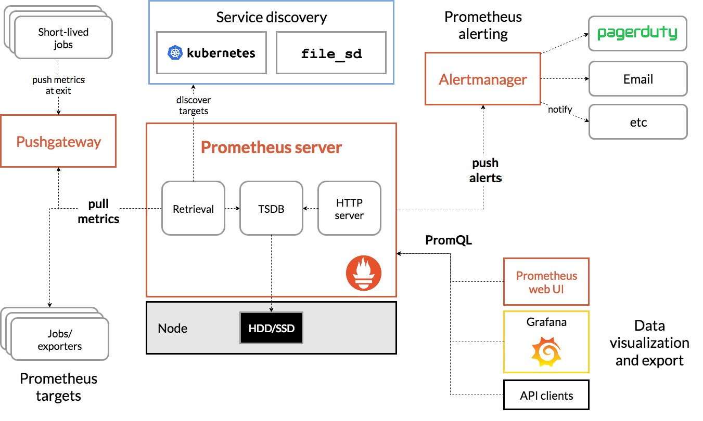

## 2022-06-22-PureStorage-Prometheus-개념

## 목차

>01.개념정리
>
>>01.1 퓨어스토리지 플래시 어레이란?
>>>
>>01.2 퓨어스토리지 플래시 블레이드란?
>>>
>>01.3 Promethues란?
>>>
>>> 01.3.1 Prometheus.yml 기본 이해하기
>

## 01.개념정리

### 01.1 퓨어스토리지 플래시 어레이란?

- 퓨어스토리지 FlashArray는
  - 메모리 액세스 및 저장을 위해 NVMe프로 토콜에서만 독점적으로 실행되는 세계 최초의 엔터프라이즈급 스토리지 어레이
    - 성능, 단순성 및 통합의 영역에서 최첨단 기능을 제공하는 `공유 가속 스토리지 기술`
  - 단순성과 안정성을 염두에 두고 구축됨
    - 움직이는 부품이 없어 잠재적으로 오류가 발생할 가능성이 있는 영역을 제거
    - 매우 안정적이며 사용자에게 데이터 손실을 방지하는 방식으로 시스템 종료를 관리할 수 있는 기능 제공
- **장점**
  - 유사한 기술 보다 훨씬 높은 수준의 속도
  - 데이터 전송 속도를 최대화하는 동시에 전송 속도를 늦출 수 있는 시스템 대기 시간을 최소화
    - 사용자에게 빠른 메모리 읽기 및 데이터 액세스 속도 제공
  - 랜섬웨어 위협에 대한 추가 보호 기능 제공
    - 랜섬웨어 위협이나 악의적인 공격을 받은 경우 데이터를 이전 버전이나 스냅샷으로 되돌릴 수 있음	

### 01.2 퓨어스토리지 플래시 블레이드란?

- 퓨어스토리지 FlashBlade는
  - 백업 어플라이언스 및 데이터 레이크와 같은 복잡한 데이터 사일로를 통합하고 미래의 발견과 통찰력을 가속화하기 위해
    - 현대적인 대규모 병렬 아키텍처로 구동되는 비정형 데이터를 위한 업계에서 가장 진보된 확장형 스토리지
- **장점**
  - 스냅샷, 복제 및 블레이드를 변경할 수 없는 기능이 가장 가치 있는 기능
    - 이러한 블레이드에 스냅샷을 저장하고 있고 만질 수 없으며, 성능이 뛰어남
  - 랜섬웨어에 감염된 경우 복구할 수 있도록 하는 것
  - 퓨어스토리지의 전체 아이디어는 하루에 여러 번 스냅샷을 찍을 수 있기 때문에 매우 효과적
  -  누군가 들어와서 기본적으로 귀하의 데이터를 가져오면 해당 데이터를 삭제하고 그들이 여기에 오기 전에 다시 저장할 수 있음

### 01.3 Promethues란?

- SoundCloud사에서 만든 오픈소스 시스템 모니터링 및 경고 툴킷

  - 매트릭 수집 및 대시보드 구축하는 방식을 장려

- **아키텍쳐**

  

- `Jobs/exporters`
  - 실제로 매트릭을 수집하는 프로세스
- `exporter`가 매트릭을 수집하고 HTTP통신을 통해 매트릭 데이터를 가져갈 수 있게 /metrics라는 HTTP 엔드포인트를 제공
  - 그러면 `Prometheus server`가 `exporter`의 엔드 포인트로 HTTP GET요청을 날려 매트릭 정볼르 수집 함
- 수집한 정보를 Prometheus가 제공하는 간단한 웹 뷰를 통해 조회할 수 있음
  - 그 안에서 테이블 및 그래프 형태로 볼 수 있음
    - 그라파나라는 도구를 사용하는 이유는 시각화 도구가 부족하기 때문에 시각화함
  - Prometheus & Grafana이고 Elasticsearch & Kibana 이런 느낌임

[참고 링크](https://medium.com/finda-tech/prometheus%EB%9E%80-cf52c9a8785f)

#### 01.3.1 Prometheus.yml 기본 이해하기

```yml
# 기본적인 전역 설정 
global:
  scrape_interval:     15s # 15초마다 매트릭을 수집한다. 기본은 1분이다.
  evaluation_interval: 15s # 15초마다 매트릭을 수집한다. 기본은 1분이다.
  # 'scrpae_timeout' 이라는 설정은 기본적으로 10초로 세팅되어 있다.
# Alertmanager 설정
alerting:
  alertmanagers:
  - static_configs:
    - targets:
      # - alertmanager:9093
# 규칙을 처음 한번 로딩하고 'evaluation_interval'설정에 따라 정기적으로 규칙을 평가한다.
rule_files:
  # - "first_rules.yml"
  # - "second_rules.yml"
# 매트릭을 수집할 엔드포인트를 설정. 여기서는 Prometheus 서버 자신을 가리키는 설정을 했다.
scrape_configs:
  # 이 설정에서 수집한 타임시리즈에 'job=<job_name>'으로 잡의 이름을 설정한다.
  - job_name: 'prometheus'
    # 'metrics_path'라는 설정의 기본 값은 '/metrics'이고
    # 'scheme'라는 설정의 기본 값은 'http'이다.
    static_configs:
    - targets: ['localhost:9090']
```

- 대개 `scrap_configs`를 사용함

  - 실제  exporter를 지정

  - `- job_name:`에 잡의 이름을 지정

    - 위의 job이 데이터를 수집할 `exporter`의 경로를 
      - `static_configs:`의 
        - `- targets:`와 `metrics_path:`. `scheme:`에 설정

  - **예시**

    ```yaml
    scrape_configs:  
       - job_name: 'node_exporter_test'
         # exporter가 제공하는 엔드포인트가 /metrics라면 metrics_path의 설정을 생략해도 된다.
         # exporter의 프로토콜이 http라면 scheme의 설정을 생략해도 된다.
         scrape_interval: 10s
         static_configs:
         - targets: ['192.168.56.111:9100']
       
       - job_name: 'kube_state_metrics_exporter_test'
         metrics_path: '/test-metrics'
         scheme: 'https'
         scrape_interval: 10s
         static_configs:
         - targets: ['13.209.3.110:30001']
    ```

## 