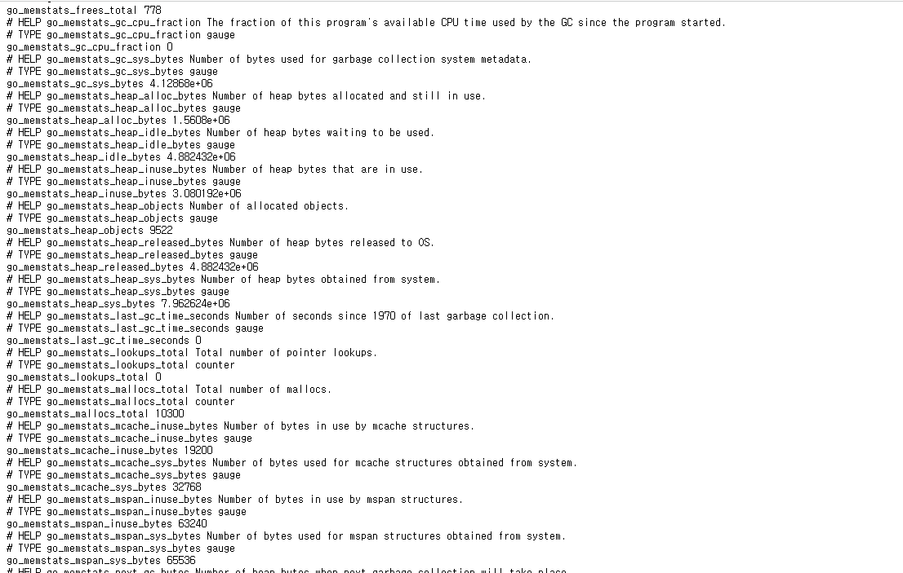
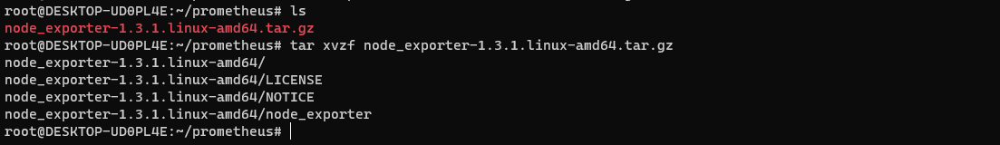
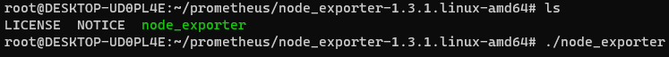

## 2022-06-23-[Prometheus]Exporter-알아보기

## 목차

>01.Exporter란?
>
>02.docker로 exporter 설치
>
>03.systemctl로 설치

## 01.Exporter란?

- 특정 메트릭을 수집해서 외부로 노출시키는 애플리케이션

## 02.docker로 exporter 설치

- [node exporter github](https://github.com/prometheus/node_exporter)

```sh
docker run -d \
-p 9100:9100 \
--name=node_exporter \
--pid=host \
-v "/:/host:ro,rslave" \
quay.io/prometheus/node-exporter:latest \
--path.rootfs=/host
```

- `-v "/:/host:ro,rslave" \`
  - 현재 호스트의 루트 볼륨이 수정되지 않도록 ro: read only와
  - 호스트의 read only 수정사항을 받아오도록 rslave 설정

- node exporter에서 모니터링할 루트파일 시스템을 /host로 host로 지정하여 실행



- localhost:9100에 접속하면 수집이 되는 것을 알 수 있음

## 03.systemctl로 설치

- [다운로드 링크](https://prometheus.io/docs/guides/node-exporter/)

  - [링크 주소 복사를위한 페이지](https://prometheus.io/download/)
    - `https://github.com/prometheus/node_exporter/releases/download/v1.3.1/node_exporter-1.3.1.linux-amd64.tar.gz`

- wget으로 받아오기

  ```sh
  wget https://github.com/prometheus/node_exporter/releases/download/v1.3.1/node_exporter-1.3.1.linux-amd64.tar.gz
  ```

- 압축 풀기

  ```sh
  tar xvzf node_exporter-1.3.1.linux-amd64.tar.gz
  ```

  

- 실행하기

  ```sh
  cd node_exporter-1.3.1.linux-amd64/
  
  ./node_exporter
  ```

  

- 설정하기

  - 다운받은 tar파일 opt아래에 풀기

    ```sh
     tar -C /opt -xvzf node_exporter-1.3.1.linux-amd64.tar.gz
    ```

  - 링크 걸어주기

    ```sh
    ln -s /opt/node_exporter-1.3.1.linux-amd64/ /opt/node_exporter
    ```

    - 버전 관리를 용이하게 하기위한 링크

  - 옵션을 위한 파일 만들기

    ```sh
    echo "OPTION=" > /etc/default/node_exporter
    ```

  - systemctl를 위한 파일 작성

    ```sh
    cat << EOF > /etc/systemd/system/node_exporter.service
    [Service]
    User=root
    EnvironmentFile=/etc/defalut/node_exporter
    ExecStart=/opt/node_exporter/node_exporter
    EOF
    ```

  - ```sh
    systemctl daemon-reload
    
    systemctl start node_exporter.service
    ```

    