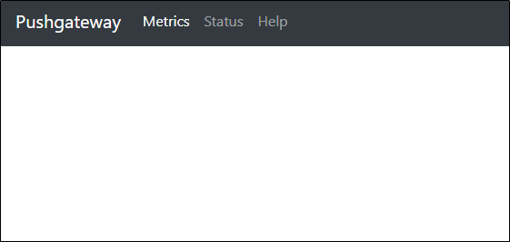
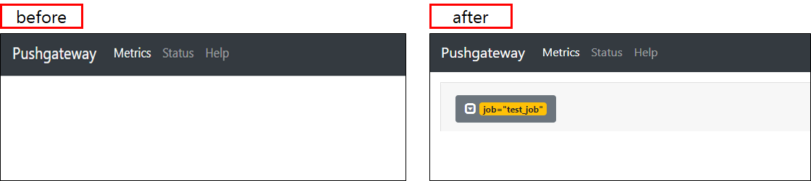
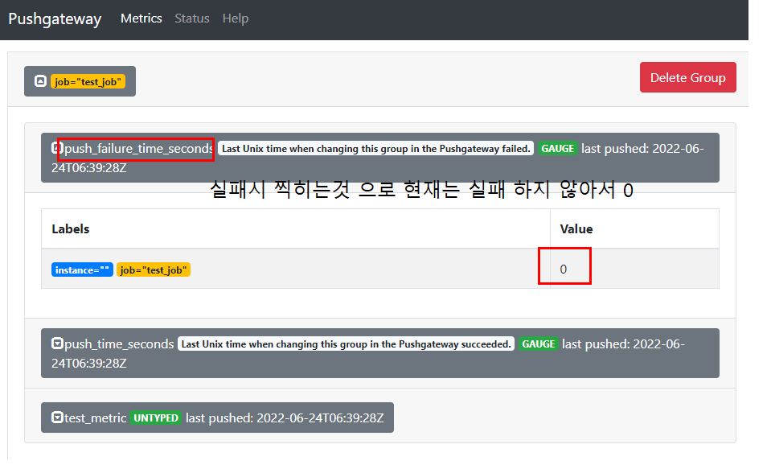
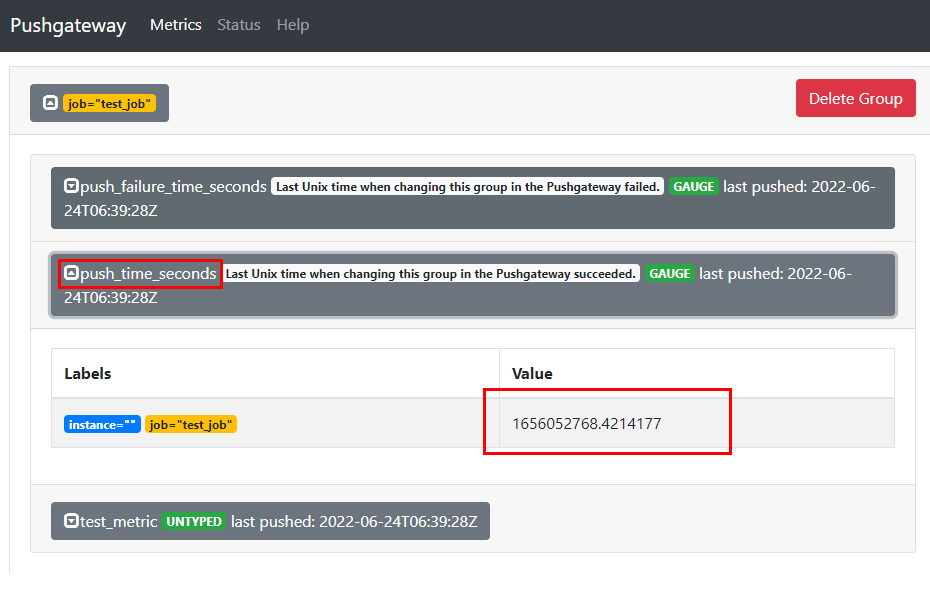
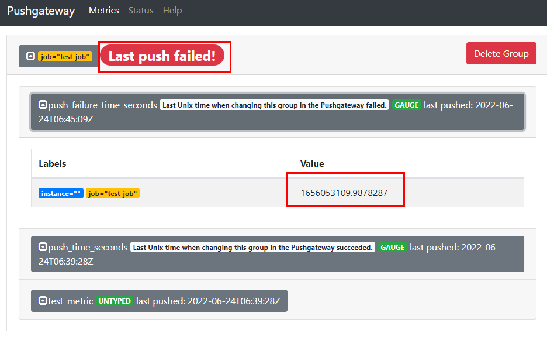
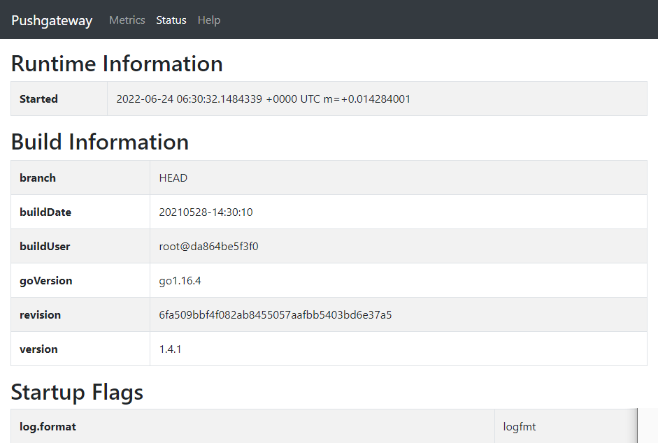
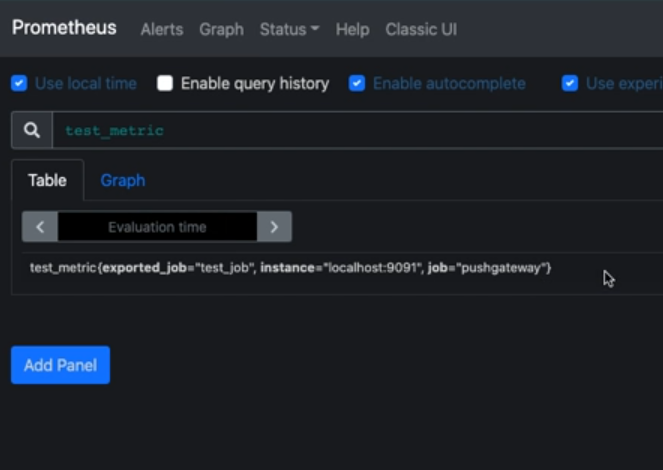
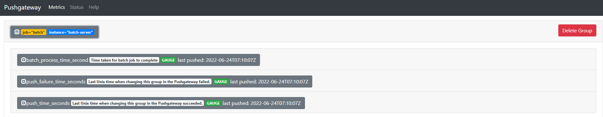
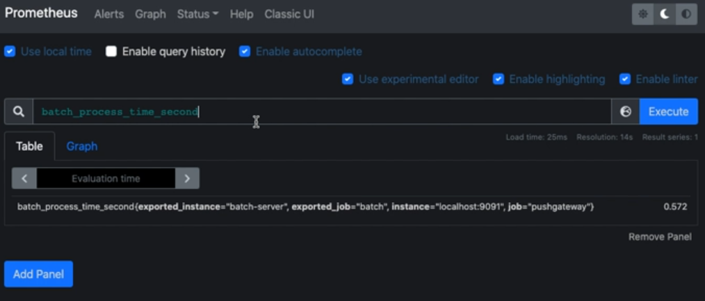

## 2022-06-24-[Prometheus]Push-GW알아보기

## 목차

>01.Pushgateway란?
>
>02.Pushgateway 설치
>
>>02.1 pushgatway 데이터 넣기
>
>02.2 Status
>
>03.인스턴스 확인 | 현재 테스트해봤을때는 안됨
>
>04.실습

## 01.Pushgateway란?

- Prometheus를 push방식으로 사용하기 위해 필요
- 단발성 작업 혹은 배치성 작업에 해당하는 메트릭 수집 용도

## 02.Pushgateway 설치

```sh
docker run -d --net=host -p 9091:9091 --name pushgateway prom/pushgateway:v1.4.1
```



```sh
 cp static_sd.yml pushgateway.yml
 
 vim pushgateway.yml
```

- pushgateway.yml

  ```yml
  scrape_configs:
    - job_name: 'pushgateway'
      follow_redirects: false
      scrape_interval: 2s
      scrape_timeout: 1s
      static_configs:
      - targets:
        - 192.168.100.116:9091
  ```

- 링크 연결 후 reload

  ```sh
  ln -sf pushgateway.yml promtheus.yml
  
  curl localhost:9090/-/reload -XPOST -D /dev/stdout
  ```

### 02.1 pushgatway 데이터 넣기

```sh
echo "test_metric 1" | curl --data-binary @- http://localhost:9091/metrics/job/t
est_job
```



- push_failure_time_seconds

  - 실패시 찍히는것

    

- push_time_seconds

  - 정상적으로 들어온 시간

    

- **실패의 상황**

  ```sh
  "test_metric 1 1" | curl --data-binary @- http://localhost:9091/metrics/job
  /test_job
  ```

  

  - Last push failed가 되고 실패한 시간이 value로 표시

## 02.2 Status

- 현재 동작중이 pushgate 정보와 옵션이 나타나 있음

  

## 03.인스턴스 확인 | 현재 테스트해봤을때는 안됨

- 문제의 원인은 각각의 컨테이너가 다른 network를 공유해서 그런듯

- prometheus에서 test_metric를 하면 아래같이 나옴



- 인스턴스 추가

  ```sh
  echo "test_metric 1" | curl --data-binary @- http://localhost:9091/metrics/job/test_job/instance/batch-server
  ```

- 인스턴스 삭제

  ```sh
  curl -XDELETE http://localhost:9091/metrics/job/test_job/instance/batch-server
  ```

  - pushgateway에서 매트릭을 삭제하지 않으면 프로메테우스가 계속에서 수집해가지 유의

## 04.실습

- bach 작업을 하고 해당 작업이 실패하면 -1
  - 성공시 배치작업을 하는데 걸리는 시간

```sh
mkdir batch

cd batch/

npm init -y

npm i waait

npm i prom-client

vim work.js
```

- work.js

  ```js
  const wait = require('waait')
  const { Registry, Pushgateway, Gauge } = require('prom-client')
  const register = new Registry()
  const gauge = new Gauge({
  	name: 'batch_process_time_second',
  	help: 'Time taken for batch job to complete',
  	registers: [register],
  })
  
  async function batchJob() {
  	if (Math.random() < 0.3) throw new Error('batch job failed')
  	else {
  		await wait(2 * Math.random() * 1000)
  	}
  }
  
  const main = (async function() {
  	try {
  		const startTime = Date.now()
  		await batchJob()
  		gauge.set((Date.now() - startTime) / 1000)
  	} catch (e) {
  		gauge.set(-1)
  	}
  	const gateway = new Pushgateway('http://localhost:9091', [], register)
  	return gateway.push({
  		jobName: 'batch',
  		groupings: { instance: 'batch-server'}
  	})
  })()
  ```

  

- 프로메테우스에서 확인

  - batch_process_time_second 

  

- 3초마다 실행

  ```sh
  watch -n 3 'node worker.js'
  ```

- 해당 메트릭 가져가고나서 삭제하는 소스

  ```js
  const wait = require('waait')
  const { Registry, Pushgateway, Gauge } = require('prom-client')
  const register = new Registry()
  const gauge = new Gauge({
  	name: 'batch_process_time_second',
  	help: 'Time taken for batch job to complete',
  	registers: [register],
  })
  
  async function batchJob() {
  	if (Math.random() < 0.3) throw new Error('batch job failed')
  	else {
  		await wait(2 * Math.random() * 1000)
  	}
  }
  
  const main = (async function() {
  	try {
  		const startTime = Date.now()
  		await batchJob()
  		gauge.set((Date.now() - startTime) / 1000)
  	} catch (e) {
  		gauge.set(-1)
  	}
  	const gateway = new Pushgateway('http://localhost:9091', [], register)
  	gateway.push({
  		jobName: 'batch',
  		groupings: { instance: 'batch-server'}
  	})
  	return setTimeout(() => {
  		gateway.delete({
  			jobName: 'batch',
  			groupings: { instance: 'batch-server' },
  		})
  	}, 4000)
  })()
  ```

  


