## 2022-11-10-VsCode-사용시-쓸만한-EXENSIONS

## 01.Trailing Spaces

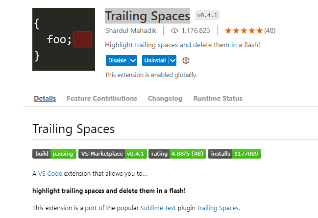

- 이를 사용하면 불필요한 공백인것을 확인 할 수 있음

  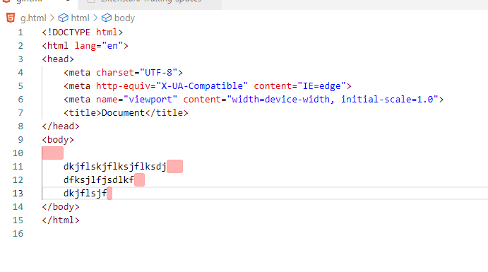

## 02.vscode-icons

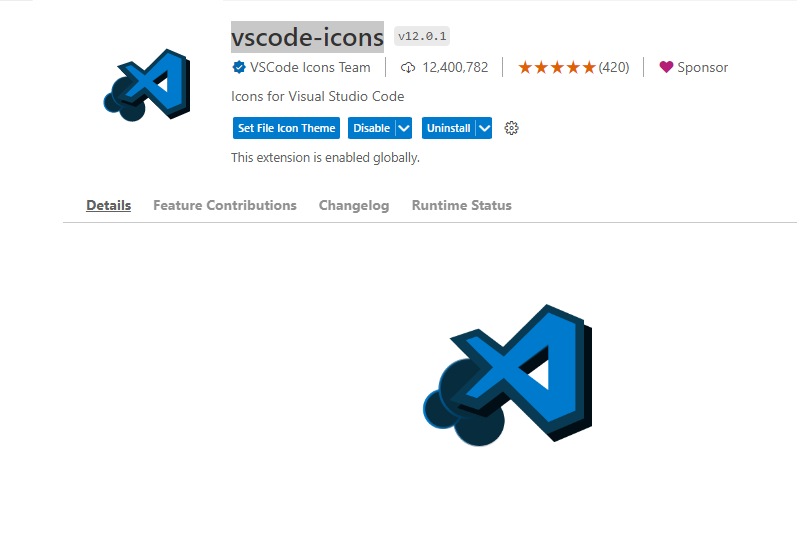

- 적용 전

  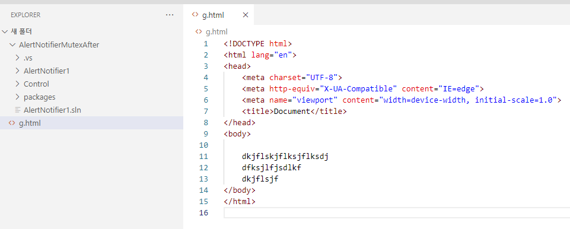

- 적용 후

  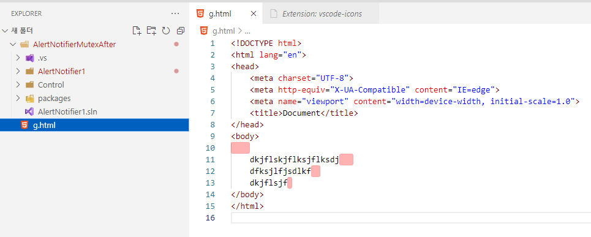

## 03.Bookmarks

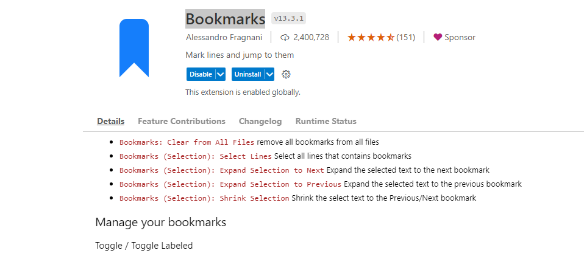

- 북마크 지정
  - ctrl + alt + k
- 북마크 이동 다음
  - ctrl + alt + l
- 북마크 이동 이전
  - ctrl + alt + j

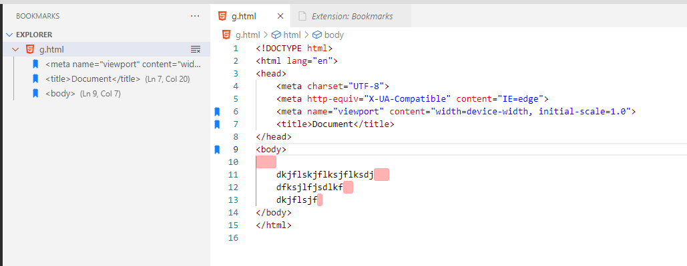

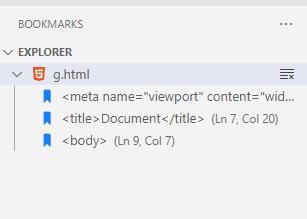

- 리스트가 따로 생기며 필요시 찾기 쉬운 장점 있음

## 04.Auto Close Tag

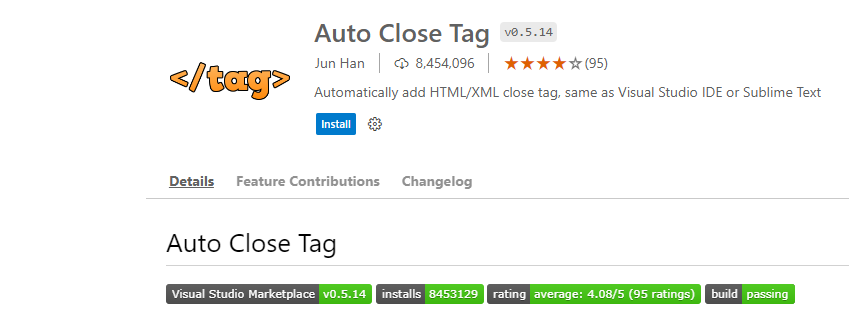

- 태크를 알아서 닫아줌

## 05.Auto Rename Tag

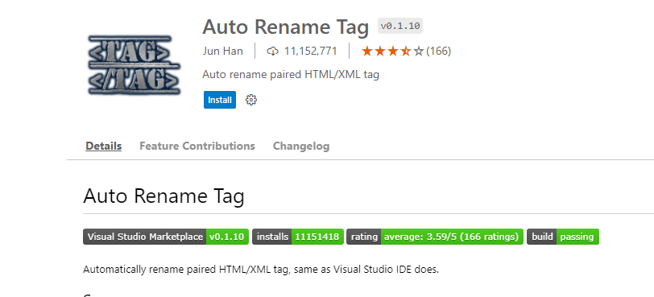

- 태그를 중간에 바꾸면 앞에만 바꿔도 뒤에도 적용됨

## 06.Bracket Pair Colorization Toggler

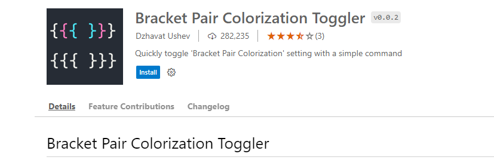

- 사용 전

  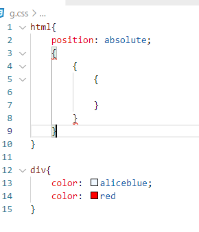

- 사용 후

  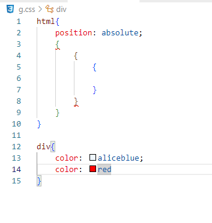

  - 활성화 안된다면 
    - ctrl + shift + p 
      - Bracket Pair Colorization
        - 입력 후 엔터 

  ​	