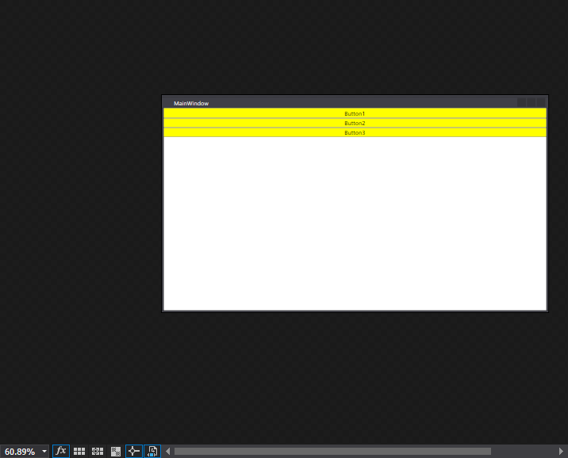
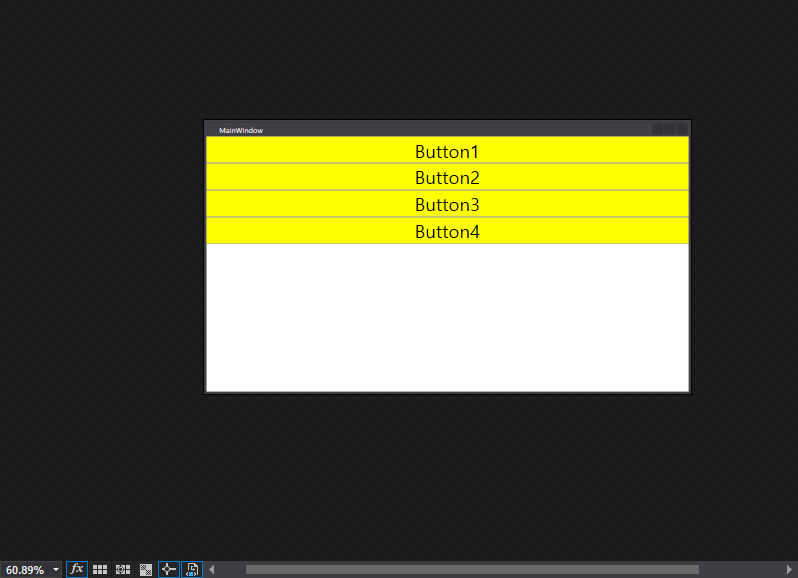
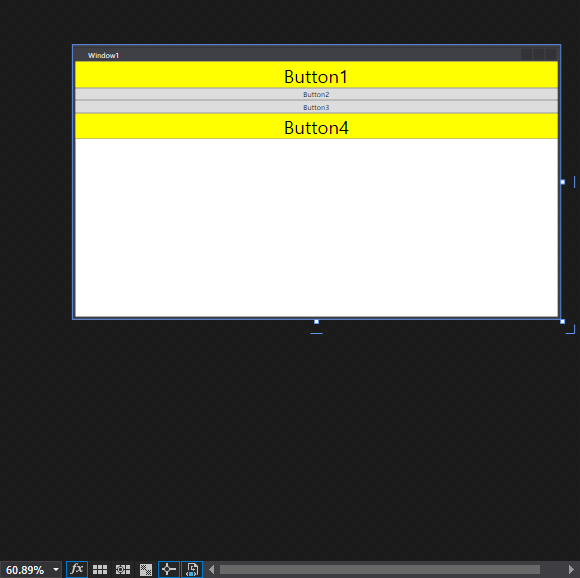
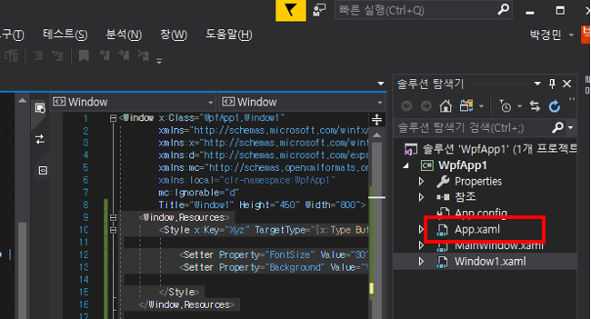
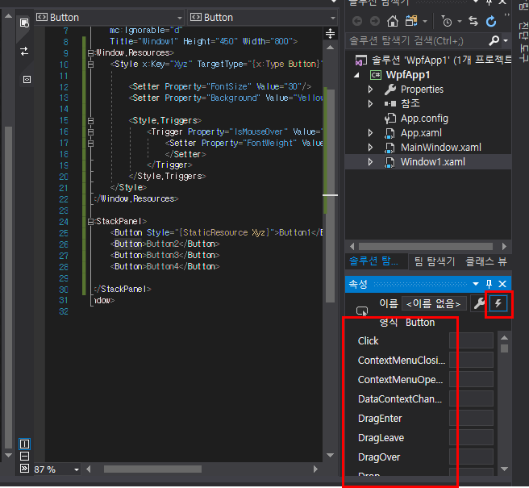
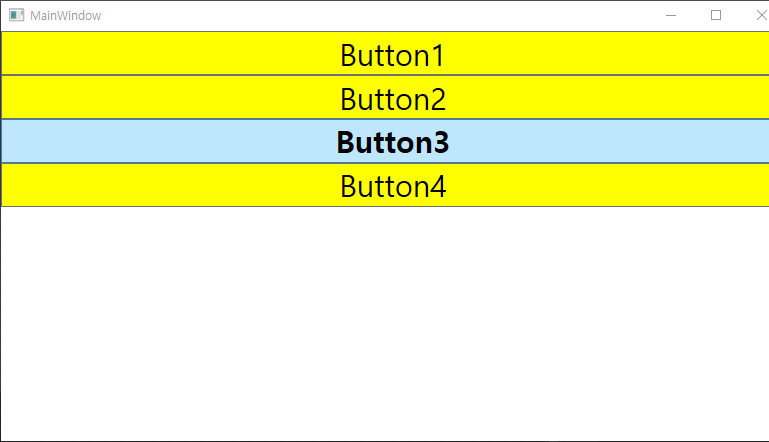
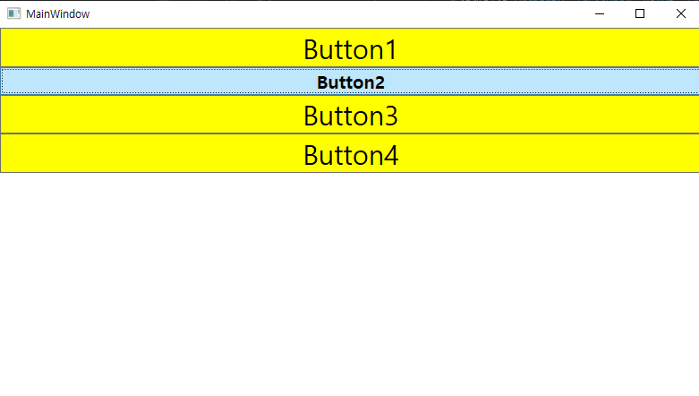

## 2022-07-12-WPF교육-style

## 목차

>01.style이란?
>
>02.실습해보기
>
>>  02.1 그냥 색상 지정하는 경우
>
>>  02.2 다른 방식으로 색상 지정하는 경우
>
>>  0.2.3 타입 구분 방식
>
>03.반복적인 소스를 줄이는 방법
>
>>  03.1 반복적인 소스를 줄이는 방법 1
>
>>  03.2 반복적인 소스를 줄이는 방법 2
>
>04.다른 화면에 같이 style 지정하기
>
>05.부모 자식간의 관계
>
>06.Triggers
>
>>  06.1 싱글 Trigger
>
>>  06.2 멀티 Trigger

## 01.style이란?

- 논리적 리소스는 하나의 속성에 해당한다는 제한이 있음

- WPF에서는 속성 설정 그룹을 Style로 수집하여 여러 요소에 적용할 수 있음

  - 선언법

    ```xaml
    <Window.Resources>
    	<Style ...>
        	...
        </Style>
    </Window.Resources>
    ```

    - Named Style을 사용시 선언할 때 이름을 지정함
      - style 이름을 사용하여 선택한 element에 명시적 적용
    - Targeted style을 사용시 선언할 때 target type을 지정함
      - 그런 다음 스타일은 해당 유형의 element에 자동으로 적용

##  02.실습해보기

### 02.1 그냥 색상 지정하는 경우

```xaml
<Window x:Class="WpfApp1.MainWindow"
        xmlns="http://schemas.microsoft.com/winfx/2006/xaml/presentation"
        xmlns:x="http://schemas.microsoft.com/winfx/2006/xaml"
        xmlns:d="http://schemas.microsoft.com/expression/blend/2008"
        xmlns:mc="http://schemas.openxmlformats.org/markup-compatibility/2006"
        xmlns:local="clr-namespace:WpfApp1"
        mc:Ignorable="d"
        Title="MainWindow" Height="450" Width="800">


    <StackPanel>
        <Button Background="Yellow">Button1</Button>
        <Button Background="Yellow">Button2</Button>
        <Button Background="Yellow">Button3</Button>
    </StackPanel>
</Window>
```



### 02.2 다른 방식으로 색상 지정하는 경우

- 1번방식

  ```xml
  <Button Background="Yellow">Button1</Button>
  ```

- 2번방식

  ```xaml
  <Button>Button1
      <Button.Background>
          Yellow
      </Button.Background>
  </Button>

- 3번방식

  ```xaml
  <Button>
      <Button.Content>
          Button1
      </Button.Content>
      
      <Button.Background>
          Yellow
      </Button.Background>
  </Button>
  ```

### 0.2.3 타입 구분 방식

```xaml
<Style TargetType="Button">

<Style TargetType="{x:Type Button}">
```

- 타입은 구분하는 범주임

- 버튼인지 레이블인지 콤보박스인지 것등등이 type

  ```xaml
  <Button.Style>
      <Style TargetType="{x:Type Button}">
          <Setter Property="Background" Value="Yellow"/>
      </Style>
  </Button.Style>
  ```

- Setter로 이용해서 백그라운드하고 색깔을 준다.

  ```xaml
  <Button>
      <Button.Content>
          Button3
      </Button.Content>
      <Button.Style>
          <Style TargetType="{x:Type Button}">
              <Setter Property="Background">
                  <Setter.Value>
                      Blue
                  </Setter.Value>
              </Setter> 
          </Style>
      </Button.Style>
  </Button>
  ```

- Property는 단순할 수 있지만
- Value는 복잡하고 태그로 내릴수 있음

## 03.반복적인 소스를 줄이는 방법

### 03.1 반복적인 소스를 줄이는 방법 1

- 반복적인것 정의 하는곳

  - windows.Resources

    - 한개 설정을 통해서 색상값 바꾸는것

      ```xaml
      <Window.Resources>
          <Style TargetType="{x:Type Button}">
              <Setter Property="FontSize" Value="30"/>
              <Setter Property="Background" Value="Yellow"/>
          </Style>
      </Window.Resources>
      
      <StackPanel>
          <Button>Button1</Button>
          <Button>Button2</Button>
          <Button>Button3</Button>
          <Button>Button4</Button>
      </StackPanel>
      ```

      

### 03.2 반복적인 소스를 줄이는 방법 2

```xaml
<Window.Resources>
    <Style x:Key="Xyz" TargetType="{x:Type Button}">

        <Setter Property="FontSize" Value="30"/>
        <Setter Property="Background" Value="Yellow"/>

    </Style>
</Window.Resources>

<StackPanel>
    <Button Style="{StaticResource Xyz}">Button1</Button>
    <Button>Button2</Button>
    <Button>Button3</Button>
    <Button Style="{StaticResource Xyz}">Button4</Button>
</StackPanel>
```

- key를 지정해서 개별적으로 적용하기

  

## 04.다른 화면에 같이 style 지정하기



- App.xaml클릭해보면 아래와 같이 나오는데

  ```xaml
  <Application x:Class="WpfApp1.App"
               xmlns="http://schemas.microsoft.com/winfx/2006/xaml/presentation"
               xmlns:x="http://schemas.microsoft.com/winfx/2006/xaml"
               xmlns:local="clr-namespace:WpfApp1"
               StartupUri="MainWindow.xaml">
      <Application.Resources>
           
      </Application.Resources>
  </Application>
  ```

  - 이 안에 필요한 부분을 넣어주면 됨

    ```xaml
    <Application.Resources>
         
    </Application.Resources>
    ```

  - 실제 적용

    ```xaml
    <Application.Resources>
            <Style x:Key="Xyz" TargetType="{x:Type Button}">
    
                <Setter Property="FontSize" Value="30"/>
                <Setter Property="Background" Value="Yellow"/>
    
            </Style>
    </Application.Resources>
    ```

## 05.부모 자식간의 관계

- Control 이 가지고 있음 부모가 가지고 있어서 물려받은것

- Style.Setters 는 그냥 생략을 해놓은것임
  - 그럼 왜 그냥 Setter를 썼는가?
    - 같은 범주에 썼을때  좀더 눈에 잘들어오거나 명시적으로 표기해야 보기 좋음
      - Trigger, resource등이 있음

## 06.Triggers

### 06.1 싱글 Trigger

```xaml
<Style.Triggers>
    <Trigger Property="IsMouseOver" Value="True">
        <Setter Property="FontWeight" Value="Bold">
        </Setter>                    
    </Trigger>
</Style.Triggers>
```

- 마우스 올릴때 그럼 올라갔음을 표시하는 방법으로 사용할 수 있을듯

- 동작 있는지 없는지 내가 어떻게 아는지?

  - 번개 표시 보면 속성에 대해서 여러개 나오는데 어떤것이 있는지에 대해서 알 수 있음

    



- 마우스가 올라간  부분만 색상이랑 특정 속성이 바뀔 수 있도록 지정

### 06.2 멀티 Trigger

- 이벤트를 판별하는 조건을 여러개를 주는것

- ```xaml
  <Window.Resources>
          <Style x:Key="Xyz" TargetType="{x:Type Button}">
  
              <Setter Property="FontSize" Value="30"/>
              <Setter Property="Background" Value="Yellow"/>
  
              <Style.Triggers>
                  <MultiTrigger>
                      <MultiTrigger.Conditions>
                          <Condition Property="IsMouseOver" Value="True"/>
                          <Condition Property="IsFocused" Value="True"/>
                      </MultiTrigger.Conditions>
                  <MultiTrigger.Setters>
                      <Setter Property="FontWeight" Value="Bold"/>
                      <Setter Property="FontSize"  Value="20"/>
                  </MultiTrigger.Setters>        
                  </MultiTrigger>
              </Style.Triggers>
          </Style>
  </Window.Resources>
  
  <StackPanel>
      <Button Style="{StaticResource Xyz}">Button1</Button>
      <Button Style="{StaticResource Xyz}">Button2</Button>
      <Button Style="{StaticResource Xyz}">Button3</Button>
      <Button Style="{StaticResource Xyz}">Button4</Button>
  </StackPanel>
  ```

  

