## 2022-07-13-WPF교육-Layout

## 목차

>  01.교육흐름내용
>
>  >  01.1 Grid
>
>  01.2 레이아웃
>
>  >  01.3 DockPanel.Docks
>
>  >  01.4 wrap패널
>
>  >  01.5 canvas
>
>  >  01.6 uniform grid
>
>  >  01.7 추가적인 스터디
>
>  02.내용 정리
>
>  >  02.1 Element 크기 설정
>
>  >  02.2  HorizontalAlignment 및 VerticalAlignment

>>  02.3 Visibility
>
>>  02.4 Padding 및 Margin
>
>>  02.5 Panel
>
>>>   StackPanel
>
>>>  WrapPanel
>
>>>>  예제
>
>>>  DockPanel
>
>>>  Grid
>
>>>  Canvas
>
>>>  UniformGrid
>
> 03.추가적인 내용 정리

## 01.교육흐름내용

### 01.1 Grid


```xaml
<Grid>
    <RowDefinition> </RowDefinition>
</Grid>
```

- 그리드 특징 여러개를 쌓을 수 있음
  - 레이어 개념으로 그리드에 포함 되어 있음
  - 밑에서 아래로 쌓이는지 옆으로 쌓이는지?
    - 쌓이는것은 쌓이는 순서가 있음

### 01.2 레이아웃

- 레이아웃안에 레이아웃 배치 할 수 있음

```xaml
<StackPanel Grid.Column ="0" Orientaion="Horizontal">
	<Button>1</Button>
</StackPanel>
```

- 가로로 배치하는 법
- 서로 배치가 적용이 되어 있어서 

### 01.3 DockPanel.Docks

- 스택패널 부분에 나머지 채우고 싶은 경우
  - **스택 패널 오른쪽에서 왼쪽으로 적용하는것**
  - **아래에서 위로하는 것**

### 01.4 wrap패널

- 왼쪽에서 오른쪽 으로 정렬
  - 크기가 작아지면 내려가게 된다.
  - 작아졌을때 스크롤이 생기는것도 아니고 아닌것도 있음
  - 이를 wrap이 가지고 있음

### 01.5 canvas

- 잘쓰지 않을것 같은 느낌
- 패널과는 다르게 원하는 위치에 넣고 싶음
- 그리드 속성과 비슷
  - 행열과 넣을 수 있고
- canvas는 
  - 구역을 나누지 않더라도 적용할 수 있음
- 위치에 제한이 없음
  - **캠버스 사용하는 곳 찾아보기**

### 01.6 uniform grid

- 추가시 같은 크기로 들어감
  - Row="2" Columns ="3"
    -  범위를 넘어가는경우 나오지 않음
  - grid에 번호 지정한 경우
    - 이를 숫자만 바꾼다면 운영 관점에서 좀 힘들지 않나?
    - 왜 숫자 넣는걸 지향하는지?
      - 찾기 쉬워서 하지 않을까 함
- **정확한 기준으로 어떤식으로 사용하는지 찾아볼걸** 
- 레이아웃에 대한 컨트롤이 더 있지 않을까?
  - 책내용에 없는 레이아웃 관련된 태그 정리
    - **stack panel, wrap, dock, uniform, grid.... 다른것 없는지 확인 해보기**
      - border까지 
- xml 레이아웃 타입
  - items control 부분은 추후에 스터디에서 진행

### 01.7 추가적인 스터디

- xaml  
  - 유튜브 참고 디자인적인 것만 보고 해보자


## 02.내용 정리

### 02.1 Element 크기 설정

- Width, Height
  - 실제 크기 설정시 사용
- MinWidth, MaxWidth, MinHeight, Minwidth
  - 고정된 크기 설정

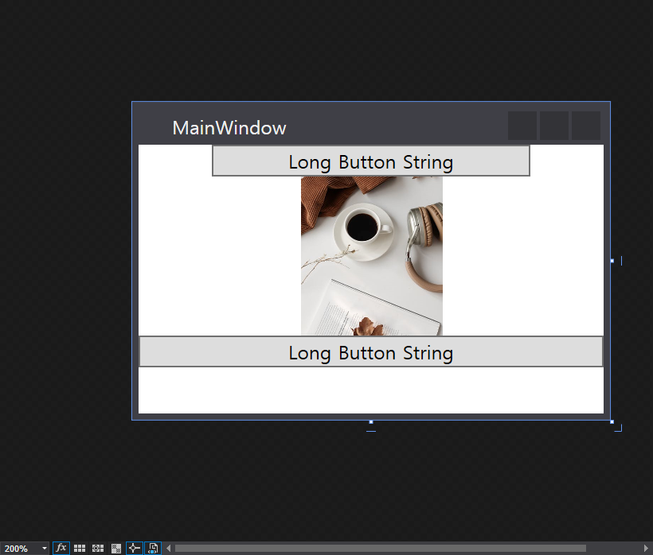

```xaml
<StackPanel>
    <Button MinWidth="125" MaxWidth="200">Long Button String</Button>
    <Image Width="150" Source="coffe.jpg" Height="100" ></Image>
    <Button>Long Button String</Button>
</StackPanel>
```

### 02.2  HorizontalAlignment 및 VerticalAlignment

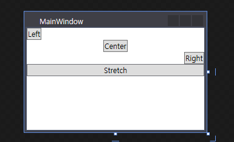

```xaml
<StackPanel>
    <Button HorizontalAlignment="Left">Left</Button>
    <Button HorizontalAlignment="Center">Center</Button>
    <Button HorizontalAlignment="Right">Right</Button>
    <Button HorizontalAlignment="Stretch">Stretch</Button>
</StackPanel>
```

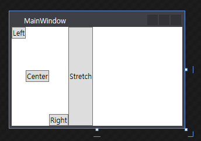

```xaml
<StackPanel Orientation ="Horizontal">
    <Button VerticalAlignment="Top">Left</Button>
    <Button VerticalAlignment="Center">Center</Button>
    <Button VerticalAlignment="Bottom">Right</Button>
    <Button VerticalAlignment="Stretch">Stretch</Button>
</StackPanel>
```

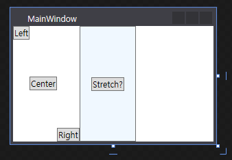

```c#
<StackPanel Orientation ="Horizontal">
        <Button VerticalAlignment="Top">Left</Button>
        <Button VerticalAlignment="Center">Center</Button>
        <Button VerticalAlignment="Bottom">Right</Button>
        <Button VerticalAlignment="Stretch" Background="AliceBlue">
            <Button Margin="15">
                Stretch?
            </Button>
        </Button>
</StackPanel>
```

### 02.3 Visibility

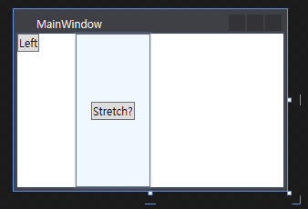

```xaml
    <StackPanel Orientation ="Horizontal">
        <Button VerticalAlignment="Top">Left</Button>
        <Button Visibility="Hidden" VerticalAlignment="Center">Center</Button>
        <Button Visibility="Collapsed"  VerticalAlignment="Bottom">Right</Button>
        <Button VerticalAlignment="Stretch" Background="AliceBlue">
            <Button Margin="15">
                Stretch?
            </Button>
        </Button>
    </StackPanel>
```

- `Visibility="Hidden"`
  - 공간 차지하고 안보임
- `Visibility="Collapsed"`
  - 공간지워지고 존재 하지 않음

### 02.4 Padding 및 Margin

- Padding

  - Element의 Content와 element의 테두리 사이의 여백

- Margin

  - Element의 바깥쪽 여백

- 한번에 상하좌우 한번에 적용하는 것

  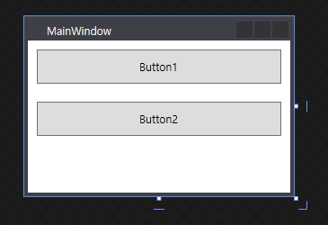

  ```xml
  <StackPanel Orientation ="Vertical">
      <Button Padding="10" Margin="10">Button1</Button>
      <Button Padding="10" Margin="10">Button2</Button>
  </StackPanel>
  ```

- 개별 적으로 적용하는 것

  - 값 두개 적용시 

    - 첫번째 값: 왼쪽, 오른쪽

    - 두번째 값: 위쪽 ,아래쪽

      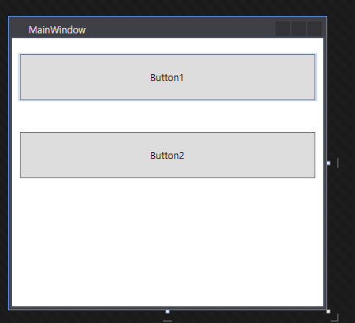

      ```xaml
      <StackPanel Orientation ="Vertical">
          <Button Padding="10, 20" Margin="10, 20">Button1</Button>
          <Button Padding="10, 20" Margin="10, 20">Button2</Button>
      </StackPanel>
      ```

  - 값 네개 적용시

    - 순서대로 왼쪽, 위쪽, 오른쪽, 아래쪽

      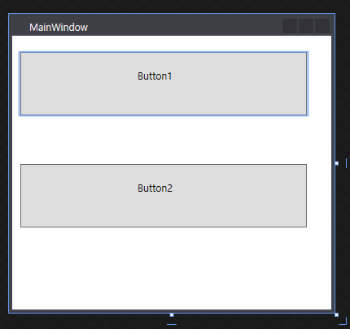

      ```xaml
      <StackPanel Orientation ="Vertical">
          <Button Padding="10, 20, 30, 40" Margin="10, 20, 30, 40" >Button1</Button>
          <Button Padding="10, 20, 30, 40" Margin="10, 20, 30, 40" >Button2</Button>
      </StackPanel>
      ```

### 02.5 Panel

- 시각적 요소들을 배치하기 위한 container

####  StackPanel

- 요소들을 스택에 배치함

- **Top to Botton (Default)**

  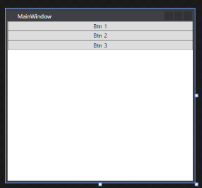

  ```xaml
  <StackPanel>
      <Button>Btn 1</Button>
      <Button>Btn 2</Button>
      <Button>Btn 3</Button>
  </StackPanel>
  ```

- **Left to Right**

  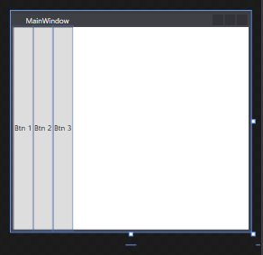

  ```xaml
  <StackPanel Orientation="Horizontal">
      <Button>Btn 1</Button>
      <Button>Btn 2</Button>
      <Button>Btn 3</Button>
  </StackPanel>
  ```

- **Right to Left**

  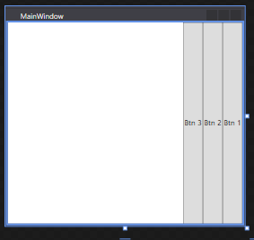

  ```xaml
  <StackPanel Orientation="Horizontal"
              FlowDirection="RightToLeft">
      <Button>Btn 1</Button>
      <Button>Btn 2</Button>
      <Button>Btn 3</Button>
  </StackPanel>
  ```

  - 아래에서 위로 배치는 불가능

#### WrapPanel

- 요소들을 놓으면서 패널의 가장자리에 도달하면 다른 라인에 쌓임

  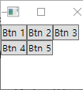

  ```xaml
  <WrapPanel Orientation="Horizontal"
             FlowDirection="LeftToRight">
      <Button>Btn 1</Button>
      <Button>Btn 2</Button>
      <Button>Btn 3</Button>
      <Button>Btn 4</Button>
      <Button>Btn 5</Button>
  </WrapPanel>
  ```

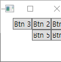

```xaml
<WrapPanel Orientation="Horizontal"
           FlowDirection="RightToLeft">
    <Button>Btn 1</Button>
    <Button>Btn 2</Button>
    <Button>Btn 3</Button>
    <Button>Btn 4</Button>
    <Button>Btn 5</Button>
</WrapPanel>
```

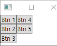

```xaml
    <WrapPanel Orientation="Vertical"
                FlowDirection="LeftToRight">
        <Button>Btn 1</Button>
        <Button>Btn 2</Button>
        <Button>Btn 3</Button>
        <Button>Btn 4</Button>
        <Button>Btn 5</Button>
    </WrapPanel>
```


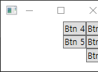

```xaml
    <WrapPanel Orientation="Vertical"
                FlowDirection="RightToLeft">
        <Button>Btn 1</Button>
        <Button>Btn 2</Button>
        <Button>Btn 3</Button>
        <Button>Btn 4</Button>
        <Button>Btn 5</Button>
    </WrapPanel>
```

- ItemHeight 
  - 행길이 설정
  - 정렬 방법 설정 가능 verticalAlignment
- ItemWidth
  - 열길이 설정
  - 정렬방법 설정 가능 HorizontalAlignment

##### 예제

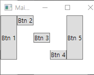

```xaml
<WrapPanel ItemHeight="90">
    <Button>Btn 1</Button>
    <Button VerticalAlignment="Top">Btn 2</Button>
    <Button VerticalAlignment="Center">Btn 3</Button>
    <Button VerticalAlignment="Bottom">Btn 4</Button>
    <Button VerticalAlignment="Stretch">Btn 5</Button>
</WrapPanel>
```

#### DockPanel

- 자식요소 위치를 자식의 순서에 따라 여유공간에 화면에 배치
  - Default는 요소들 왼쪽으로 부터 채움
    - Docking edge는 Left가 기본값
  - LastChildFill속성이 True
    - 마지막 요소는 패널의 공간에 확장해서 위치

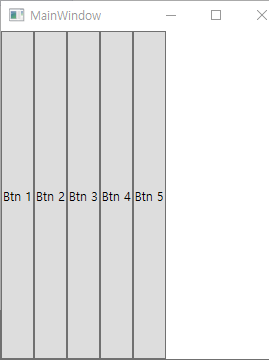

```xaml
<DockPanel LastChildFill="False">
    <Button>Btn 1</Button>
    <Button>Btn 2</Button>
    <Button>Btn 3</Button>
    <Button>Btn 4</Button>
    <Button>Btn 5</Button>
</DockPanel>
```

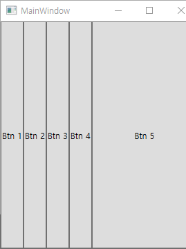

```xaml
<DockPanel LastChildFill="True">
    <Button>Btn 1</Button>
    <Button>Btn 2</Button>
    <Button>Btn 3</Button>
    <Button>Btn 4</Button>
    <Button>Btn 5</Button>
</DockPanel>
```

#### Grid

- 행과 열로 정의된 셀로 구성된 container
  - 처음 행과 열은 0
- grid line은 기본값은 보이지 않음
  - ShowGridLines = "True" 로 보이게 할 수 있음

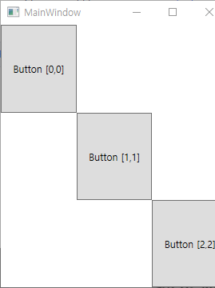

```xaml
<Grid>
    <Grid.RowDefinitions>
        <RowDefinition></RowDefinition>
        <RowDefinition></RowDefinition>
        <RowDefinition></RowDefinition>
    </Grid.RowDefinitions>
    <Grid.ColumnDefinitions>
        <ColumnDefinition></ColumnDefinition>
        <ColumnDefinition></ColumnDefinition>
        <ColumnDefinition></ColumnDefinition>
    </Grid.ColumnDefinitions>
    <Button Grid.Row="0" Grid.Column="0">Button [0,0]</Button>
    <Button Grid.Row="1" Grid.Column="1">Button [1,1]</Button>
    <Button Grid.Row="2" Grid.Column="2">Button [2,2]</Button>
</Grid>
```

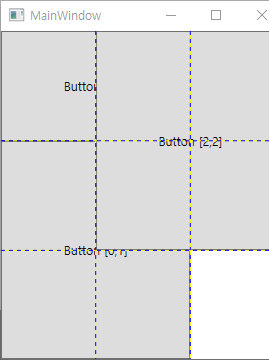

```xaml
    <Grid ShowGridLines="True">
        <Grid.RowDefinitions>
            <RowDefinition></RowDefinition>
            <RowDefinition></RowDefinition>
            <RowDefinition></RowDefinition>
        </Grid.RowDefinitions>
        <Grid.ColumnDefinitions>
            <ColumnDefinition></ColumnDefinition>
            <ColumnDefinition></ColumnDefinition>
            <ColumnDefinition></ColumnDefinition>
        </Grid.ColumnDefinitions>
        <Button Grid.Row="0" Grid.Column="0" Grid.ColumnSpan="2">Button [0,0]</Button>
        <Button Grid.Row="1" Grid.Column="0" Grid.RowSpan="2" Grid.ColumnSpan="2">Button [0,1]</Button>
        <Button Grid.Row="0" Grid.Column="1" Grid.RowSpan="2" Grid.ColumnSpan="2">Button [2,2]</Button>
    </Grid>
```

- 행 과 열의 size 설정

  - Height와 Width 속성으로 설정하면됨

    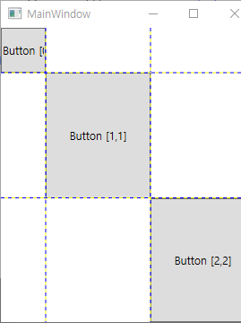

    ```xaml
        <Grid ShowGridLines="True">
            <Grid.RowDefinitions>
                <RowDefinition Height="50"></RowDefinition>
                <RowDefinition></RowDefinition>
                <RowDefinition></RowDefinition>
            </Grid.RowDefinitions>
            <Grid.ColumnDefinitions>
                <ColumnDefinition Width="50"></ColumnDefinition>
                <ColumnDefinition></ColumnDefinition>
                <ColumnDefinition></ColumnDefinition>
            </Grid.ColumnDefinitions>
            <Button Grid.Row="0" Grid.Column="0">Button [0,0]</Button>
            <Button Grid.Row="1" Grid.Column="1">Button [1,1]</Button>
            <Button Grid.Row="2" Grid.Column="2">Button [2,2]</Button>
        </Grid>
    ```

- Automatic Sizing

  - 셀 Content에 맞도로 크기가 수정

  - 기본의 경우 가득 차지만

    - Auto의 경우 content를 다 포함 할 수 있게 크기 할당

      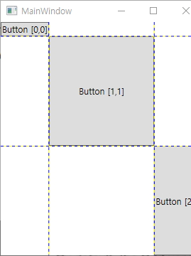

      ```xaml
      <Grid ShowGridLines="True">
          <Grid.RowDefinitions>
              <RowDefinition Height="auto"></RowDefinition>
              <RowDefinition></RowDefinition>
              <RowDefinition></RowDefinition>
          </Grid.RowDefinitions>
          <Grid.ColumnDefinitions>
              <ColumnDefinition Width="auto"></ColumnDefinition>
              <ColumnDefinition></ColumnDefinition>
              <ColumnDefinition Width="auto"></ColumnDefinition>
          </Grid.ColumnDefinitions>
          <Button Grid.Row="0" Grid.Column="0">Button [0,0]</Button>
          <Button Grid.Row="1" Grid.Column="1">Button [1,1]</Button>
          <Button Grid.Row="2" Grid.Column="2">Button [2,2]</Button>
      </Grid>
      ```

- Proportional Sizing

  - 사용 가능한 공간을 비례적으로 행과 열을 나눔

    - Grid의 크기를 조정할 때 레이아웃이 비례적으로 유지됨

    - Asterisk(*) 사용

      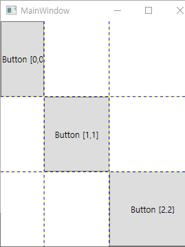

    ```xaml
    <Grid ShowGridLines="True">
        <Grid.RowDefinitions>
            <RowDefinition Height="*"></RowDefinition>
            <RowDefinition Height="*"></RowDefinition>
            <RowDefinition Height="*"></RowDefinition>
        </Grid.RowDefinitions>
        <Grid.ColumnDefinitions>
            <ColumnDefinition Width="2*"></ColumnDefinition>
            <ColumnDefinition Width="3*"></ColumnDefinition>
            <ColumnDefinition Width="4*"></ColumnDefinition>
        </Grid.ColumnDefinitions>
        <Button Grid.Row="0" Grid.Column="0">Button [0,0]</Button>
        <Button Grid.Row="1" Grid.Column="1">Button [1,1]</Button>
        <Button Grid.Row="2" Grid.Column="2">Button [2,2]</Button>
    </Grid>
    ```

- Splitter Bars

  - 그리드를 두 부분으로 나누는 수직 or 수평선

    - 사용자가 splitter bar를 다른 방향으로 끌어서 두 부분의 비율을 변경할 수 있음

    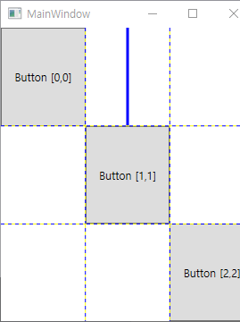

    ```xaml
    <Grid ShowGridLines="True">
        <Grid.RowDefinitions>
            <RowDefinition Height="*"></RowDefinition>
            <RowDefinition Height="*"></RowDefinition>
            <RowDefinition Height="*"></RowDefinition>
        </Grid.RowDefinitions>
        <Grid.ColumnDefinitions>
            <ColumnDefinition Width="*"></ColumnDefinition>
            <ColumnDefinition Width="*"></ColumnDefinition>
            <ColumnDefinition Width="*"></ColumnDefinition>
        </Grid.ColumnDefinitions>
    
        <GridSplitter Grid.Row="0" Grid.Column="1" Width="3" Background="Blue" HorizontalAlignment="Center" VerticalAlignment="Stretch"> 
            
        </GridSplitter>
        <Button Grid.Row="0" Grid.Column="0">Button [0,0]</Button>
        <Button Grid.Row="1" Grid.Column="1">Button [1,1]</Button>
        <Button Grid.Row="2" Grid.Column="2">Button [2,2]</Button>
    </Grid>
    ```

#### Canvas

- 좌표계를 사용하여 원하는 위치에 요소 배치

  - Canvas.Left, Canvas.Right를 둘 다 사용할 수 없음

  - Canvas.Top, Canvas.Botton도 둘 다 사용할 수 없음

    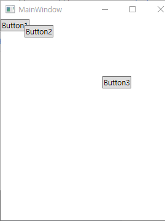

  ```xaml
  <Canvas>
      <Button>Button1</Button>
      <Button Canvas.Left="39" Canvas.Top="10">Button2</Button>
      <Button Canvas.Left="166" Canvas.Top="93">Button3</Button>
  </Canvas>
  ```

- Z-order on a Canvas

  - 캔버스의 요소가 겹칠 때 순서를 지정하는 방법

    - ZIndex의 속성값이 다른 값 보다 높으면 앞에 표시

    - Default는 모든 요소 0
      

      ```xaml
      <Canvas>
          <Button Canvas.ZIndex="3"> Button1</Button>
          <Button Canvas.ZIndex="2"  Canvas.Left="39" Canvas.Top="10">Button2</Button>
          <Button Canvas.Left="166" Canvas.Top="93">Button3</Button>
      </Canvas>
      ```

#### UniformGrid

- UniformGrid의 모양이나 크기를 변경할지라도 항상 다른 셀들과 크기가 같음

  - 각각의 셀은 하나의 요소를 포함함

    - 요소들은 나열한 순서대로 셀에 추가

    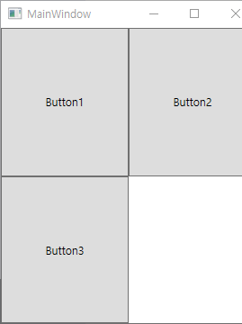

    ```xaml
    <UniformGrid>
        <Button> Button1</Button>
        <Button>Button2</Button>
        <Button>Button3</Button>
    </UniformGrid>
    ```

## 03.추가적인 내용 정리

- **스택 패널 오른쪽에서 왼쪽으로 적용하는것**

  ```xaml
  <StackPanel Orientation="Horizontal"
              FlowDirection="RightToLeft">
      <Button>Btn 1</Button>
      <Button>Btn 2</Button>
      <Button>Btn 3</Button>
  </StackPanel>
  ```

  - **아래에서 위로하는 것**
    - 없음

- **Canvas 사용하는 곳 찾아보기**

  - 단지 그냥 정말 캔버스 같은 느낌으로 자율성 있게 사용

- **stack panel, wrap, dock panel, uniform, grid.... 다른것 없는지 확인 해보기**

  - border
    - 패널은 아님
  - relative panel
  - items control 
  - VirtualizingPanel 