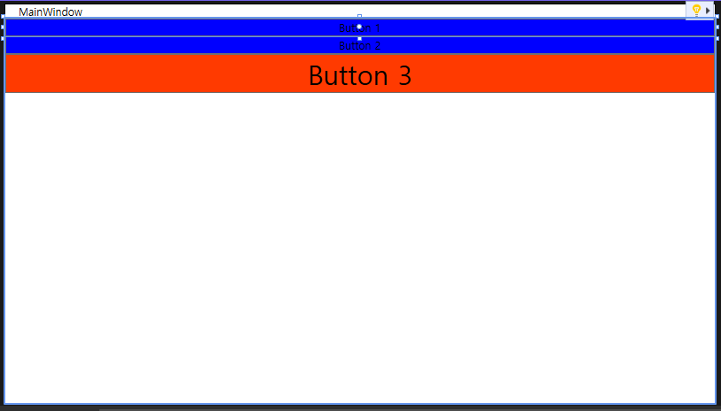
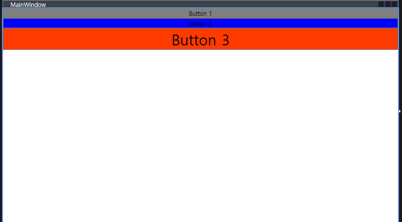
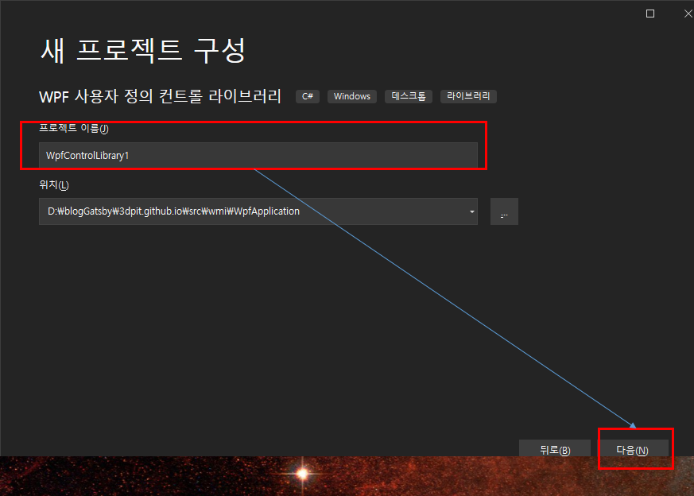
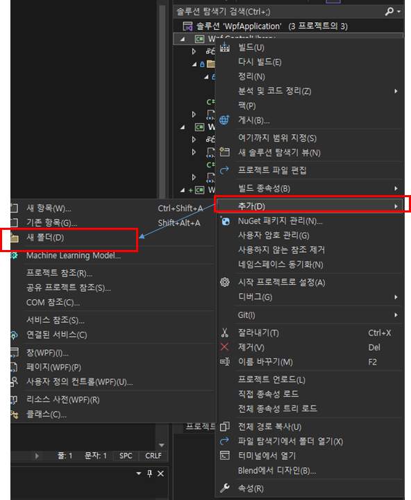
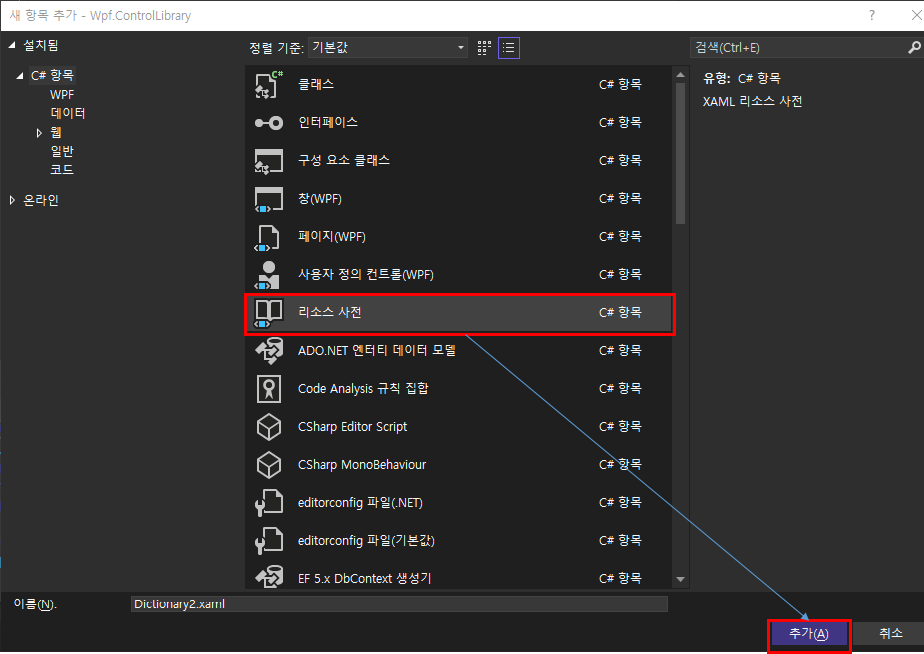
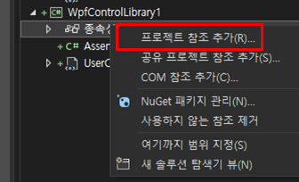
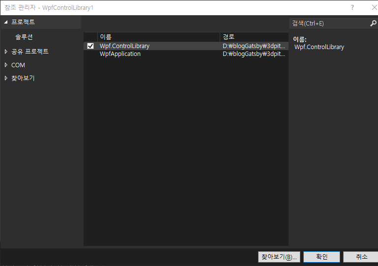
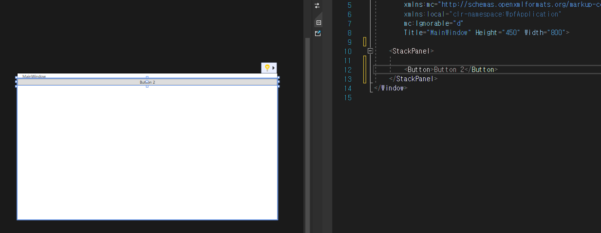
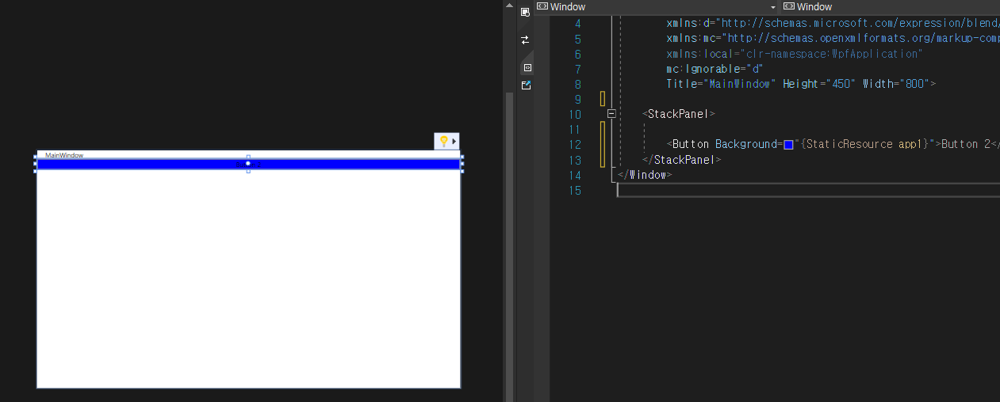

## 2022-07-14-WPF교육-Resources

- 리소스

  - app 은 프로젝트

  - window는 해당 windows에서 쓰이는 것

  - key를 이용해서 명시적으로 사용함

## 목차

>01.교육내용
>
>>01.1 x로 시작하는것
>
>>01.2 코드로 xaml로 만들기
>
>>01.3 exe 이외에 있는곳
>
>>01.4 라이브러리
>
>>01.5 과제
>
>02.공부내용
>
>>02.1 Resources적용해보기
>
>>02.2 cs코드 xmal로 변경해보기
>
>03.과제
>
>>03.1 WPF Library 적용해서 다른 프로젝트에서 사용해보기
>
>>02.3 리소스 관리를 위한 폴더 생성
>
>>02.3 프로젝트 참조 걸기
>
>>02.3 해당 프로젝트의 App.xaml에 추가
>
>>02.4 Resource 적용해보기

## 01.교육내용

### 01.1 x로 시작하는것

- x.name, x.key

  - 키를 쓸때 해당 필드에

    - {StaticResource}

    ```xaml
    <Window.Resources>
    	<Style TargetType ={x:Type Button} x:Key ="Hi">
        	<Setter Property="Background" Value="Blue"/>
        </Style>
    </Window.Resources>
    <!-- <Button Style="{StaticResource Hi}">  -->
    <Button Style="{StaticResource ResourceKey=Hi}">
        Button1
    </Button>
    ```

  - DynamicResource의 부분의 경우 소스랑 연동을 해야하기 때문에 추후로 미룰 예정

- add

  - 한 태그가 들어간것임

  - key는 background같은 것들

  - 그것의 값은 실버색  관련한것

    ```xaml
    <Button Background ="{StaticResource background}">
    </Button>
    ```

    - Style로 하려면 Setter이런것을 해야 가능 위에서는 Background로 해야함
    - Resource는 한곳이 아니고 자식인 곳은 모두 쓸 수 있음

- 실습 진행

  - window resource와 stack panel 
    - window는 컨트롤 하나만 가짐
      - 그래서 오류 걸림
    - 그 오류 해결하는 법
      - 패널 같은 것을 하나 만들면됨

### 01.2 코드로 xaml로 만들기

```xaml
<StackPanel Name ="sp">
    <StackPanel.Resource>
    	<SolidColorBrush x:Key ="background" Color=:"Auqa"/>
    </StackPanel.Resource>
	<Button Name ="btn1">Button1</Button>
	<Button Name ="btn2">Button2</Button>
	<Button Name ="btn3" Background ="{StaticResource background}">Button3</Button>
</StackPanel>
```

### 01.3 exe 이외에 있는곳

- 이미지 부분 넣는것 이외의 것

### 01.4 라이브러리

- 라이브러리?
  - 특정 기능을 가져다 씀
  - 그것의 집합 클래스 라이브러리
  - 프로젝트 이외의 것에 재사용하고 싶음

### 01.5 과제

- 다른곳에서도 빨간 것

## 02.공부내용

### 02.1 Resources적용해보기



```xaml
<Window.Resources>
    <Style  TargetType="{x:Type Button}" x:Key ="Hi">
        <Setter Property="Background" Value="#FFFF3A00"/>
        <Setter Property="FontSize" Value="30"/>
    </Style>
</Window.Resources>
<StackPanel>
    <StackPanel.Resources>
        <SolidColorBrush x:Key="background" Color="Blue"/>
    </StackPanel.Resources>

    <Button Background="{StaticResource background}">Button 1</Button>
    <Button Background="{StaticResource background}">Button 2</Button>
    <Button Style="{StaticResource Hi}">Button 3</Button>
</StackPanel> 
```

-  Style로 적용하는법 , Background로 적용하는 법
  - Window.Resources와 Stackpanel.Resources를 쓸 수 있음

### 02.2 cs코드 xmal로 변경해보기



- xaml.cs

  ```csharp
  public partial class MainWindow : Window
  {
      public MainWindow()
      {
          InitializeComponent();
  
          SolidColorBrush silverBrush = Brushes.Silver;
  
          App application = (App)Application.Current;
  
          application.Resources.Add("background", silverBrush);
  
          btn1.Background = (SolidColorBrush)btn1.FindResource("background");
      }
  }

- xaml로 변경

  - App.xaml

    ```xaml
    <Application.Resources>
        <SolidColorBrush x:Key = "app1" Color =" Blue"/>
    </Application.Resources>
    ```

  - MainWindow.xaml

    ```xaml
    <Window.Resources>
        <Style  TargetType="{x:Type Button}" x:Key ="Hi">
            <Setter Property="Background" Value="#FFFF3A00"/>
            <Setter Property="FontSize" Value="30"/>
        </Style>
    </Window.Resources>
    <StackPanel>
        <StackPanel.Resources>
            <SolidColorBrush x:Key="background" Color="Gray"/>
        </StackPanel.Resources>
    
        <Button Background="{StaticResource background}">Button 1</Button>
        <Button Background="{StaticResource app1}">Button 2</Button>
        <Button Style="{StaticResource Hi}">Button 3</Button>
    </StackPanel> 
    ```

  ## 03.과제

  ### 03.1 WPF Library 적용해서 다른 프로젝트에서 사용해보기

  
  
  - 사용자 정의 컨트롤 라이브러리 검색 후 클릭후 다음진행
  
  
  
  - 이름 설정 후 다음 클릭
  
  ### 02.3 리소스 관리를 위한 폴더 생성
  
  
  
  - Resources
    - Styles 	
  - 위의 순서대로 폴더를 만들어 줍니다.
  
  
  
  - 리소스 사전 클릭 후 추가를 Styles폴더에 해준다.
  
    -  Dictionary로 시작하는 xaml이 생기는데
  
      - before
  
        ```xaml
        <ResourceDictionary xmlns="http://schemas.microsoft.com/winfx/2006/xaml/presentation"
                            xmlns:x="http://schemas.microsoft.com/winfx/2006/xaml">
        </ResourceDictionary>
        ```
  
      - after
  
        ```xaml
        <ResourceDictionary xmlns="http://schemas.microsoft.com/winfx/2006/xaml/presentation"
                            xmlns:x="http://schemas.microsoft.com/winfx/2006/xaml">
            <SolidColorBrush x:Key="app1" Color="blue"/>
        </ResourceDictionary>
        ```
  
        - 원하는 속성 적어준다.
  
  ### 02.3 프로젝트 참조 걸기
  
  
  
  - 프로젝트에보면 종속성이라고 있는데 오른쪽 클릭하여 프로젝트 참조 추가를 클릭
  
  

- 저기에 Wpf.ControlLibrary라고 있음 이를 체크하고 확인을 눌러준다.

### 02.3 해당 프로젝트의 App.xaml에 추가

- before

  ```xaml
  <Application x:Class="WpfApplication.App"
               xmlns="http://schemas.microsoft.com/winfx/2006/xaml/presentation"
               xmlns:x="http://schemas.microsoft.com/winfx/2006/xaml"
               xmlns:local="clr-namespace:WpfApplication"
               StartupUri="MainWindow.xaml">
      <Application.Resources>
  
      </Application.Resources>
  </Application>
  
  ```

- after

  ```xaml
  <Application x:Class="WpfApplication.App"
               xmlns="http://schemas.microsoft.com/winfx/2006/xaml/presentation"
               xmlns:x="http://schemas.microsoft.com/winfx/2006/xaml"
               xmlns:local="clr-namespace:WpfApplication"
               StartupUri="MainWindow.xaml">
      <Application.Resources>
          
          
          <ResourceDictionary>
              <ResourceDictionary.MergedDictionaries>
                  <ResourceDictionary Source="pack://application:,,,/Wpf.ControlLibrary;component/Resources/Styles/Dictionary1.xaml"/>
              </ResourceDictionary.MergedDictionaries>
          </ResourceDictionary>
          
          
          
      </Application.Resources>
  </Application>
  
  ```

  - 위처럼 xaml를 추가해준다.


### 02.4 Resource 적용해보기

- before

  

- after

  

  - 적용한  리소스를 사용하며 프로젝트에 적용이 된다.