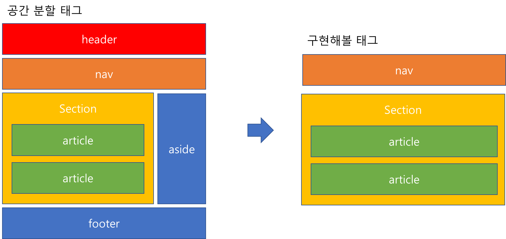

## 2022-11-06-webStudy[1일차]

## 목차

> 00.레이아웃 설계하면서 느낀것
>
> > 00.1 추가적으로 공부할 것
>
> 01.레이아웃 분석
>
> 02.레이아웃 먼저 잡기
>
> > 02.1 구현소스
>
> 03.최종화면
>
> 04.문제점 해결 소스 코드
>
> > > css
> > >
> > > html
> >
> > 04.1 최종 완료 화면
>

## 00.레이아웃 설계하면서 느낀것

- 어렵지는 않았지만 각 레이아웃을 어떻게 분리하고 어떤 태그를 사용하는지 적절하는지 선택에 어려움 있었음
- 그리고 특히 가장 마지막에 글과 테이블이 있는 부분이 있는데
  - 사진 위에 글을 어떻게 쓸것이고 두개의 영역으로 어떻게 나눌지에 대한 생각이 필요했음
- 현재완료된 레이아웃을 보게되면 웹페이지의 크기가 달라짐에 따라서 글이 넘어가는 현상이 있음

### 00.1 추가적으로 공부할 것

- position의 관계 설정하는것
- 각 태그별 사이즈및 색등의 명령어에 대한 것 공부하기

## 01.레이아웃 분석

- 구현해야할 레이아웃

  

- 분석한 레이아웃

  

## 02.레이아웃 먼저 잡기



| 태그    | 설명                                                         |
| ------- | ------------------------------------------------------------ |
| header  | **웹사이트의 메타데이터들을 담고 있음**                      |
|         | 페이지의 타이틀을 보여주는 부분                              |
| nav     | **네비케이터를 의미**                                        |
|         | 페이지 이동을 할 때 이용                                     |
| aside   | **본문 옆에 존재하고 본문과는 연관이 없는 내용이 많음**      |
|         | 주로 광고나 카테고리 목록을 표시함                           |
| section | **본문(article)을 여러개 포함하고 있는 공간을 의미**         |
| article | **본무늬 주내용이 들어가는 공간을 의미**                     |
| footer  | **주로 웹사이트의 카피라이터(저작권 표시), 대표자, 이메일등을 표시** |

- 위에서 초기 생각한 레이아웃

  ```html
  <!DOCTYPE html>
  <html>
      <nav>
  
      </nav>
  
      <section>
          <article>
  
          </article>
          <article>
              
          </article>
      </section>
  </html>
  ```

### 02.1 구현소스

- 레이아웃 표시 css

  ```css
  /*reset*/
  *{margin:0;padding:0}
  li{list-style: none;}
  a{text-decoration:none;}
  button{width: 4rem; height: 2rem;}
  /*common*/
  .wrapper{width:1170px; margin: 0 auto;}
  .clearfix{content: ''; display: block; clear: both;}
  
  /*header*/
  nav{height: 75px; background-color: orange;
  position: fixed; width: 100%; z-index: 9999; top: 0; left: 0;}
  ul{color: rgb(0, 0, 0); line-height: 75px; float: left;}
   .menu{float: left;}
   .menu img{float: left; margin-top: 25px; margin-left: 10px;}
   .menu li{float: left; }
   .menu a{line-height: 75px; margin:4px; color: black; padding: 0 15px; display: block}
   .menu button{ margin-left: 300px;}
  
  section{ margin-top: 75px; height: 1350px; background-color: yellow;}
  article{ margin-top: 1px; height: 675px; background-color: rgb(0, 255, 98);}
  
  video{ width: 1250px; height: 675px;};
  
  .main_image{
      position: relative;
  }
  .main_image_text{
      position: absolute;
      top:20%;
      left: 10%;
      /* transform: translate(-50%, -50%); */
      color: white;
      font-size: 1rem;
  }
  
  div {
      width: 100%;
      height: 500px;
      position: relative;
      /* border: 1px solid #000; */
  }
  .main_image_text_R{
      
      position: absolute;
      transform: translate(0%,-100%);
      color: white;
      font-size: 2em;
      float: left;
  }
  .main_image_text_L{
      position: absolute;
      transform: translate(45%,-100%);
      color: white;
      font-size: 2rem;
      float: right;
  }
  
  
  .div_img{
      width: 1250px;
      height: 500px;
  }
  
  .li_first{
  margin-top: 10rem;
  margin-left: 5rem;
  margin-bottom: 1rem;
      float: center;
      font-size: 16px;
  }
  .li_second{
  margin-left: 5rem;
  font-size: 2rem;
  }
  
  
  
  table{
      margin-top: 10rem;
      margin-left: 5rem;
      border-top:1px solid white;
      border-collapse: collapse;
  }
  th, td{
      border-bottom: 1px solid white;
      border-left: 1px solid white;
      padding: 10px;
  }
  th:first-child, td:first-child{
      border-left: none;
  }
  th{
      font-size: 1rem;
      text-align: center;    
  }
  td{
      font-size: 50px;
      text-align: center;
  }
  ```

- 최종 css

  ```css
  *{margin:0;padding:0}
  li{list-style: none;}
  a{text-decoration:none;}
  button{width: 4rem; height: 2rem;}
  
  .wrapper{width:1170px; margin: 0 auto;}
  .clearfix{content: ''; display: block; clear: both;}
  
  nav{height: 75px; background-color: white;
  position: fixed; width: auto; z-index: 9999; top: 0; left: 0;}
  
  
  ul{color: rgb(0, 0, 0); line-height: 75px; float: left;}
   .menu{float: left;}
   .menu img{float: left; margin-top: 25px; margin-left: 10px;}
   .menu li{float: left; }
   .menu a{line-height: 75px; margin:4px; color: black; padding: 0 15px; display: block}
   .menu button{ margin-left: 300px;}
  
  section{ margin-top: 75px; height: 1350px;}
  article{ margin-top: 1px; height: 675px;}
  
  video{ width: 1250px; height: 675px;};
  
  .main_image{
      position: relative;
  }
  .main_image_text{
      position: absolute;
      top:20%;
      left: 10%;
      /* transform: translate(-50%, -50%); */
      color: white;
      font-size: 1rem;
  }
  
  div {
      width: 100%;
      height: 500px;
      position: relative;
      /* border: 1px solid #000; */
  }
  .main_image_text_R{
      
      position: absolute;
      transform: translate(0%,-100%);
      color: white;
      font-size: 2em;
  }
  .main_image_text_L{
      position: absolute;
      transform: translate(30%,-100%);
      color: white;
      font-size: 2rem;
  }
  
  
  .div_img{
      width: 1250px;
      height: 500px;
  }
  
  .li_first{
  margin-top: 10rem;
  margin-left: 5rem;
  margin-bottom: 1rem;
      float: center;
      font-size: 16px;
  }
  .li_second{
  margin-left: 5rem;
  font-size: 2rem;
  }
  
  
  
  table{
      margin-top: 10rem;
      margin-left: 5rem;
      border-top:1px solid white;
      border-collapse: collapse;
  }
  th, td{
      border-bottom: 1px solid white;
      border-left: 1px solid white;
      padding: 10px;
  }
  th:first-child, td:first-child{
      border-left: none;
  }
  th{
      font-size: 1rem;
      text-align: center;    
  }
  td{
      font-size: 50px;
      text-align: center;
  }
  ```

- 최종 html

  ```html
  <!DOCTYPE html>
  <link rel="stylesheet" href="home.css">
  <html>
      <nav class="wrapper">
          <ul class="menu">
              <li></img>
              <li><a href="#시작하기">시작하기</a></li>
              <li><a href="#채널">채널</a></li>
              <li><a href="#광고">광고</a></li>
              <li><a href="#서비스/도구">서비스/도구</a></li>
              <li><a href="#파트너지원">파트너지원</a></li>
              <li><button>로그인</button></li>
          </ul>
      </nav>
  
      <section>
          <article>
              <video src="https://t1.kakaocdn.net/kakao_biz_common/public/movies/main_visual_210525.mp4" autoplay controls></video>
          </article>
          <article>
            <div>
              </img>
          </div>
            <div class="main_image_text_R">
              <li class ="li_first">카카오의 영향력</li>
            </p>
              <li class ="li_second">카카오비즈니스를 한다는 건?</li>
          </p>
          <li class ="li_second">전 국민이 잠재 고객이 된다는 것</li>
            </div>
            <div class="main_image_text_L">
              <table>
                  <th>국내 카카오톡 월간 이용자 수</th>
                  <th>현재 가입자 중 채널 이용자 비율</th>
                  <tr><!-- 첫번째 줄 시작 -->
                      <td>4,600만+</td>
                      <td>84%+</td>
                  </tr><!-- 첫번째 줄 끝 -->
                  </table>
            </div>
          </article>
      </section>
  </html>

## 03.최종화면


- 현재 위에서 문제되는 것을 제일 아래부분을 두개의 div를 적용함 인터넷 크기가 변함에 따라서 글씨가넘어가는 현상이 있음 위의 부분을 해결을 더해봐야할듯함

## 04.문제점 해결 소스코드

#### css

```css
*{margin:0;padding:0}
li{list-style: none;}
a{text-decoration:none;}
button{width: 4rem; height: 2rem;}

.wrapper{width:100%; margin: 0 auto;}
.clearfix{content: ''; display: block; clear: both;}

nav{height: 75px; background-color: white;
position: fixed; width: auto; z-index: 9999; top: 0; left: 0;}


ul{color: rgb(0, 0, 0); line-height: 75px; float: left;}
.menu{float: left;}
.menu img{float: left; margin-top: 35px; margin-left: 15px; width: 8rem; height: 1rem;}
.menu li{float: left; }
.menu a{line-height: 75px; margin:4px; color: black; padding: 0 15px; display: block}
.menu button{ margin-left: 100%}

section{ margin-top: 75px; height: 1350px;}
article{ margin-top: 1px; height: 675px;}


.video-box { width: 100%; overflow: hidden;margin: 0px auto; position: relative; }

video { width: 100%; }
.video-text { position: absolute; top: 70%; width: 100%; }
.video-text p { margin-top:px; text-align: center; font-size: 35px; color: #ffffff; }


.img-box { width: 100%; height: 100%; overflow: hidden; margin: 0px auto; position: relative; }

img { width: 100%; }


.main_image{
width: 100%; overflow: hidden; margin: 0px auto; position: relative; 
}

.li_first{
text-align: left; font-size: 1rem; color: #ffffff;
margin-top: -10rem; margin-left: 20rem;
}
.li_second{
color: #ffffff;
text-align: left; font-size: 2rem; color: #ffffff;
margin-left: 20rem;
}

.main_image_text_R{
position: absolute;
transform: translate(-15%, -200%);
color: white;
font-size: 2em;
}
.main_image_text_L{
position: absolute;
transform: translate(200%,-180%);
color: white;
font-size: 2rem;
}

table{
    margin-right: auto;
    margin-left: auto;

border-top:1px solid white;
border-collapse: collapse;
}
th, td{
border-bottom: 1px solid white;
border-left: 1px solid white;
padding: 10px;
}
th:first-child, td:first-child{
border-left: none;
}
th{
font-size: 1rem;
text-align: center;    
}
td{
font-size: 2rem;
text-align: center;
}


.li_first{
text-align: left; font-size: 1rem; color: #ffffff;
margin-top: -10rem; margin-left: 20rem;
}
.li_second{
color: #ffffff;
text-align: left; font-size: 2rem; color: #ffffff;
margin-left: 20rem;
}

.img-position{
    position:absolute;
}
.main_left_btn {
position:relative;
width:50%;
margin-top: 15%;
float:left;
text-align: center;
color:#ffffff;
}
.main_right_btn {
position:relative;
width:50%;
margin-top: 15%;
float:right;
float: center;
color:#ffffff;
}

.s-font{
    font-size: 1.2rem;
}
.m-font{
    font-size:1.5rem;
}
```

#### html

```html
<!DOCTYPE html>
<link rel="stylesheet" href="home.css">
<html>
<nav class="wrapper">
  <ul class="menu">
    <li></img>
    <li><a href="#시작하기">시작하기</a></li>
    <li><a href="#채널">채널</a></li>
    <li><a href="#광고">광고</a></li>
    <li><a href="#서비스/도구">서비스/도구</a></li>
    <li><a href="#파트너지원">파트너지원</a></li>
    <li><button>로그인</button></li>
  </ul>
</nav>

<section>
  <article>

    <div class="video-box">
      <video muted autoplay loop>
        <source src="https://t1.kakaocdn.net/kakao_biz_common/public/movies/main_visual_210525.mp4" type="video/mp4">
        <strong>Your browser does not support the video tag.</strong>
      </video>
      <div class="video-text">
        <p>비지니스, 톡처럼 쉬워진다.</p>
        <p>카카오비즈니스</p>
      </div>
    </div>
    </img>
    <div class="main_left_btn">
      <p class="s-font">카카오의 영향력</p>
      <p class="m-font">카카오비즈니스를 한다는 건?</p>
      <p class="m-font">전 국민이 잠재 고객이 된다는 것</p>
    </div>
    <div class="main_right_btn">
      <table>
        <th>국내 카카오톡 월간 이용자 수</th>
        <th>현재 가입자 중 채널 이용자 비율</th>
        <tr><!-- 첫번째 줄 시작 -->
            <td>4,600만+</td>
            <td>84%+</td>
        </tr><!-- 첫번째 줄 끝 -->
        </table>
    </div>


  </article>
</section>
</html>
```

### 04.1 최종 완료 화면


