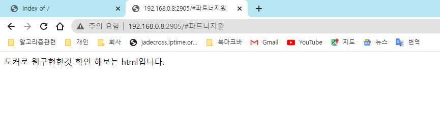

## 2022-11-07-웹사이트-도커로-실행해보기

## 목차

> 01.폴더 구성
>
> 02.도커 파일과 도커 컴포즈 파일
>
> 03.도커 실행하기
>
> 04.실행 하면 확인하기

## 01.폴더 구성

```
html
-----public-html
	-----index.css
	-----index.html
-----docker-compose.yml
-----Dockerfile
```

- html

  

- public-html

  

- public-html에 각자가 만든 html, css 소스가 있으면 됩니다.

## 02.도커 파일과 도커 컴포즈 파일

- index.html

  ```html
  <!DOCTYPE html>
  <html>
      <body>
          <div>
              도커로 웹구현한것 확인 해보는 html입니다.
          </div>
      </body>
  </html>
  ```

- Docerfile

  ```dockerfile
  FROM httpd:2.4
  COPY ./public-html/ /usr/local/apache2/htdocs/
  ```

- docker-compose.yml

  ```yml
  version: "2.0"
  services:
    webserver:
      image: httpd:2.4
      volumes: 
        - ./public-html:/usr/local/apache2/htdocs:rw
      ports:
        - 2905:80
  ```

## 03.도커 실행하기

- docker-compose.yml 위치에서 `docker-compose up -d`

- 로그 그대로 보고 싶다면 `docker-compose up`

## 04.실행 화면 확인하기



- localhost:2905 로 접근하면 위와 같은 창을 볼 수 있음

- 혹시나 저렇게 안나오고 index of 라고 나오는경우

  

  - 해당 html을 클릭하거나 localhost:2905/home.html 
    - 이라고 해주면됩니다. 
    - html 이름은 각장 생성한 이름으로 맞춰주시면됩니다. 

- 해당 html을 수정하고 저장 후 웹페이지 새로고침하면 다시 적용된 화면을 볼 수 있으니 개발할때 간단하게 적용해보세요