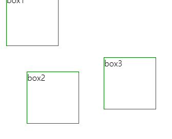

## 2022-11-11-webStudy[Position-Display]

## 목차

> 01.CSS속성 공부
>
> > 01.1 Position
> >
> > 01.2 Display

## 01.CSS 속성 공부

### 01.1 Position

- Position은 이름 그대로 위치를 결정하는 속성
  - 요소의 위치를 어떤 기준으로,
    - 어디에 배치시킬 것인지 표현 할 수 있음
- Position의 Value
  - static: 초기값, 기준 위치를 설정하지 않음
  - relative: 현재 위치를 기준으로 상대위치를 지정
  - absolute:  부모 위치를 기준으로 절대 위치를 지정
  - fixed: 윈도우(브라우저 창)를 기준으로 절대 위치를 지정하여 요소를 그 위치에 고정
  - sticky: 지정된 위치에 뷰포트가 도달했을 때,
    - 요소가 그 위치에 고정됨

#### 01.1.1 실습

#### html

```html
/*index.html*/
<!DOCTYPE html>
<html>
  <head>
    <title>Title</title>
    <meta charset="UTF-8" />
    <link rel="stylesheet" href="index.css" />
  </head>

  <body>
    <div class="box one">box1</div>
    <div class="box two">box2</div>
    <div class="box three">box3</div>
  </body>
</html>
```

#### static

```css
.box {
    position: static;
    width: 100px;
    height: 100px;
    border: 1px solid green;
  }
  .box.one {

    right: 10px;
  }
  .box.two {
    /* box의 position 값이 static이기 때문에,
    실제로는 bottom 값이 적용되지 않음 */
    bottom: 20px;
  }
  .box.three {
    /* box의 position 값이 static이기 때문에,
    실제로는 top 값이 적용되지 않음 */
    top: 50px;
  }
```

- static의 경우

  - position의 기본값,  position을 지정하지 않아도 기본적으로 적용 
  - top, left, bottom, right, z-index를 지정해도 위치 변경 안됨

  

####  relative

```css
.box {
    position: relative;
    width: 100px;
    height: 100px;
    border: 1px solid green;
  }
  .box.one {
    right: -10px;
    bottom: 20px;
  }
  .box.two {
    top: 30px;
    left: 50px;
  }
  .box.three {
    bottom: 100px;
    left: 200px;
  }
```




- relative의 경우
  - top, left, bottom, right의 지정이 가능
  - zindex의 지정 가능
  - relative의 기준점은 자기 자신이 원래 배치되었던 위치
  - absolute의 기준 위치가됨

#### absolute

- html

  ```html
  <!DOCTYPE html>
  <html>
    <head>
      <title>Title</title>
      <meta charset="UTF-8" />
      <link rel="stylesheet" href="index.css" />
    </head>
  
    <body>
      <div class="parent">
          <div class="box one">box1</div>
          <div class="box two">box2</div>
          <div class="box three">box3</div>
      </div>
    </body>
  </html>
  
  ```

- css

  ```css
  .parents{
    position: relative;
    width: 400px;
    height: 400px;
    background: skyblue ;
  }
  
  .box {
      position: absolute;
      width: 100px;
      height: 100px;
      border: 1px solid green;
    }
    .box.one {
      right:  20px;
      bottom: 10px;
    }
    .box.two {
      top: 30px;
      left: 50px;
    }
    .box.three {
      bottom: 100px;
      left: 200px;
    }
  ```

- absolute의 경우
  - relative나 fixed가 지정된 부모 위치를 기준으로 자신의 위치를 지정
  - div.parents가 box들의 부모
    - 부모인 parents에 position: relative를 지정한 수 
    - parents의 자식 요소인 box들에게 absolute를 설정
  - top, left, bottom, right등에 구체적인 위치 조절

#### fixed

- 브라우저 화면(윈도우)을 기준으로 요소를 정해진 위치에 고정 시킬 수 있음

- html

  ```html
  /*html*/
  <!DOCTYPE html>
  <html lang="en">
      <head>
          <meta charset="UTF-8">
          <meta http-equiv="X-UA-Compatible" content="IE=edge">
          <meta name="viewport" content="width=device-width, initial-scale=1.0">
          <title>fixed</title>
          <link rel="stylesheet" href="index.css" />
        </head>
  <body>
      <h1 id="title">스크롤 끝까지 내려보세요.</h1>
      <p>스크롤 내리기</p>
      <p>스크롤 내리기</p>
      <p>스크롤 내리기</p>
      <p>스크롤 내리기</p>
      <p>스크롤 내리기</p>
      <p>스크롤 내리기</p>
      <p>스크롤 내리기</p>
      <p>스크롤 내리기</p>
      <p>스크롤 내리기</p>
      <p>스크롤 내리기</p>
      <p>스크롤 내리기</p>
      <p>스크롤 내리기</p>
      <p>스크롤 내리기</p>
      <p>스크롤 내리기</p>
      <p>스크롤 내리기</p>
      <p>스크롤 내리기</p>
      <p>스크롤 내리기</p>
      <p>스크롤 내리기</p>
      <p>스크롤 내리기</p>
      <p>스크롤 내리기</p>
      <p>스크롤 내리기</p>
      <p>스크롤 내리기</p>
      <p>스크롤 내리기</p>
      <p>스크롤 내리기 하더라도 ️⬆은 고정</p>
      <p>스크롤 내리기</p>
      <p>스크롤 내리기</p>
      <p>스크롤 내리기</p>
      <p>스크롤 내리기</p>
      <p>스크롤 내리기</p>
      <p>스크롤 내리기</p>
      <p>스크롤 내리기</p>
      <p>스크롤 내리기</p>
      <p>스크롤 내리기</p>
      <p>스크롤 내리기</p>
      <p>스크롤 내리기</p>
      <p>스크롤 내리기</p>
      <p>스크롤 내리기</p>
      <p>스크롤 내리기</p>
      <p>스크롤 내리기</p>
      <p>스크롤 내리기</p>
      <a class="btn-top" href="#title">⬆️</a>
  </body>
  </html>
  ```

- css

  ```css
  body{
      height: 1000px;
  }
  
  a{
      text-decoration: none;
  }
  
  .btn-top{
      position: fixed;
      width: 30px;
      height: 30px;
      right: 20px;
      bottom: 60px;
      border-radius:50%;
      text-align: center;
      line-height: 2.1;
      background: black;
  }
  ```


- fixed의 경우
  - 브라우저 화면 전체가 기준점
  - 스크롤을 해도 요소가 지정된 위치에 계속 고정
  - top, left, bottom, right, z-index 지정이 가능

####  sticky

- 요소가 지정된 기준점(top, left, bottom, right 등으로 설정해둔 위치)에 도달 했을 때, 
  - 그 기준점에 요소를 고정

- html

  ```html
  <!DOCTYPE html>
  <html lang="en">
      <head>
          <meta charset="UTF-8">
          <meta http-equiv="X-UA-Compatible" content="IE=edge">
          <meta name="viewport" content="width=device-width, initial-scale=1.0">
          <title>fixed</title>
          <link rel="stylesheet" href="index.css" />
        </head>
  <body>
      <h1 id="title">스크롤 끝까지 내려보세요.</h1>
      <p>스크롤 내리기</p>
      <p>스크롤 내리기</p>
      <p>스크롤 내리기</p>
      <p>스크롤 내리기</p>
      <p>스크롤 내리기</p>
      <p>스크롤 내리기</p>
      <p>스크롤 내리기</p>
      <p>스크롤 내리기</p>
      <div class="menu">menu</div>
      <p>스크롤 내리기</p>
      <p>스크롤 내리기</p>
      <p>스크롤 내리기</p>
      <p>스크롤 내리기</p>
      <p>스크롤 내리기</p>
      <p>스크롤 내리기</p>
      <p>스크롤 내리기</p>
      <p>스크롤 내리기</p>
      <p>스크롤 내리기</p>
      <p>스크롤 내리기</p>
      <p>스크롤 내리기</p>
      <p>스크롤 내리기</p>
      <p>스크롤 내리기</p>
      <p>스크롤 내리기</p>
      <p>스크롤 내리기</p>
      <p>스크롤 내리기</p>
      <p>스크롤 내리기</p>
      <p>스크롤 내리기</p>
      <p>스크롤 내리기</p>
      <p>스크롤 내리기</p>
      <p>스크롤 내리기</p>
      <p>스크롤 내리기</p>
      <p>스크롤 내리기</p>
      <p>스크롤 내리기</p>
      <p>스크롤 내리기</p>
      <p>스크롤 내리기</p>
      <p>스크롤 내리기</p>
      <p>스크롤 내리기</p>
      <p>스크롤 내리기</p>
      <p>스크롤 내리기</p>
      <p>스크롤 내리기</p>
  </body>
  </html>
  ```

- css

  ```css
  body {
      height: 1000px;
    }
  
    .menu {
     /* position: -webkit-sticky; /* Safari 호환을 위한 Vendor prefix */
      position: sticky;
      height: 30px;
      top: 0;
      text-align: center;
      line-height: 2;
      background: #c98986;
      color: #fff;
    }
  ```

- sticky의 경우

  - 브라우저 화면 전체가 기준점
    - 기준점에 도달했을 때 요소가 그 위치에 고정됨
    - top, left, bottom, right, z-index 지정이 가능

### 01.2 Display

- 요소를 블록과 인라인 요소 중 어느 쪽으로 처리할 지와 함께
  - 플로우, 그리드, 플렉스처럼 자식 요소를 배치할 때 사용할 레이아웃을 설정
- display-outside, display-inline그룹으로 나뉨

#### display-outside 그룹

- 요소의 외부적인 성질을 설정할 수 있음
  - 설정된 성질에 따라 요소의 배치 방법, 레이아웃이 달라짐
- block, inline, inline-block이 있음

##### display: block

- html

  ```html
  <!DOCTYPE html>
  <html lang="en">
  <head>
      <meta charset="UTF-8">
      <meta http-equiv="X-UA-Compatible" content="IE=edge">
      <meta name="viewport" content="width=device-width, initial-scale=1.0">
      <link rel="stylesheet" href="index.css" />
      <title>block테스트</title>
  </head>
  <body>
      <p>
          p 태그는 block 레벨 요소(Block-level element)이기 때문에 뷰 포트의 가로
          영역을 100% 점유한다
      </p>
      <span>block 옆으로 안됨 세로로 가능</span>
      <span>>>이렇게는 됨</span>
      <p class="width-height">block의 경우 width와 height를 변경가능</p>
      <p class="margin-padding">margin, padding설정도 가능</p>
  </body>
  </html>
  ```

- css

  ```css
  p{
      background-color: skyblue;
  }
  
  .width-height{
      width:500px;
      height:100px;
  }
  
  .margin-padding{
      margin: 40px;
      padding: 20px 5px;
  }
  ```

  

- block은 요소가 뷰포트의 가로 영역을 100% 점유하게 되는 특징 있음
  - 그렇기 때문에 block 특성을 가진 요소와 인접된 다른 요소는 양 옆으로 배치 될 수 없고,
  - 블럭이 쌓이듯 세로로 배열이 됨
    - width, height, margin, padding 설정이 가능
    - 사이즈나 외관을 제어하기 용이함
- block 특성을 가진 요소는 
  - `<div>. <p>. <h1>, <ul>등이 있음`

##### display: inline

- html

  ```html
  <!DOCTYPE html>
  <html lang="en">
  <head>
      <meta charset="UTF-8">
      <meta http-equiv="X-UA-Compatible" content="IE=edge">
      <meta name="viewport" content="width=device-width, initial-scale=1.0">
      <title>Document</title>
      <link rel="stylesheet" href="index.css"/>
  </head>
  <body>
      <div>
          <p>
              span과 a 태그는 대표적인 inline 요소이므로 요소들이 양 옆으로 나열된다
          </p>
          <span>span 태그</span>
          <a href="#">a 태그</a>
          <a href="#">a 태그</a>
          <a href="#">a 태그</a>
      </div>
      <div>
          <a class="margin-test" href="#">
              inline요소에게 margin은 좌우만 적용
              상하 margin은 적용되지 않음
          </a>
      </div>
      <div>
          <b class="padding-test bg-green">
              padding은 상하좌우 설정이 가능하지만, 상하의 padding은 다른 요소에게
          영향을 줄 수 없기 때문에 겹쳐지는 모습.
          </b>
          <b class="padding-test bg-yellow">
              padding은 상하좌우 설정이 가능하지만, 상하의 padding은 다른 요소에게
          영향을 줄 수 없기 때문에 겹쳐지는 모습.
          </b>
      </div>
  </body>
  </html>
  ```

- css

  ```css
  div{
      margin: 100px 0;
  }
  
  div:first-child{
      margin: 0;
  }
  
  span{
      width: 100px;
      height: 500px;
  }
  
  a.margin-test{
      margin-top:100px;
      margin-bottom:200px;
      margin-left: 30px;
      margin-right: 50px;
      background: pink;
  }
  
  b.padding-test{
      padding-top: 50px;
      padding-bottom: 30px;
      padding-left: 20px;
      padding-right: 40px; 
  }
  
  .bg-green{
      background-color: green;
  }
  
  .bg-yellow{
      background-color: yellow;
  }
  ```

  - 인접된 요소의 양 옆으로 나열 되는 것이 가능
    - 단, width, height값을 적용할 수 없음
    - 즉, 속성이 지닌 요소의 사이즈의 경우 
      - 내부 컨텐츠 자체의 사이즈
        - 폰트 사이즈, 테스트량, 이미지의 가로 세로의 크기에 따라 결정됨
    - block과는 달리 margin 좌우 값만 적용됨
      - padding은 상하좌우 설정이 가능하나
        - 상하 패딩의 경우 다른 요소에게 영향을 끼치지 못함
  - inline 특성을 가진 요소
    - <a>, <span>, , <svg> 등이 있음

- inline의 특징은

  - 요소를 가로로 나열할 수 있음
  - width, height설정이 불가능
  - margin 좌우 값만 설정이 가능
  - padding은 상하좌우 설정 가능하나
    - 다른 요소에게 영향 못줌
  - text-align와 vertical-aligh을 지정하는 것이 가능

##### display: inline-block

- html

  ```html
  <!DOCTYPE html>
  <html lang="en">
  <head>
      <meta charset="UTF-8">
      <meta http-equiv="X-UA-Compatible" content="IE=edge">
      <meta name="viewport" content="width=device-width, initial-scale=1.0">
      <title>Document</title>
      <link rel="stylesheet" href="index.css"/>
  </head>
  <body>
      <p>ul, li는 기본적으로 block 요소임</p>
      <nav class="nav">
          <ul>
              <li>HOME</li>
              <li>HTML</li>
              <li>CSS</li>
          </ul>
      </nav>
  </body>
  </html>
  ```

- css

  ```css
  ul{
      text-align: center;
  }
  
  li{
      display: inline-block;
      width: 80px;
      height: 18px;
      margin: 10px 0;
      padding: 10px 0;
      background: skyblue;
      font-weight: bold;
      color: white;
  }
  ```

- inline과 block이 섞인 속성

  - 요소의 배치의 경우 inline적인 성질을 가지고 있음
  - 요소의 형태는 block적인 성질

- inline처럼 요소가 옆으로 나열되는 특징

- block처럼 width, height의 설정이 가능

  - 여백의 설정에 관해서는 block처럼
  - margin과 padding값을 자유롭게 설정하는 것이 가능

- inline-block속성을 기본값으로 가지고 있는 html요소가 없기 때문에

  - 속성을 활용하기 위해서는 개별적으로 inline-block선언해줘야함
  - 자유롭게 가로 폭, 높이, 여백을 조절할 수 있어서 다방면에 사용

- inline-block의 특징은

  - `inline`처럼 요소를 가로로 나열할 수 있다.

  - `block`처럼 `width`, `height`의 설정이 가능하다.

  - `block`처럼 상하좌우에 `margin`, `padding`의 설정이 가능하다.

  - `inline`처럼 `text-align`, `vertical-align`을 사용하는 것이 가능하다.

#### display-inside 그룹

- 요소의 내부의 자신 요소를 배치하는 방법을 설정할 수 있음
- flex, grid, table이 있음

##### display: flex

- flexible box, flexbox라고 부름
- 레이아웃 배치 전용 기능으로 고안됨

- **flex 레이아웃을 만들기 위한 기본적인 html 구조**

  ```html
  <div class="container">
      <div class="item">hello flex</div>
      <div class="item">abc</div>
      <div class="item">helloflex</div>
  </div>
  ```

  - 여기서 div.container를 플렉스 컨테이너라고 하고
    - 자식 요소인 div.item들을 플렉스 아이템이라고 부름
  - 컨테이너가 flex의 영향을 받는 전체 공간
    - 설정된 속성에 따라 각각의 아이템들이 어떤 형태로 배치되는 것
  - 즉, flex속성은 
    - 컨테이너에 적용하는 속성
    - 아이템에 적용하는 속성  으로 나뉨

###### flex 컨테이너에 적용하는 속성들

```css
.container {
    display: flex;
}
```

- html

  ```html
  <!DOCTYPE html>
  <html lang="en">
  <head>
      <meta charset="UTF-8">
      <meta http-equiv="X-UA-Compatible" content="IE=edge">
      <meta name="viewport" content="width=device-width, initial-scale=1.0">
      <title>Document</title>
      <link rel="stylesheet" href="index.css"/>
  </head>
  <body>
      <div class="container">
          <div class="item1">hello flex</div>
          <div class="item2">abc</div>
          <div class="item3">helloflex</div>
      </div>
  </body>
  </html>
  ```

- css

  ```css
  .container {
      display: flex;
  }
  .container > .item1{
      background-color: aquamarine;
  }
  .container > .item2{
      background-color: rgb(255, 81, 0);
  }
  .container > .item3{
      background-color: rgb(229, 255, 0);
  }
  ```

  

  - 위의 그림과 같이 아이템들은 가로방향으로 배치되며,
    - 가진 내용물의 width만큼만 차지함
    - inline요소들 처럼 되는것, height는 컨테이너의 높이만큼 늘어남

##### display: inline-flex

- block과  inline-block의 관계를 생각하면됨

- 아이템 배치와 관련이 있다기 보다는 , 컨테이너가 주변 요소들과 어떻게 어우러질지 결정하는 값

  - inline-block처럼 동작함

  - flex의 경우

    

  - inline-flex의 경우

    

- **배치 방향 설정**

  축의 방향을 결정하는 속성

  ```css
  .container {
  	flex-direction: row;
  	/* flex-direction: column; */
  	/* flex-direction: row-reverse; */
  	/* flex-direction: column-reverse; */
  }
  ```

  - row의 경우 위의 경우와 동일

  - row-reverse

    

  - column

    

  - column-reverse

    

    - 크기가 작은 모바일 기기의 경우 cloumn으로 배치하다가 일정 폭 이상이 되면 row로 바꿔주는 식을 반응형 레이아웃을 구현할 수 있음

- 줄넘긴 처리 설정 | flex-wrap

  - 컨테이너가 더 이상 아이템들을 한 줄에 담을 여유 공간이 없을때

    ```css
    .container {
    	flex-wrap: nowrap;
    	/* flex-wrap: wrap; */
    	/* flex-wrap: wrap-reverse; */
    }
    ```

    - nowrap(기본 값)

      - 줄바꿈하지 않음 넘치면 그냥 빠져나감

      

    - wrap

      - 줄바꿈을 함, float, inline-block으로 배치한 요소들과 비슷하게 동작

      

    - wrap-reverse

      - 줄바꿈을 하지만 아이템을 역순으로 배치

      

- flex-flow

  - flex-direction과 flex-wrap를 한번에 지정할 수 있는 단축 속성
    - 사용은 flex-direction, flex-wrap의 순으로 한 칸씩 간격 주고 쓰면됨

  ```css
  .container{
      flex-flow: row wrap;
  }
  ```

- 정렬

  - justify는 메인 축방향으로 정렬

    - 정렬 속성

      ```css
      .container {
      	justify-content: flex-start;
      	/* justify-content: flex-end; */
      	/* justify-content: center; */
      	/* justify-content: space-between; */
      	/* justify-content: space-around; */
      	/* justify-content: space-evenly; */
      }
      ```

      - flex-start

        - 아이템들을 시작점으로 정렬

        

      - flex-end

        - 아이템들을 끝점으로 정렬
          

      - center

        - 가운데로 정렬

          

      - space-between

        - 아이템들의 사이에 균일한 간격을 만들어줌

          

      - space-around

        - 아이템들의 둘레에 균일한 간격을 만들어줌

          

      - space-evenly

        - 아이템들의 사이와 양 끝에 규닝한 간격을 만들어줌
          - IE와 Edge에서는 지원되지 않음

        

  - align은 수직축 방향으로 정렬

    - 정렬 속성

      ```css
      .container {
      	align-items: stretch;
      	/* align-items: flex-start; */
      	/* align-items: flex-end; */
      	/* align-items: center; */
      	/* align-items: baseline; */
      }
      ```

      - stretch

        - 기본값 수직축 방향으로 끝까지 늘어남

        

      - flex-start

        - 시작점으로 정렬

        

      - flex-end

        - 끝으로 정렬

        

      - center

        - 가운데 정렬

        

      - baseline

        - 텍스트 베이스라인 기준으로 정렬

        

- 여러행 정렬

  - wrap에서 행이 2줄이상 되었을때 수직축 방향정렬을 결정하는 속성

  ```css
  .container {
  	flex-wrap: wrap;
  	align-content: stretch;
  	/* align-content: flex-start; */
  	/* align-content: flex-end; */
  	/* align-content: center; */
  	/* align-content: space-between; */
  	/* align-content: space-around; */
  	/* align-content: space-evenly; */
  }
  ```

###### flex 아이템에 적용하는 속성들

- flex-basis

  - flex 아이템의 기본 크기를 설정
  - direction이 row일때 너비
    - column일때 높이

  ```
  .item {
  	flex-basis: auto; /* 기본값 */
  	/* flex-basis: 0; */
  	/* flex-basis: 50%; */
  	/* flex-basis: 300px; */
  	/* flex-basis: 10rem; */
  	/* flex-basis: content; */
  }
  ```

- flex-grow

  - flex-basis의 값보다 커질 수 있는지를 결정하는 속성
  - 일단 0보다 큰 값이 세팅이 되면 해당 아이템이 유연한 박스로 변하고 원래의 크기보다 커지며 빈공간 메움

  - flex-grow : 0;

    

  - flex-grow: 1;

    

  ```css
  /* 1:2:1의 비율로 세팅할 경우 */
  .item:nth-child(1) { flex-grow: 1; }
  .item:nth-child(2) { flex-grow: 2; }
  .item:nth-child(3) { flex-grow: 1; }
  ```

  

- flex-shrink

  - flex-grow와 쌍을 이루는 속성으로 아이템이 flex-basis의 값보다 작아질 수 있는지를 결정

  ```css
  .container {
  	display: flex;
  }
  .item:nth-child(1) {
  	flex-shrink: 0;
  	width: 100px;
  }
  .item:nth-child(2) {
  	flex-grow: 1;
  }
  ```

  - 100px

    

  - 250px

    

    - 위의 예제는 컨테이너의 폭이 작아져도 title이 있는곳은 100px를 유지하는것임

##### display: grid	

###### grid: 컨테이너에 적용하는 속성들

- flex가 1차원 즉, 한 방향 레이아웃 시스템
- grid는 2차원 두방향(가로-세로) 레이아웃 시스템
- 그리드 컨테이너 - Grid Container
  - grid의 전체 영역
- 그리드 아이템 - Grid Item
  - grid 컨테이너의 자식 요소
- 그리드 트랙 - Grid Track
  - grid의 행 또는 열
- 그리드 셀 - Grid Cell
  - grid의 한 칸을 가리키는 말
  - grid 아이템 하나가 들어가는 가상의 칸이라고 생각하면됨
- 그리드 라인 - Grid Line
  - grid셀 을 구분하는 선
- 그리드 갭 - Grid Gap
  - Grid 셀 사이의 간격
- 그리드 영역 - Grid Area
  - Grid라인으로 둘러싸인 사각형 영역,
  - 그리드 셀의 집합
- **그리드 형태의 정의**
  - grid-template-rows
  - grid-template-columns

```css
.container {
	grid-template-columns: 200px 200px 500px;
	/* grid-template-columns: 1fr 1fr 1fr */
	/* grid-template-columns: repeat(3, 1fr) */
	/* grid-template-columns: 200px 1fr */
	/* grid-template-columns: 100px 200px auto */

	grid-template-rows: 200px 200px 500px;
	/* grid-template-rows: 1fr 1fr 1fr */
	/* grid-template-rows: repeat(3, 1fr) */
	/* grid-template-rows: 200px 1fr */
	/* grid-template-rows: 100px 200px auto */
}
```

- 위와 같이 여러 단위 섞어쓸 수 있음

  - fr :  숫자 비율대로 트랙의 크기

  - html

    ```html
    <!DOCTYPE html>
    <html lang="en">
    <head>
        <meta charset="UTF-8">
        <meta http-equiv="X-UA-Compatible" content="IE=edge">
        <meta name="viewport" content="width=device-width, initial-scale=1.0">
        <title>grid</title>
        <link rel="stylesheet" href="index.css"/>
    </head>
    <body>
        <div class="container">
            <div class="item">A</div>
            <div class="item">B</div>
            <div class="item">C</div>
            <div class="item">D</div>
            <div class="item">E</div>
            <div class="item">F</div>
            <div class="item">G</div>
            <div class="item">H</div>
            <div class="item">I</div>
        </div>
    </body>
    </html>

  - css

    ```css
    .container {
    	display: grid;
        /* grid-template-columns: 200px 200px 500px; */
        grid-template-columns: 1fr 1fr 1fr;
        background: green;
    }
    .item{
     background: yellow;
     margin: 5px;
     border: solid;
    }
    ```

    

- repeat 함수

  - 반복되는 값을 자동으로 처리할 수 있는 함수

    ```css
    .container{
        grid-template-columns: repeat(5, 1fr)
    }
    ```

- minmax 함수

  - 최솟값과 최댓값을 지정할 수 있는 함수
  - minmax(100px, auto)
    - 최소한 100px, 최대는 자동으로 늘어남

  ```css
  .container {
  	grid-template-columns: repeat(3, 1fr);
  	grid-template-rows: repeat(3, minmax(100px, auto));
  }
  ```

- auto-fill과 auto-fit

  - column의 개수를 미리 정하지 않고 설정된 너비가 허용하는 한 최대한 셀 채움

  - auto-fill

    ```css
    .container {
    	grid-template-columns: repeat(auto-fill, minmax(20%, auto));
    }
    ```

    - 모자르게 되면 공간이 남음

  - auto-fit

    남은 공간까지 채움

###### grid: 아이템에 적용하는 속성들

- 각 셀의 영역 지정

  ```
  .item:nth-child(1) {
  	grid-column-start: 1;
  	grid-column-end: 3;
  	grid-row-start: 1;
  	grid-row-end: 2;
  }
  
  /*
  .item:nth-child(1) {
  	grid-column: 1 / 3;
  	grid-row: 1 / 2;
  }*/
  ```

- 영역 이름으로 그리드 정의

  ```css
  .container {
  	grid-template-areas:
  		"header header header"
  		"   a    main    b   "
  		"   .     .      .   "
  		"footer footer footer";
  }
  
  .header { grid-area: header; }
  .sidebar-a { grid-area: a; }
  .main-content { grid-area: main; }
  .sidebar-b { grid-area: b; }
  .footer { grid-area: footer; }
  ```

- 자동 배치 - grid-auto-flow

  - 아이템이 자동 배치 되는 흐름을 결정하는 속성	

    ```css
    .container {
    	display: grid;
    	grid-template-columns: repeat(auto-fill, minmax(25%, auto));
    	grid-template-rows: repeat(5, minmax(50px,auto));
    	grid-auto-flow: dense;
    }
    item:nth-child(2) { grid-column: auto / span 3; }
    item:nth-child(5) { grid-column: auto / span 3; }
    item:nth-child(7) { grid-column: auto / span 2; }
    ```

    - row, column, dense, row dense, column dense

- 세로 방향 정렬 - align-items

  - stretch

    

  - start

    

  - center

    

  - end

    

- 가로방향 정렬 - justify-items

  - 세로와 비슷함

- place-items

  - align-items와 justify-items를 같이 쓸 수 있는 단축 속성
    - 순서는 align-items, justify-items의 순서로 작성
      - 하나의 값만 쓰면 두 속성 모두에 적용

  ```css
  .container {
  	place-items: center start;
  }
  ```

- 아이템 그룹 세로 정렬 - align-content

  - grid 아이템들의 높이를 모두 합한 값

  - grid컨테이너의 높이 보다 작을 때 grid 아이템을 통째로 정렬

    - 속성 값들

      ```css
      .container {
      	align-content: stretch;
      	/* align-content: start; */
      	/* align-content: center; */
      	/* align-content: end; */
      	/* align-content: space-between; */
      	/* align-content: space-around; */
      	/* align-content: space-evenly; */
      }
      ```

- 아이템 그룹 가로 정렬 - justify-content

  - 세로와 동일 하지만 가로로 정렬

- place-content

  - align-content와 justify-content를 같이 쓸 수 있는 단축 속성

  - 순서는 위의 순서대로 사용

    ```css
    .container {
    	place-content: space-between center;
    }
    ```

- 개별 아이템 세로 정렬과 가로 정렬

  - 세로 정렬

    ```css
    .item {
    	align-self: stretch;
    	/* align-self: start; */
    	/* align-self: center; */
    	/* align-self: end; */
    }
    ```

  - 가로 정렬

    ```css
    .item {
    	justify-self: stretch;
    	/* justify-self: start; */
    	/* justify-self: center; */
    	/* justify-self: end; */
    }
    ```

- place-self

  - align-self와 justify-self를 같이 쓸 수 있는 단축 속성

  ```css
  .item {
  	place-self: start center;
  }
  ```

###### IE에서 지원하는 것

| 표준                                     | 그지같은 IE             |
| ---------------------------------------- | ----------------------- |
| display: grid;                           | display: -ms-grid;      |
| grid-template-rows                       | -ms-grid-rows           |
| grid-template-columns                    | -ms-grid-columns        |
| grid-row-start                           | -ms-grid-row            |
| grid-column-start                        | -ms-grid-column         |
| grid-row: 1 / span 2;에서 span 2 대신    | -ms-grid-row-span: 2    |
| grid-column: 1 / span 2;에서 span 2 대신 | -ms-grid-column-span: 2 |
| align-self                               | -ms-grid-row-align      |
| justify-self                             | -ms-grid-column-align   |

##### display: table 

- 사용법

  - html

    ```html
    <!DOCTYPE html>
    <html lang="en">
    <head>
        <meta charset="UTF-8">
        <meta http-equiv="X-UA-Compatible" content="IE=edge">
        <meta name="viewport" content="width=device-width, initial-scale=1.0">
        <title>table</title>
        <link rel="stylesheet" href="index.css"/>
    </head>
    <body>
        <div class="div_table">
            <div class="div_table_row">
               <div class="div_table_cell">table-cell1</div>
               <div class="div_table_cell">table-cell2</div>
            </div>
            <div class="div_table_row">
                <div class="div_table_cell">table-cell1</div>
                <div class="div_table_cell">table-cell2</div>
             </div>
             <div class="div_table_row">
                <div class="div_table_cell">table-cell1</div>
                <div class="div_table_cell">table-cell2</div>
             </div>
         </div>
    </body>
    </html>
    ```

  - css

    ```css
    .div_table{
        display: table;
        border-collapse: collapse;
        width:400px;
        table-layout: fixed;
    }
    .div_table_row{
        display:table-row
    }
    .div_table_cell{
        display: table-cell;
        border: 1px solid #333;
        background: skyblue;
        color: #fff;
    }
    ```

- table관련 속성

  | 속성               | 설명                          |
  | ------------------ | ----------------------------- |
  | table              | <table> 태그의 역할로 사용    |
  | table-caption      | <caption> 태그의 역할로 사용  |
  | table-column-group | <colgroup> 태그의 역할로 사용 |
  | table-header-group | <thead> 태그의 역할로 사용    |
  | table-footer-group | <tfoot> 태그의 역할로 사용    |
  | table-row-group    | <tbody> 태그의 역할로 사용    |
  | table-cell         | <td> 태그의 역할로 사용       |
  | table-column       | <col> 태그의 역할로 사용      |
  | table-row          | <tr> 태그의 역할로 사용       |

#### 01.2.1 display속성 사용시 주의

- block은 inline을 포괄하는 더 큰 개념

  - inline속성의 요소안에 block속성의 요소를 배치시키는 것은 웹표준에 어긋남

- 하면안되는 것

  ```html
  <span>
  	<h1>
         안녕하세요! 
      </h1>
  </span>
  ```

- 지향해야 하는 것

  ```html
  <h1>
  	<span>
         안녕하세요! 
      </span>
  </h1>
  ```

