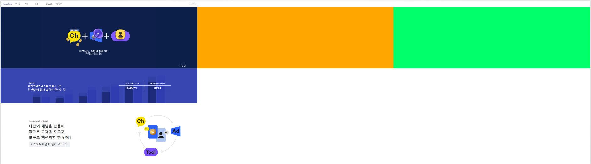

## 2022-11-16-webStudy[2일차]

## 목차

> 00.아쉬웠던 점
>
> 01.참고 및 공부한 자료
>
> 02.숙제 소스코드
>
> 03.완성된 모습

## 00.아쉬웠던 점

- 버튼 부분으로 처음에 구현햇던 것
  - <a>태그로 변경했고, 여기서 마우스 오버시 아이콘의 색상까지 바꾸고 싶었지만 실패함


- 처음에 position이랑 display를 정리를 하고 쓰임에 대해서 공부하고 ui를 구성하였지만,
  - div로 기능을 나누다 보니 css가 길어지것이 좀 아쉬웠음
  - 앞으로 html과 css에 익숙해진다면 좀더 효율적으로 ui를 묶어서 위에 실패한 부분을 하나로 통합하여 더 제대로 완료할 수 있을것 같다는 생각을 함

## 01.참고 및 공부한 자료

- [Position-Display](#43)

## 02.숙제 소스코드
<details>
<summary>HTML 소스</summary>
  ```html
  <!DOCTYPE html>
  <html lang="en">
  <head>
      <meta charset="UTF-8">
      <meta http-equiv="X-UA-Compatible" content="IE=edge">
      <meta name="viewport" content="width=device-width, initial-scale=1.0">
      <title>2일차</title>
      <link rel="stylesheet" href="index.css">
  </head>
  <body>
      <div id="wrap">
          <div id="nav">
              <div class="nav-containers">
                      <span class="logo-containers"><a href="http://www.naver.com" target="_blank" class="logo-link"></a> </span>
                      <ul>
                          <li><a href="#시작하기">시작하기</a></li>
                          <li><a href="#채널">채널</a></li>
                          <li><a href="#광고">광고</a></li>
                          <li><a href="#서비스/도구">서비스/도구</a></li>
                          <li><a href="#파트너지원">파트너지원</a></li>
                      </ul>
              </div>
              <div class="btn-containers">
                  <button> 로그인 </button>
              </div>
          </div>
          <div>
          <div id="slider-container">
              <div class="slider">
                  <div class="slider-contents">
                      <div class="slider-item">
                          <div class="slider-item-contents">
                              <video
                                  src="/0_asset/resource/main_visual_210525.mp4"
                                  autoplay="autoplay"
                                  muted ="muted"
                                  loop="loop"
                              ></video>
                              <div class="slider-text">
                                  비즈니스, 톡처럼 쉬워지다<br />
                                  카카오비즈니스 <br />
                              </div>
                          </div>
                      </div>
                      <div class="slider-item"></div>
                      <div class="slider-item"></div>
                  </div>
              </div>
              <div class="slider-pager">
                  <div>
                      <span>1</span>
                      <span>/</span>
                      <span>3</span>
                  </div>
              </div>
          </div>
          <div id="content-container">
              <div class="content-items">
                  
                  </img>
                  <div class="items-group">
                      <div class="items-text">
                          <div class="title">카카오의 영향력</div>
                          <div class="sub-title">카카오비즈니스를 한다는 건?</div>
                          <div class="sub-title">전 국민이 잠재 고객이 된다는 것</div>
                      </div>
                      <div class="items-table">
                          <div class="table-column">
                              <div class="table-row title">국내 카카오톡 월간 이용자 수</div>
                              <div class="table-row title">전체 가입자 중 채널 이용자 비율</div>
                          </div>
                          <div class="table-column">
                              <div class="table-row  sub-title">4,600만+</div>
                              <div class="table-row  sub-title">84%+</div>
                          </div>
                      </div>
                  </div>
              </div>
          </div>
          <div id="content1-container">
              <div class="content1-item-group">
                  <div class="content1-main">
                      <div class="content1-text-group">
                          <div class="title">카카오비즈니스 생태계</div>
                          <div class="sub-title">나만의 채널을 만들어,</div>
                          <div class="sub-title">광고로 고객을 모으고,</div>
                          <div class="sub-title">도구로 액션까지 한 번에!</div>
                      </div>
                      <div class="content1-button-group">
                          <a class="button-group">
                              카카오톡 채널 더 알아 보기<span class="icon-container"></span>
                          </a>
                      </div>
                  </div>
                  <div class="video-group">
                      <video src="/0_asset/resource/kako_kfb_ecosystem.mp4"
                      autoplay="autoplay"
                      muted ="muted"
                      loop="loop">
                      </video>
                  </div>
              </div>
          </div>
      </body>
  </html>
  ```
</details>
<details>
<summary>CSS소스</summary>
    ```css
    @charset "utf-8";
    /*
    * @ RESET CSS
    * -------------------------------
    */
    html, body, div, p, span, strong, b, em, iframe, pre,
    h1, h2, h3, h4, h5, h6,
    img, dl, dt, dd,
    fieldset, form, legend, label,
    table, caption, thead, tbody, tfoot, tr, th, td,
    ul, ol, li, a, input, select, textarea {margin: 0;padding: 0; border: 0 none; 
    body {font-family: MalgunGothic, '맑은 고딕','돋움', Dotum, AppleGothic, Sans-serif, Arial; font-size: 12px; line-height: 1;color: #333;}
    ul, ol, li {list-style: none;}
    em, address {font-style: normal;}
    img {border: 0 none; font-size: 0;line-height: 0;}
    sup {position: relative;top: 2px;font-size: 11px;line-height: 100%;}
    table {border-collapse: collapse; border-spacing:0; }
    caption {overflow: hidden;width: 0;height: 0;font-size: 0; line-height: 0;}
    th, td { vertical-align: middle;/* white-space: nowrap */}
    a {color: #333; text-decoration: none; line-height: 1;}
    a:hover, a:focus, a:active {text-decoration: underline;}
    a:visited {color: #333;}
    *, html {box-sizing: border-box; -webkit-box-sizing: border-box; -moz-box-sizing: border-box; }
    *, *:before, *:after {box-sizing: border-box;-webkit-box-sizing: border-box; -moz-box-sizing: border-box;}
    /*   */
    /*nav*/
    /*   */
    #nav{
    position: sticky;
    display: inline-flex;
    top: 0;
    background: white;
    height: 60px;
    width: 100%;
    z-index: 9999;
    }
    #nav .nav-containers{
    margin:10px;
    display: inline-flex;
    /* background: red; */
    width: 100%;
    padding: 15px 0px;
    justify-content: row;
    }
    #nav .nav-containers > .logo-containers>.logo-link{
    display: block;
    height: 15px;
    width: 130px;
    background: url(/0_asset/resource/kakao_biz_logo.png) no-repeat 0 0;
    background-size: 100px;
    }
    #nav .nav-containers > ul{
    /* background: rgb(219, 177, 177); */
    font-weight: bold;
    }
    #nav > .nav-containers > ul > li{
    /* background: blueviolet; */
    flex-flow: row wrap;
    float:left;
    width: 100px;
    height: 15px;
    }
    #nav .btn-containers{
    display: inline-flex;
    align-items: center;
    justify-items: end;
    }
    #nav .btn-containers > button{
    width: 60px;
    height: 20px;
    font-size: 1px;
    margin: 10px;
    }
    /*   */
    /*slider*/
    /*   */
    #slider-container{
    /* background: green; */
    height: 600px;
    }
    #slider-container > .slider{
    /* background: rgb(0, 153, 255); */
    position: relative;
    height: 560px;
    }
    #slider-container > .slider > .slider-contents {
    /* background: rgb(0, 0, 255); */
    position: relative;
    height: 600px;
    }
    #slider-container > .slider > .slider-contents >.slider-item{
    position: absolute;
    height: 600px;
    width: 100%;
    align-items: center;
    }
    #slider-container > .slider > .slider-contents >.slider-item:nth-child(1){
    background:red ;
    left:0%;
    }
    #slider-container > .slider > .slider-contents >.slider-item:nth-child(2){
    background:rgb(255, 166, 0) ;
    left:100%;
    }
    #slider-container > .slider > .slider-contents >.slider-item:nth-child(3){
    background:rgb(0, 255, 106) ;
    left:200%;
    }
    #slider-container > .slider > .slider-contents >.slider-item > .slider-item-contents
    {
    position: relative;
    width: 100%;
    height: 100%;
    }
    #slider-container > .slider > .slider-contents >.slider-item video{
    position: absolute;
    height: 600px;
    width: 100%;
    background-color: #0c1f48;
    }
    #slider-container > .slider > .slider-contents >.slider-item .slider-text
    {
    color: white;
    position: absolute;
    top: 70%;
    left: 40%;
    font-size:2em;
    text-align: center;
    }
    #slider-container > .slider-pager
    {
    position: absolute;
    right: 5%;
    color: white;
    font-size: 24px;
    font-weight: bold;
    }
    /*   */
    /*content*/
    /*   */
    #content-container{
    background: yellow;
    height: 340px;
    }
    #content-container .title{
    font-size :10px;
    padding: 5px;
    font-weight: bold;
    }
    #content-container .sub-title{
    font-size :25px;
    padding: 5px;
    font-weight: bold;
    }
    #content-container > .content-items{
    position: relative;
    display: flex;
    }
    #content-container > .content-items img{
    position: relative;
    width: 100%;
    height: 340px;
    }
    #content-container > .content-items > .items-group
    {
    position: absolute;
    display: flex;
    flex-wrap: wrap;
    justify-content: space-around;
    top:40%;
    width: 100%;
    }
    #content-container > .content-items > .items-group> .items-text{
    position: relative;
    color:white;
    }
    #content-container > .content-items > .items-group>.items-table{
    position: relative;
    color:white;
    }
    #content-container > .content-items > .items-group> .items-table > .table-column{
    display: flex;
    font-size: 15px;
    width: 500px;
    }
    #content-container > .content-items > .items-group> .items-table > .table-column >.table-row:nth-child(1){
    /* background: rgb(255, 0, 0); */
    width: 300px;
    padding: 10px;
    border-top : 1px white solid;
    border-right: 1px white solid ;
    border-bottom: 1px white solid;
    text-align: center;
    }
    #content-container > .content-items > div>.items-table > .table-column >.table-row:nth-child(2){
    width: 300px;
    /* background: rgb(0, 255, 213); */
    padding: 10px;
    border-top : 1px white solid;
    border-left: 1px white solid ;
    border-bottom: 1px white solid;
    text-align: center;
    }
    /*   */
    /*content2*/
    /*   */
    #content1-container{
    display: flex;
    flex-direction: row-reverse;
    /* background: blueviolet; */
    height: 600px;
    }
    #content1-container > .content1-item-group{
    position:relative;
    width: 100%;
    }
    #content1-container > .content1-item-group  > .content1-main{
    /* background: red;
    height: 600px; */
    position:absolute;
    display: flex;
    flex-direction: column;
    justify-content: center;
    align-items: center;
    height: 600px;
    width: 50%;
    }
    #content1-container > .content1-item-group > .content1-main >  .content1-text-group{
    /* background: red;
    height: 600px; */
    font-weight: bold;
    }
    #content1-container > .content1-item-group > .content1-main >  .content1-text-group > .title{
    /* background: red;
    height: 600px; */
    font-size: 1.5em;
    margin-bottom: 20px;
    color: grey;
    }
    #content1-container > .content1-item-group > .content1-main >  .content1-text-group > .sub-title{
    /* background: red;
    height: 600px; */
    font-size: 3em;
    margin-bottom: 20px;
    }
    #content1-container > .content1-item-group  .content1-main >  .content1-button-group > .button-group{
    display: inline-flex;
    flex-direction: row;
    align-items: center;;
    font-size: 25px;
    padding: 15px;
    border-radius: 8px;
    background: #F0F1F4;
    width: 400px;
    border:0;
    outline:0;
    text-decoration:none;
    }
    #content1-container > .content1-item-group  .content1-main >  .content1-button-group > .button-group > .icon-container{
    background:url(/1_htmlStudy/pkm/0.homeWork/2일차/homework/0_asset/resource/right-arrow.png) no-repeat 0 0;
    width: 24px;
    height: 24px;
    margin-left:15px;
    }
    #content1-container > .content1-item-group  .content1-main >  .content1-button-group > .button-group:hover{
    color:#ffff;
    background:  #326EDC ;
    overflow:hidden;
    }
    #content1-container > .content1-item-group > .video-group{
    position:absolute;
    left: 50%;
    }
    #content1-container > .content1-item-group > .video-group > video{
    height: 600px;
    }
    ```
</details>


## 03.완성된 모습



- 리팩토링한 1일차

  

- 2일차 과제 부분

  

```    @charset "utf-8";
/*
* @ RESET CSS
* -------------------------------
*/
html, body, div, p, span, strong, b, em, iframe, pre,
h1, h2, h3, h4, h5, h6,
img, dl, dt, dd,
fieldset, form, legend, label,
table, caption, thead, tbody, tfoot, tr, th, td,
ul, ol, li, a, input, select, textarea {margin: 0;padding: 0; border: 0 none; 
body {font-family: MalgunGothic, '맑은 고딕','돋움', Dotum, AppleGothic, Sans-serif, Arial; font-size: 12px; line-height: 1;color: #333;}
ul, ol, li {list-style: none;}
em, address {font-style: normal;}
img {border: 0 none; font-size: 0;line-height: 0;}
sup {position: relative;top: 2px;font-size: 11px;line-height: 100%;}
table {border-collapse: collapse; border-spacing:0; }
caption {overflow: hidden;width: 0;height: 0;font-size: 0; line-height: 0;}
th, td { vertical-align: middle;/* white-space: nowrap */}
a {color: #333; text-decoration: none; line-height: 1;}
a:hover, a:focus, a:active {text-decoration: underline;}
a:visited {color: #333;}
*, html {box-sizing: border-box; -webkit-box-sizing: border-box; -moz-box-sizing: border-box; }
*, *:before, *:after {box-sizing: border-box;-webkit-box-sizing: border-box; -moz-box-sizing: border-box;}
